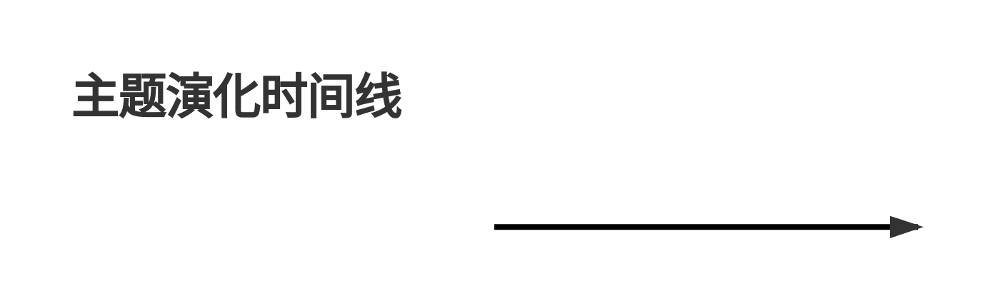

# Deep Research Ultra — 超级深度调研工具 v5.2

**Plan → Execute → Synthesize → Reflect 四阶段深度调研范式**
**智能路由（三级级联） + 四层数据源（30 引擎） + GitHub 深度搜索 + 国内内容源 + 推荐度评分**

---

## 一、核心定位

v5.2 不再是"16 个搜索引擎平铺搜索"，而是**智能调研编排层**：

- **智能路由**：三级级联（Rule→Semantic→LLM）自动识别 9 类查询意图，动态生成引擎链
- **编排者角色**：本 skill 调度 MCP 服务器、全局 skill、内置工具，不重复造轮子
- **方法论驱动**：MECE 问题树（6状态）+ CRAAP 评分 + 交叉验证 + CER 结构 + 多信号反思
- **分层降级**：MCP → 学术直连 → Skill → 内置 → 降级引擎（含 curl_cffi TLS 指纹伪装）
- **学术深度**：arXiv 全文(PDF/LaTeX) + Unpaywall OA + Semantic Scholar 引用图谱
- **反爬升级**：curl_cffi TLS 指纹 + Crawl4AI JS 渲染 + Camoufox 强反爬兜底
- **GitHub 深搜**：分桶搜索 + 低星项目挖掘 + 依赖图反向挖掘 + awesome 列表挖掘（不漏项目） ★v5.2
- **国内适配**：百度 SERP + 搜狗微信/知乎 + 百度学术，国内调研最适配 ★v5.2
- **推荐度评分**：8 维 GitHub 评分 + 5 维论文评分 + 分组排序 + 雷达图可视化 ★v5.2

---

## 二、v5.2 新功能概览

| 功能 | 模块 | 说明 | 版本 |
|------|------|------|------|
| **智能路由** | `router.py` | 三级级联 Rule→Semantic→LLM，9 类查询，CircuitBreaker 断路器 | v5.0 |
| **学术全文** | `academic_fulltext.py` | arXiv PDF/HTML/LaTeX 下载 + Unpaywall DOI→OA PDF | v5.1 |
| **引用图谱** | `academic_fulltext.py` | Semantic Scholar 引用意图 + influential citations | v5.1 |
| **浏览器自动化** | `crawl4ai_engine.py` | Crawl4AI Docker + LayeredCrawler 四级策略 | v5.1 |
| **反爬虫升级** | `fallback.py` | curl_cffi TLS/JA3 指纹伪装（`_http_get` + `_http_post`） | v5.1 |
| **问题链状态机** | `plan.py` | 6 状态（pending→searching→verified/conflict/supplementing→completed） | v5.1 |
| **多信号停止** | `reflect.py` | 边际收益递减检测 + 无高优先级空白自动收敛 | v5.1 |
| **GitHub 深度搜索** | `github_deep_search.py` | 分桶搜索 + 低星挖掘 + 依赖图 + awesome 列表（不漏项目） | ★v5.2 |
| **GitHub 代码搜索** | `github_deep_search.py` | GitHub Code Search API（代码级搜索） | ★v5.2 |
| **百度搜索 SERP** | `cn_sources.py` | 百度搜索（国内搜索主力，含知乎/CSDN/掘金等） | ★v5.2 |
| **搜狗微信搜索** | `cn_sources.py` | 微信公众号文章搜索 | ★v5.2 |
| **搜狗知乎搜索** | `cn_sources.py` | 知乎问答搜索 | ★v5.2 |
| **百度学术** | `cn_sources.py` | 国内学术论文搜索 | ★v5.2 |
| **推荐度评分系统** | `recommend.py` | 8 维 GitHub 评分 + 5 维论文评分 + 分组排序 + 雷达图 | ★v5.2 |

---

## 三、智能路由（v5.0 核心新功能）

### 3.1 三级级联架构

```
查询输入
  ↓
[L1 规则层] 关键词/正则匹配 → 60-70% 查询在此解决（<1ms，零依赖）
  ↓ 置信度 < 0.8
[L2 语义层] 向量相似度匹配 → 20-25% 查询（20-50ms，可选 sentence-transformers）
  ↓ 置信度 < 0.7
[L3 LLM 层] LLM 判断查询类型 → 5-10% 复杂查询（200-800ms，可选回调）
  ↓
RoutingDecision → 动态引擎链 + 多语言查询变体
```

### 3.2 九类查询-数据源匹配矩阵（v5.2 更新）

| 查询类型 | 关键词特征 | 推荐引擎链（v5.2） |
|---------|----------|-----------|
| **学术论文** | paper/research/论文/arxiv/doi | arxiv, paper-search, openalex, semantic-scholar, pubmed, **baidu-xueshu** |
| **开源项目** | github/open source/开源/npm | **github-deep-search**, **github-code-search**, oss-finder, tavily, open-websearch |
| **社区口碑** | reddit/评价/口碑/知乎 | agent-reach, last30days, tavily, **sogou-zhihu**, **baidu-serp** |
| **技术文档** | docs/文档/api/tutorial | context7, defuddle, firecrawl |
| **时效新闻** | 最新/今天/近期/2025 | last30days, tavily, websearch, **baidu-serp** |
| **通用搜索** | （默认兜底） | tavily, open-websearch, websearch, **baidu-serp** |
| **定义解释** | 什么是/what is/定义 | tavily, websearch, defuddle, **baidu-serp** |
| **操作指南** | how to/怎么做/教程 | tavily, context7, defuddle |
| **对比分析** | vs/对比/比较 | tavily, agent-reach, arxiv, **sogou-weixin** |

**v5.2 新增引擎**（粗体标注）：GitHub 深度搜索（不漏低星项目）+ 国内内容源（百度/搜狗/百度学术）

### 3.3 横切关注点

- **时间敏感度**：`realtime`（今天/刚刚/突发）/ `recent`（最近/近期/2025）/ `evergreen`
- **权威性需求**：`high`（论文/官方/doi）/ `medium` / `low`（评价/口碑/论坛）
- **多语言变体**：自动生成中英双语查询变体，提升召回率

### 3.4 断路器（CircuitBreaker）

每个引擎拥有独立断路器，状态机：`CLOSED → OPEN → HALF_OPEN`

- **CLOSED**：正常工作
- **OPEN**：连续失败超阈值，短路拒绝调用
- **HALF_OPEN**：冷却后放行一次试探，成功则 CLOSED，失败则重新 OPEN

### 3.5 路由使用

```bash
# 查看路由分析（不执行搜索）
python "${SKILL_DIR}/scripts/research.py" "RAG 开源实现" --route

# 智能路由自动选择数据源
python "${SKILL_DIR}/scripts/research.py" "最新 LLM 论文" --auto-route

# 深度模式 + 智能路由
python "${SKILL_DIR}/scripts/research.py" "深度调研大语言模型微调" --depth deep --auto-route
```

---

## 四、四阶段工作流

### Phase 0: Pre-flight（前置配置）

```bash
# 1. 一键配置 MCP（推荐 --core 免费模式）
bash "${SKILL_DIR}/scripts/setup-mcp.sh" --core

# 2. 检查数据源可用性
python "${SKILL_DIR}/scripts/research.py" --mcp-check

# 3. 列出所有可用引擎（v5.2 共 30 个引擎）
python "${SKILL_DIR}/scripts/research.py" --list
```

### Phase 1: Plan（规划）— MECE 问题树 + 6 状态机

**目标**：将模糊主题拆解为互斥穷尽（MECE）的子问题树，每个子问题附可验证假设。

**v5.1 改进（秘塔问题链）**：每个子问题拥有 6 状态状态机：

```
pending → searching → verified | conflict | supplementing → completed
```

| 状态 | 含义 |
|------|------|
| `pending` | 待搜索 |
| `searching` | 搜索中 |
| `verified` | 已验证（≥2 独立来源） |
| `conflict` | 矛盾（来源冲突） |
| `supplementing` | 补充中（Drill-down） |
| `completed` | 已完成 |

**步骤**：
1. 主题澄清（AskUserQuestion）：调研目标 / 深度 / 维度 / 时间范围
2. MECE 拆解：生成 Issue Tree（参考 `scripts/plan.py`）
3. 假设生成：每个子问题给出可验证假设
4. 数据源匹配：智能路由自动选择（或手动指定）

**深度策略**：

| 深度 | 子问题数 | 数据源数 | 反思轮次 | 报告字数 |
|------|----------|----------|----------|----------|
| 快速 | 2-3 | 2-3 | 0 | 1500-3000 |
| 标准 | 4-6 | 3-5 | 1 | 3000-6000 |
| 深度 | 7-10 | 5-8 | 2-3 | 6000-15000 |
| 极深 | 10+ | 8+ | 3+ | 15000+ |

### Phase 2: Execute（执行）— 并行子 Agent + 反思循环

**子 Agent 类型**：

| Agent 类型 | 数据源 | 适用场景 |
|-----------|--------|----------|
| 搜索 Agent | Tavily MCP / open-websearch MCP / Firecrawl MCP | 通用网页搜索 |
| 学术 Agent | arxiv MCP / paper-search MCP / **OpenAlex/S2/PubMed 直连** / **arXiv全文/Unpaywall/S2图谱** | 学术论文+全文+引用 |
| 社区 Agent | agent-reach skill（Reddit/HN/X/知乎/B站） | 社区口碑 |
| 开源 Agent | oss-finder skill + GitHub MCP | 开源项目 |
| 时效 Agent | last30days skill | 近期热点 |
| 文档 Agent | context7 skill / defuddle skill | 库文档/网页提取 |
| 浏览器 Agent | **Crawl4AI Docker / LayeredCrawler** | JS 渲染/反爬 |

**反思循环**（v5.1 多信号停止，Kimi 式）：

```
每轮搜索后评估：
  1. 覆盖率是否达标？（≥0.75）
  2. 是否有高优先级空白？
  3. 边际收益是否递减？（Δ覆盖率 < 0.05 且覆盖率 ≥ 0.6 → 收敛）
  4. 无高优先级空白且覆盖率 ≥ 0.6 → 停止
```

### Phase 3: Synthesize（合成）— 结构化报告

**报告结构**（参考 `scripts/report.py`）：

```markdown
# {调研主题}

**调研时间**：YYYY-MM-DD HH:MM
**调研深度**：标准（4-6 子问题 / 3-5 数据源 / 1 轮反思）
**调研 Agent**：deep-research-ultra v5.1
**路由决策**：[rule] 学术论文（置信度 0.95）→ arxiv, paper-search, openalex

---

## 执行摘要
[3-5 句话核心结论]

## 调研范围与方法
- 主题拆解：MECE 问题树（6 状态）
- 假设清单：H1, H2, H3...
- 数据源选择理由（智能路由决策）

## 1. 子问题 1：{问题} [✅已验证]
### 1.1 关键发现
[CER 结构：Claim → Evidence → Reasoning]
### 1.2 来源
| # | 来源 | URL | CRAAP 评分 | 可信度 |
### 1.3 矛盾点

## N. 子问题 N：{问题} [⚠️待补充]
...

## 时间线


## 结论与建议
### 验证的假设
- ✅ H1: [假设内容] — 已验证
- ❌ H2: [假设内容] — 被证伪

## 附录 A：MECE 问题树（含 6 状态）
## 附录 B：完整来源列表（含 CRAAP 评分）
## 附录 C：调研质量自评
- 覆盖率：X%
- 交叉验证率：X%
- 矛盾处理率：X%
```

**输出格式**：

```bash
# 默认 HTML（含 Mermaid 图表，体验最佳）
python "${SKILL_DIR}/scripts/research.py" "关键词" --format html

# Markdown / JSON / CSV
python "${SKILL_DIR}/scripts/research.py" "关键词" --format markdown
```

### Phase 4: Reflect（反思）— 持续改进

**自评指标**：

| 指标 | 目标值 |
|------|--------|
| 覆盖率 | ≥ 90% |
| 交叉验证率 | ≥ 70% |
| 矛盾处理率 | = 100% |
| 平均 CRAAP 分 | ≥ 70 |

---

## 五、四层数据源架构（v5.2 共 30 个引擎）

```
┌─────────────────────────────────────────────────────────────────────┐
│  Layer 1: MCP + 学术直连层（11 个引擎）                              │
│  ├── Tavily MCP          AI 搜索 + extract + map + crawl            │
│  ├── Firecrawl MCP       搜索 + scrape + crawl + browser 自动化     │
│  ├── open-websearch MCP  免费、无 Key、Bing/百度/CSDN/掘金等        │
│  ├── arxiv MCP           arXiv 论文                                  │
│  ├── paper-search MCP    14 学术平台聚合                             │
│  ├── OpenAlex ★          474M+ 作品，直连无需 MCP（v5.0 新增）       │
│  ├── Semantic Scholar ★  200M+ 论文 + AI 引用上下文（v5.0 新增）     │
│  ├── PubMed ★            36M+ 医学论文（v5.0 新增）                  │
│  ├── arXiv Fulltext ★    PDF/HTML/LaTeX 全文下载（v5.1 新增）        │
│  ├── Unpaywall ★         DOI→合法 OA PDF（v5.1 新增）                │
│  └── S2 Citation Graph ★ 引用图谱 + intents + influential（v5.1）    │
├─────────────────────────────────────────────────────────────────────┤
│  Layer 2: 全局 Skill + GitHub 深搜 + 国内源层（12 个引擎）           │
│  ├── agent-reach         13 平台社交（X/Reddit/HN/B站/知乎...）     │
│  ├── oss-finder          GitHub/GitLab/Gitee/npm/PyPI               │
│  ├── last30days          近 30 天全网                                │
│  ├── sciverse            学术论文深度检索                            │
│  ├── defuddle            网页转 Markdown（替代 Jina）                │
│  ├── context7            库文档拉取                                  │
│  ├── GitHub Deep Search ★★★ 分桶+低星+依赖图+awesome（v5.2 新增）   │
│  ├── GitHub Code Search ★★★ GitHub Code Search API（v5.2 新增）     │
│  ├── Baidu SERP ★★★      百度搜索（国内主力，v5.2 新增）             │
│  ├── Sogou 微信 ★★★      微信公众号文章（v5.2 新增）                 │
│  ├── Sogou 知乎 ★★★      知乎问答（v5.2 新增）                       │
│  └── Baidu 学术 ★★★      百度学术（国内论文，v5.2 新增）             │
├─────────────────────────────────────────────────────────────────────┤
│  Layer 3: Claude 内置 + 浏览器自动化层（3 个引擎）                    │
│  ├── WebSearch           实时网络搜索                                │
│  ├── WebFetch            简单网页抓取                                │
│  └── Crawl4AI ★          Docker 浏览器自动化 + 反检测（v5.1 新增）   │
├─────────────────────────────────────────────────────────────────────┤
│  Layer 4: 降级层（4 个引擎，含 curl_cffi TLS 指纹伪装）              │
│  ├── DuckDuckGo          ddgs Python 库                             │
│  ├── Baidu HTML          百度搜索 HTML 解析                          │
│  ├── Bing HTML           Bing 搜索 HTML 解析                         │
│  └── SearXNG             自建元搜索（Docker）                        │
└─────────────────────────────────────────────────────────────────────┘

★ = v5.0/v5.1 新增引擎    ★★★ = v5.2 新增引擎（6 个）
```

**引擎数量演进**：v4.0（20）→ v5.0（22）→ v5.1（24）→ **v5.2（30）**

**降级链**（含断路器）：

```
优先级 1: Tavily MCP（AI 搜索 + 结构化）
   ↓ 断路器 OPEN
优先级 2: open-websearch MCP（免费多引擎）
   ↓ 断路器 OPEN
优先级 3: Claude 内置 WebSearch
   ↓ 断路器 OPEN
优先级 4: ddgs Python 库（curl_cffi TLS 伪装）
```

---

## 六、反爬虫与浏览器自动化（v5.1 升级）

### 6.1 curl_cffi TLS 指纹伪装

所有 HTTP 请求（`_http_get` / `_http_post`）优先使用 curl_cffi 进行 TLS/JA3 指纹伪装：

```python
from curl_cffi import requests as cffi_requests
r = cffi_requests.get(url, impersonate="chrome124")  # 伪装 Chrome 124
```

- 未安装 curl_cffi 时自动降级到 urllib（保留兼容）
- 支持 HTTP GET + POST，统一重试与代理

### 6.2 LayeredCrawler 四级爬取策略

```
Level 1: curl_cffi（轻量 TLS 伪装，90% 场景）
   ↓ 需 JS 渲染
Level 2: Firecrawl MCP（搜索 + scrape）
   ↓ MCP 不可用
Level 3: Crawl4AI Docker（JS 渲染 + magic_mode 反检测）
   ↓ 强反爬
Level 4: Camoufox（C++ 指纹注入，强反爬兜底）
```

### 6.3 Crawl4AI 配置

```bash
# Docker 部署 Crawl4AI
docker run -d --name crawl4ai \
  -p 11235:11235 \
  -e CRAWL4AI_API_TOKEN=your_token \
  unclecode/crawl4ai:latest

# 环境变量
export CRAWL4AI_URL=http://localhost:11235
export CRAWL4AI_API_TOKEN=your_token
```

---

## 七、学术全文与引用图谱（v5.1 新增）

### 7.1 arXiv 全文下载

```python
from engines.academic_fulltext import ArxivFulltextEngine

e = ArxivFulltextEngine()
# 搜索论文（返回元数据 + PDF/HTML/LaTeX URL）
results = e.search("transformer attention", max_results=10)
# 下载 PDF
e.download_pdf("2404.19756", "paper.pdf")
# 获取 LaTeX 源码（tar.gz）
latex = e.fetch_latex("2404.19756")
```

- 数据量：2.4M+ 预印本
- API Key：无需
- 速率限制：3 秒/请求（官方建议）
- 国内可用：✅

### 7.2 Unpaywall 开放获取

```python
from engines.academic_fulltext import UnpaywallEngine

e = UnpaywallEngine()
# DOI → OA PDF URL
result = e.search_by_doi("10.1038/nature12373")
```

- 数据量：1000 万+ OA 文章
- 必需参数：email（`UNPAYWALL_EMAIL` 环境变量）
- 速率限制：100,000 calls/day
- 国内可用：✅

### 7.3 Semantic Scholar 引用图谱

```python
from engines.academic_fulltext import CitationGraphEngine

e = CitationGraphEngine()
# 构建引用关系图
graph = e.build_citation_graph(seed_paper_id="2404.19756", depth=1, max_nodes=30)
# 引用意图分析
intents = e.get_citation_intents(paper_id="2404.19756")
# influential citations
influential = e.get_influential_citations(paper_id="2404.19756")
```

- 数据量：214M 论文
- 功能：引用图谱 + 引用意图（methodology/background/result）+ influential citations
- API Key：可选（无 Key 有速率限制）
- 国内可用：✅

---

## 八、GitHub 深度搜索（v5.2 新增）

### 8.1 设计目标：不漏项目

传统搜索只返回高星项目，低星但有价值的项目容易被遗漏。v5.2 采用**四维挖掘策略**确保全网搜索一个不漏：

| 策略 | 说明 | 解决的问题 |
|------|------|-----------|
| **分桶搜索** | 按 star 数分 4 桶（0-100/100-1k/1k-10k/10k+），每桶独立搜索 | 高星项目垄断结果 |
| **低星挖掘** | 专门搜索 stars:<100 的项目，按最近更新排序 | 低星项目被淹没 |
| **依赖图反向挖掘** | 从种子项目出发，搜索依赖它的项目 | 发现生态中的关键小项目 |
| **awesome 列表挖掘** | 搜索 awesome-* 列表并提取其中的项目链接 | 社区精选不遗漏 |

### 8.2 使用示例

```python
from engines.github_deep_search import GitHubDeepSearchEngine

e = GitHubDeepSearchEngine()
# 基础搜索（分桶 + 低星挖掘）
results = e.search("RAG framework", max_results=20, deep=False)
# 深度搜索（+ 依赖图 + awesome 列表）
results = e.search("RAG framework", max_results=30, deep=True)
```

### 8.3 GitHub Code Search（代码级搜索）

```python
from engines.github_deep_search import GitHubCodeSearchEngine

e = GitHubCodeSearchEngine()
# 搜索包含特定代码的项目
results = e.search("from langchain.chains import RetrievalQA", max_results=10)
```

- 配置：`GITHUB_TOKEN` 环境变量（可选，无 Token 有速率限制 60/h）
- 国内可用：✅（GitHub API 国内可直连）
- 速率限制：有 Token 5000/h，无 Token 60/h

---

## 九、国内内容源（v5.2 新增）

### 9.1 设计目标：国内调研最适配

国内调研场景下，百度/搜狗/知乎/微信公众号/百度学术是最重要的内容源。v5.2 新增 4 个国内引擎：

| 引擎 | 数据源 | 优先级 | 能力 |
|------|--------|--------|------|
| **BaiduSerpEngine** | 百度搜索 SERP | 80 | 通用搜索（含知乎/CSDN/掘金等） |
| **SogouWeixinEngine** | 搜狗微信搜索 | 85 | 微信公众号文章 |
| **SogouZhihuEngine** | 搜狗知乎搜索 | 82 | 知乎问答 |
| **BaiduXueshuEngine** | 百度学术 | 78 | 国内学术论文 |

### 9.2 使用示例

```python
from engines.cn_sources import BaiduSerpEngine, SogouWeixinEngine, SogouZhihuEngine, BaiduXueshuEngine

# 百度搜索
BaiduSerpEngine().search("RAG 框架对比", max_results=10)
# 微信公众号文章
SogouWeixinEngine().search("大模型微调实践", max_results=10)
# 知乎问答
SogouZhihuEngine().search("LangChain vs LlamaIndex", max_results=10)
# 百度学术
BaiduXueshuEngine().search("transformer attention", max_results=10)
```

### 9.3 反爬虫策略

- **curl_cffi TLS 指纹伪装**：所有国内引擎使用 `impersonate="chrome124"`
- **验证码降级**：搜狗遇到验证码时自动降级到百度
- **User-Agent 轮换**：内置 UA 池，随机轮换
- **请求间隔**：默认 1-2 秒间隔，避免触发频控

### 9.4 配置

```bash
# 国内源无需任何配置，开箱即用
# 可选：配置 GITHUB_TOKEN 增强 GitHub 搜索（v5.2）
export GITHUB_TOKEN=your_token

# 可选：安装 curl_cffi 增强反爬虫
pip install curl_cffi
```

---

## 十、推荐度评分系统（v5.2 新增）

### 10.1 设计目标：推荐度与排序

调研报告需输出推荐度和排序，小众结果可借鉴。v5.2 实现多维度评分 + 分组排序 + 雷达图可视化。

### 10.2 GitHub 项目推荐度（8 维评分）

| 维度 | 权重（default） | 说明 |
|------|----------------|------|
| popularity（人气） | 0.15 | log10(stars+1) 对数缩放 |
| activity（活跃度） | 0.15 | 最近 commit/push 时间 + release 频率 |
| maintenance（维护） | 0.15 | 是否归档 + issue 响应 + 最后更新 |
| community（社区） | 0.10 | contributors + forks + watchers |
| docs（文档） | 0.10 | README 长度 + 是否有文档站 |
| dependency（依赖健康） | 0.10 | 依赖是否过时（有数据时评） |
| relevance（相关性） | 0.15 | 关键词匹配度 + topic 匹配 |
| ecosystem（生态） | 0.10 | 是否被其他高星项目引用 |

**意图识别权重调整**：

| 意图 | 人气 | 活跃 | 维护 | 社区 | 文档 | 依赖 | 相关 | 生态 |
|------|------|------|------|------|------|------|------|------|
| default | 0.15 | 0.15 | 0.15 | 0.10 | 0.10 | 0.10 | 0.15 | 0.10 |
| novel_approach（创新） | 0.05 | 0.15 | 0.10 | 0.10 | 0.10 | 0.05 | **0.35** | 0.10 |
| production_ready（生产） | **0.20** | **0.20** | **0.20** | 0.10 | 0.10 | 0.10 | 0.05 | 0.05 |
| learning（学习） | 0.10 | 0.10 | 0.10 | 0.10 | **0.20** | 0.05 | **0.25** | 0.10 |

**分组排序**（确保低星项目也有展示机会）：

| 分组 | 阈值 | 说明 |
|------|------|------|
| flagship（旗舰） | stars ≥ 1000 | 高星项目组 |
| mainstream（主流） | 100 ≤ stars < 1000 | 主流项目组 |
| niche（小众） | stars < 100 | 小众项目组（可借鉴） |

**推荐等级**（借鉴 ThoughtWorks Technology Radar 四环模型）：

| 等级 | 总分 | 含义 |
|------|------|------|
| **Adopt（采纳）** | ≥ 75 | 可直接采纳 |
| **Trial（试验）** | ≥ 55 | 值得试验 |
| **Assess（评估）** | ≥ 35 | 需进一步评估 |
| **Hold（谨慎）** | < 35 | 谨慎使用 |

### 10.3 学术论文推荐度（5 维评分）

| 维度 | 权重 | 说明 |
|------|------|------|
| citation_impact（引用影响力） | 0.30 | log10(citations+1) + influential 加权 |
| recency（时效性） | 0.20 | 3 年半衰期指数衰减 |
| authority（来源权威） | 0.20 | 顶会/顶刊识别（NeurIPS/ICML/ACL/Nature/Science...） |
| author_h_index（作者 h-index） | 0.10 | 通讯作者 h-index |
| relevance（相关性） | 0.20 | 标题/摘要关键词匹配 |

**推荐等级**：

| 等级 | 总分 | 含义 |
|------|------|------|
| **Must Read（必读）** | ≥ 80 | 必读论文 |
| **Recommended（推荐）** | ≥ 60 | 推荐阅读 |
| **Optional（可选）** | ≥ 40 | 可选阅读 |
| **Skip（跳过）** | < 40 | 跳过 |

### 10.4 雷达图可视化（SVG）

报告自动生成 SVG 雷达图，多维度对比最多 5 个项目/论文：

```python
from report import RadarChartGenerator

svg = RadarChartGenerator.generate(
    items=[
        {'name': 'Project A', 'dimensions': {'popularity': 90, 'activity': 80, ...}},
        {'name': 'Project B', 'dimensions': {'popularity': 60, 'activity': 95, ...}},
    ],
    dimensions=['popularity', 'activity', 'maintenance', 'community', 'docs', 'dependency', 'relevance', 'ecosystem'],
    dimension_labels={'popularity': '人气', 'activity': '活跃', ...},
    max_items=5,
    size=400,
)
```

- 纯 SVG 生成，不依赖外部库
- 支持暗色模式
- 最多 5 个项目对比，8 种配色

### 10.5 使用示例

```python
from recommend import GitHubRecommender, PaperRecommender, detect_intent

# GitHub 项目推荐度评分
rec = GitHubRecommender()
score = rec.score(repo_data={'stars': 5000, 'pushed_at': '2026-08-01', ...}, query='RAG framework', intent='default')
print(f"总分: {score.total_score}, 等级: {score.grade}, 分组: {score.group}")

# 意图识别
intent = detect_intent("寻找创新的小众 RAG 方案")  # → 'novel_approach'

# 分组排序
ranked = rec.rank_results(results_list, query='RAG framework', intent='novel_approach')
# ranked 按 flagship → mainstream → niche 顺序排列，每组内按总分降序
```

---

## 十一、方法论

### 11.1 MECE 问题树 + 6 状态机（秘塔问题链）

- **M**utually **E**xclusive：子问题互不重叠
- **C**ollectively **E**xhaustive：子问题合起来覆盖全部
- **6 状态**：pending → searching → verified/conflict/supplementing → completed

实现：`scripts/plan.py` 的 `build_issue_tree(topic, depth)`

### 11.2 CRAAP 评分（五维可信度评估）

| 维度 | 含义 | 分值 |
|------|------|------|
| **C**urrency | 时效性 | 0-20 |
| **R**elevance | 相关性（LLM 评分） | 0-20 |
| **A**uthority | 权威性（域名 + 作者） | 0-20 |
| **A**ccuracy | 准确性（可验证性） | 0-20 |
| **P**urpose | 目的性（偏见检测） | 0-20 |

实现：`scripts/score.py` 的 `score_with_craap(item, query, context)`

### 11.3 交叉验证

**硬性规则**：同一结论需要 **≥2 个独立来源**支持。

实现：`scripts/verify.py` 的 `cross_validate(claims)`

### 11.4 多信号反思循环（Kimi 式）

实现：`scripts/reflect.py` 的 `_should_continue()`

**停止信号**：
1. 覆盖率 ≥ 阈值（0.75）
2. 达到最大反思轮次
3. **边际收益递减**：Δ覆盖率 < 0.05 且覆盖率 ≥ 0.6 → 收敛
4. **无高优先级空白**且覆盖率 ≥ 0.6 → 停止

### 11.5 CER 结构（Claim-Evidence-Reasoning）

报告中每个关键结论都应有 CER 结构：
- **Claim**：结论
- **Evidence**：证据（带来源 URL）
- **Reasoning**：推理链

### 11.6 PICO 框架（对比类调研）

- **P**opulation：研究主体
- **I**ntervention：干预措施
- **C**omparison：对比对象
- **O**utcome：评估结果

### 11.7 推荐度评分（v5.2 新增）

- **GitHub 项目**：8 维评分（人气/活跃/维护/社区/文档/依赖/相关/生态）+ 分组排序（旗舰/主流/小众）+ 4 级推荐（Adopt/Trial/Assess/Hold）
- **学术论文**：5 维评分（引用/时效/权威/h-index/相关）+ 4 级推荐（Must Read/Recommended/Optional/Skip）
- **意图识别**：根据查询意图调整权重（novel_approach 降低人气权重、提升相关性权重）

实现：`scripts/recommend.py` 的 `GitHubRecommender` / `PaperRecommender` / `detect_intent`

---

## 十二、与现有 skill 的路由策略

| 用户意图 | 推荐 skill | 备注 |
|---------|-----------|------|
| "深度调研 X" | **deep-research-ultra v5.2** | 本 skill，完整 Plan-Execute-Synthesize-Reflect |
| "搜一下 X" / "research first" | research-first | 轻量前置调研 |
| "近 30 天 X 怎么样" | last30days | 时效性调研 |
| "找 X 的学术论文" | sciverse / **本 skill 学术路由** | 学术深度 |
| "找 GitHub 上的 X 项目" | oss-finder / **本 skill 开源路由（含深搜）** | 开源项目（不漏低星） |
| "X 在 Reddit 上怎么样" | agent-reach / **本 skill 社区路由** | 社区口碑 |
| "国内 X 怎么样" | **本 skill 国内源路由** | 百度/搜狗/知乎/微信 ★v5.2 |

**智能路由示例**：
- "最新 LLM 论文" → 自动路由到学术链（arxiv + paper-search + openalex + s2 + pubmed + **baidu-xueshu**）
- "RAG 开源实现" → 自动路由到开源链（**github-deep-search** + oss-finder + tavily + open-websearch）
- "国内 RAG 落地实践" → 自动路由到国内链（**baidu-serp + sogou-weixin + sogou-zhihu**） ★v5.2
- "什么是 RAG" → 自动路由到定义链（tavily + websearch + defuddle）

---

## 十三、核心原则（八条铁律）

1. **澄清优先** — 模糊主题必须先问用户，不能自作主张
2. **MECE 拆解** — 子问题必须互斥穷尽，不重叠不遗漏
3. **智能路由** — 根据查询意图自动选择数据源（理论→学术，开源→GitHub，国内→百度/搜狗）
4. **CRAAP 评分** — 每个来源五维评分，标注可信度
5. **交叉验证** — 同一结论需 ≥2 个独立来源支持
6. **引用可追溯** — 报告中每个关键结论必须附带来源链接
7. **诚实标注** — 无法验证的信息标注"待确认"，矛盾点明示
8. **推荐度排序** — GitHub 项目和论文必须输出推荐度评分与分组排序 ★v5.2

---

## 十四、环境检测与配置

### 14.1 首次使用必做

```bash
# 1. 配置 MCP（推荐 --core 免费模式）
bash "${SKILL_DIR}/scripts/setup-mcp.sh" --core

# 2. 检查数据源可用性
python "${SKILL_DIR}/scripts/research.py" --mcp-check

# 3. 列出所有可用引擎（v5.2 共 30 个）
python "${SKILL_DIR}/scripts/research.py" --list

# 4.（可选）安装 curl_cffi 增强 TLS 伪装
pip install curl_cffi

# 5.（可选）配置 GITHUB_TOKEN 增强 GitHub 深度搜索 ★v5.2
export GITHUB_TOKEN=your_token
```

### 14.2 配置场景

| 场景 | 推荐操作 |
|------|----------|
| 零配置快速开始 | `bash setup-mcp.sh --core`（免费 MCP）+ 国内源开箱即用 |
| 国内无 VPN | `--core` + curl_cffi + 国内源（百度/搜狗/百度学术无需 VPN） |
| 学术深度调研 | `--core` + 配置 `UNPAYWALL_EMAIL` + Semantic Scholar（可选 Key） |
| 开源项目深搜 | 配置 `GITHUB_TOKEN`（5000/h 速率） ★v5.2 |
| 强反爬场景 | Crawl4AI Docker + Camoufox |
| 国内调研 | 国内源自动启用（百度/搜狗微信/搜狗知乎/百度学术） ★v5.2 |

---

## 十五、使用示例

### 15.1 智能路由（v5.0+ 推荐）

```bash
# 查看路由分析（不执行搜索）
python "${SKILL_DIR}/scripts/research.py" "RAG 开源实现" --route

# 智能路由自动选择数据源
python "${SKILL_DIR}/scripts/research.py" "最新 LLM 论文" --auto-route

# 深度模式 + 智能路由 + 多轮反思
python "${SKILL_DIR}/scripts/research.py" "深度调研大语言模型微调" --depth deep --auto-route --reflect-rounds 3
```

### 15.2 基本搜索

```bash
# 自动选择数据源（默认 HTML 报告）
python "${SKILL_DIR}/scripts/research.py" "Python Web 框架"

# 指定深度与反思轮数
python "${SKILL_DIR}/scripts/research.py" "AI agent" --depth deep --reflect-rounds 3

# 指定数据源
python "${SKILL_DIR}/scripts/research.py" "AI agent" --sources tavily,arxiv

# 仅生成 MECE 计划（不执行搜索）
python "${SKILL_DIR}/scripts/research.py" "RAG 最佳实践" --plan-only

# 输出到文件
python "${SKILL_DIR}/scripts/research.py" "FastAPI vs Django" --format html -o report.html
```

### 15.3 路由决策示例（v5.2）

**中文技术问题**（如 "Python Web 框架对比"）：
```
查询类型: comparison
引擎链: tavily, agent-reach, arxiv, sogou-weixin
置信度: 0.95
```

**英文学术问题**（如 "latest LLM research papers"）：
```
查询类型: academic
引擎链: arxiv, paper-search, openalex, semantic-scholar, pubmed, baidu-xueshu
置信度: 0.95
```

**开源项目搜索**（如 "RAG 开源实现"）：
```
查询类型: opensource
引擎链: github-deep-search, github-code-search, oss-finder, tavily, open-websearch
置信度: 0.95
```

**国内调研**（如 "国内 RAG 落地实践"） ★v5.2：
```
查询类型: general（国内适配）
引擎链: baidu-serp, sogou-weixin, sogou-zhihu, baidu-xueshu
置信度: 0.85
```

---

## 十六、代码结构（v5.2）

```
scripts/
├── research.py              # v5 主入口（--auto-route/--route/--depth/--mcp-check）
├── search.py                # v3 兼容入口（保留 --sources baidu,bing 等旧参数）
├── setup-mcp.sh             # MCP 一键配置脚本
├── router.py                # ★ v5.0 智能路由（三级级联 Rule→Semantic→LLM）
├── recommend.py             # ★★★ v5.2 推荐度评分（GitHubRecommender/PaperRecommender/detect_intent）
├── engines/
│   ├── __init__.py          # 引擎导出聚合（30 个引擎）
│   ├── base.py              # SearchEngine 抽象基类 + EngineMetadata + EngineRegistry
│   ├── mcp_client.py        # MCP 客户端封装
│   ├── mcp_engines.py       # MCP 服务器封装（Tavily/Firecrawl/open-websearch/arxiv/paper-search）
│   ├── academic_engines.py  # ★ v5.0 学术直连（OpenAlex/S2/PubMed）
│   ├── academic_fulltext.py # ★ v5.1 学术全文+引用图谱（arXiv全文/Unpaywall/S2图谱）
│   ├── skill_engines.py     # 全局 skill 封装（agent-reach/oss-finder/last30days/sciverse/defuddle/context7）
│   ├── github_deep_search.py # ★★★ v5.2 GitHub 深度搜索（分桶+低星+依赖图+awesome）+ Code Search
│   ├── cn_sources.py        # ★★★ v5.2 国内内容源（百度/搜狗微信/搜狗知乎/百度学术）
│   ├── builtin.py           # Claude 内置工具封装（WebSearch/WebFetch）
│   ├── crawl4ai_engine.py   # ★ v5.1 Crawl4AI 浏览器自动化 + LayeredCrawler
│   └── fallback.py          # 降级引擎（ddgs/百度/Bing/SearXNG）+ curl_cffi TLS 伪装
├── plan.py                  # MECE 问题树 + 6 状态机（PlanGenerator）
├── score.py                 # CRAAP 五维评分
├── verify.py                # 交叉验证（矛盾检测）
├── reflect.py               # 反思循环 + 多信号停止（Reflector）
├── report.py                # 报告生成（md/html/csv/json + Mermaid + ★★★推荐度评分+雷达图）
├── progress.py              # 进度跟踪 + ETA
├── cache.py                 # LRU 缓存
└── tests/
    └── test_core.py         # 核心模块单元测试
```

★ = v5.0/v5.1 新增模块    ★★★ = v5.2 新增模块

---

## 十七、禁止行为

- ❌ **禁止跳过澄清** — 模糊主题必须先确认
- ❌ **禁止无来源结论** — 每个结论必须有出处
- ❌ **禁止静默降级** — 数据源不可用时必须告知用户
- ❌ **禁止单源结论** — 关键结论需 ≥2 独立来源
- ❌ **禁止递归调用本 skill** — 子 Agent 的 prompt 中不得包含"深度调研"、"帮我研究"、"全面分析"等触发词
- ❌ **禁止使用 HTML regex 解析** — 已弃用，改用 MCP 或 defuddle 或 Crawl4AI
- ❌ **禁止遗漏低星项目** — 开源调研必须使用 GitHub 深度搜索（分桶+低星+依赖图+awesome） ★v5.2

---

## 十八、参考资料

### 内部参考

- [references/mcp-config.md](references/mcp-config.md) — MCP 配置指南
- [references/optimization-plan-v5.md](references/optimization-plan-v5.md) — v5.0 优化方案
- [references/大厂方法论落地调研-v2.md](references/大厂方法论落地调研-v2.md) — Kimi/秘塔方法论
- [references/论文全文与引用图谱调研-v2.md](references/论文全文与引用图谱调研-v2.md) — arXiv/Unpaywall/S2
- [references/浏览器自动化与反爬虫调研-v2.md](references/浏览器自动化与反爬虫调研-v2.md) — Crawl4AI/curl_cffi
- [references/intelligent-routing-research.md](references/intelligent-routing-research.md) — 智能路由设计
- [references/GitHub深度搜索技巧调研.md](references/GitHub深度搜索技巧调研.md) — ★v5.2 GitHub 深度搜索技巧
- [references/调研报告格式最佳实践调研.md](references/调研报告格式最佳实践调研.md) — ★v5.2 报告格式最佳实践
- [references/国内大厂深度研究方案调研-v3.md](references/国内大厂深度研究方案调研-v3.md) — ★v5.2 国内大厂深度研究
- [references/深度研究开源项目调研-v3.md](references/深度研究开源项目调研-v3.md) — ★v5.2 开源深度研究项目
- [references/国内智能体平台与调研专家团调研.md](references/国内智能体平台与调研专家团调研.md) — ★v5.2 国内智能体平台与专家团

### 外部参考

- **OpenAI Deep Research**：Plan → Execute → Synthesize 三步范式
- **LangChain open_deep_research**：https://github.com/langchain-ai/open_deep_research
- **字节跳动 DeerFlow 2.0**：https://github.com/bytedance/deer-flow
- **Kimi 研究方法论**：多信号反思 + 边际收益递减检测
- **秘塔 AI 问题链**：6 状态可视化研究日志
- **麦肯锡方法**：MECE 原则、假设驱动、逻辑树
- **CRAAP Test**：信息可信度评估标准
- **CER（Claim-Evidence-Reasoning）**：科学论证结构
- **ThoughtWorks Technology Radar**：四环模型（Adopt/Trial/Assess/Hold） ★v5.2

---

## 十九、迁移指南（v4 → v5.2）

### 新增功能

1. **智能路由**（v5.0）：`--auto-route` / `--route` 参数，三级级联自动选择数据源
2. **学术直连引擎**（v5.0）：OpenAlex/S2/PubMed（无需 MCP，直连免费 API）
3. **学术全文**（v5.1）：arXiv PDF/LaTeX + Unpaywall OA + S2 引用图谱
4. **反爬虫升级**（v5.1）：curl_cffi TLS 指纹伪装（`_http_get` / `_http_post`）
5. **浏览器自动化**（v5.1）：Crawl4AI Docker + LayeredCrawler 四级策略
6. **6 状态问题链**（v5.1）：秘塔式问题状态机（pending→searching→verified→completed）
7. **多信号停止**（v5.1）：Kimi 式边际收益递减检测
8. **GitHub 深度搜索**（v5.2）：分桶+低星+依赖图+awesome，不漏项目
9. **国内内容源**（v5.2）：百度/搜狗微信/搜狗知乎/百度学术
10. **推荐度评分系统**（v5.2）：8 维 GitHub 评分 + 5 维论文评分 + 分组排序 + 雷达图

### 兼容性

- v4 的 `--sources` 参数仍可用
- v4 的 `--format` 参数仍可用
- v4 的 `--depth` / `--reflect-rounds` 参数仍可用
- v4 的缓存目录 `~/.cache/deep-research/` 仍兼容

### 升级步骤

```bash
# 1. 配置 MCP
bash "${SKILL_DIR}/scripts/setup-mcp.sh" --core

# 2.（可选）安装 curl_cffi 增强 TLS 伪装
pip install curl_cffi

# 3.（可选）配置 Unpaywall email（学术全文）
export UNPAYWALL_EMAIL=your_email@example.com

# 4.（可选）配置 GITHUB_TOKEN（GitHub 深度搜索） ★v5.2
export GITHUB_TOKEN=your_token

# 5. 验证
python "${SKILL_DIR}/scripts/research.py" --mcp-check
python "${SKILL_DIR}/scripts/research.py" "测试" --route  # 查看路由分析

# 6. 测试
python "${SKILL_DIR}/scripts/research.py" "最新 LLM 论文" --auto-route --format html
```

---

## 二十、测试

```bash
# 运行全部测试
cd "${SKILL_DIR}/scripts"
python -m pytest tests/test_core.py -v

# 测试覆盖
# - engines/base.py: EngineMetadata, SearchResult, EngineRegistry
# - cache.py: LRUCache
# - plan.py: IssueTree, PlanGenerator, DataSourceMatcher
# - score.py: CraapScorer
# - verify.py: CrossVerifier
# - reflect.py: Reflector（含多信号停止）
# - report.py: ReportGenerator, MermaidGenerator, RadarChartGenerator ★v5.2
# - progress.py: ProgressTracker, QualityAssessor
# - router.py: QueryPreprocessor, RuleRouter, CircuitBreaker, QueryRouter ★v5.0
# - academic_fulltext.py: ArxivFulltext, Unpaywall, CitationGraph ★v5.1
# - crawl4ai_engine.py: Crawl4aiEngine, LayeredCrawler ★v5.1
# - recommend.py: GitHubRecommender, PaperRecommender, detect_intent ★v5.2
# - engines/github_deep_search.py: GitHubDeepSearchEngine, GitHubCodeSearchEngine ★v5.2
# - engines/cn_sources.py: BaiduSerpEngine, SogouWeixinEngine, SogouZhihuEngine, BaiduXueshuEngine ★v5.2
```

---

*v5.2 · 2026-08-08 · 智能路由 + 学术全文/引用图谱 + 反爬虫升级 + 大厂方法论落地 + GitHub 深度搜索 + 国内内容源 + 推荐度评分系统*
