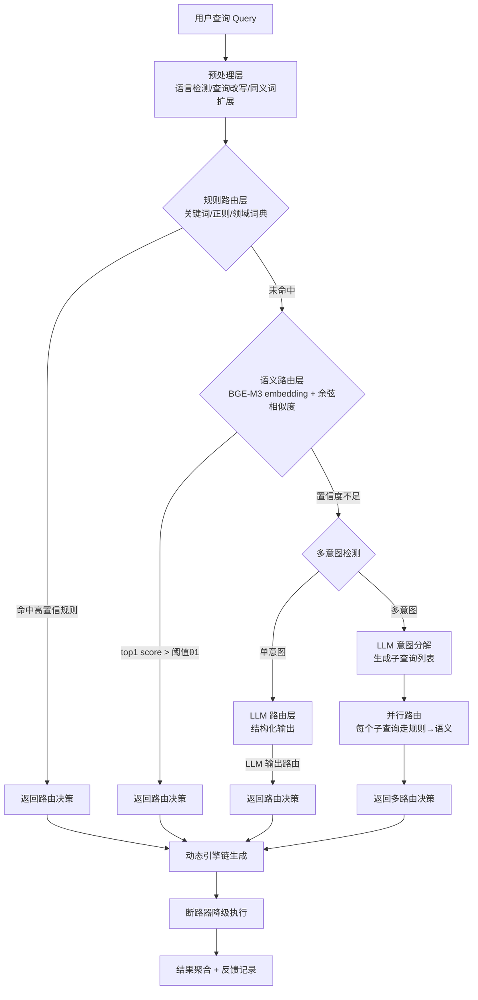
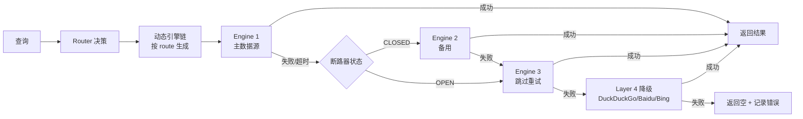
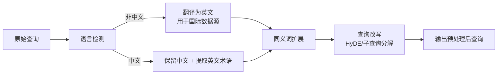
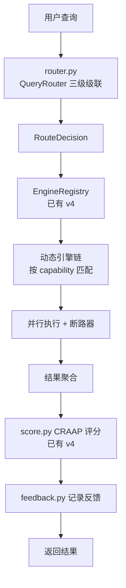
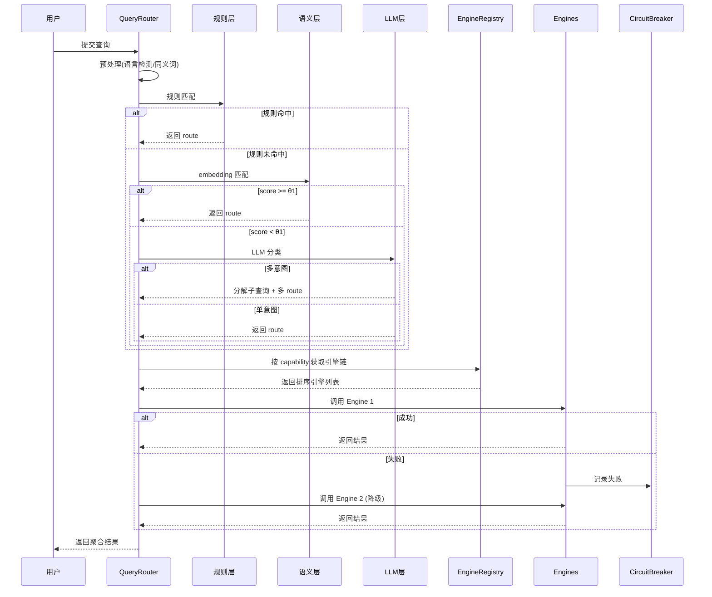
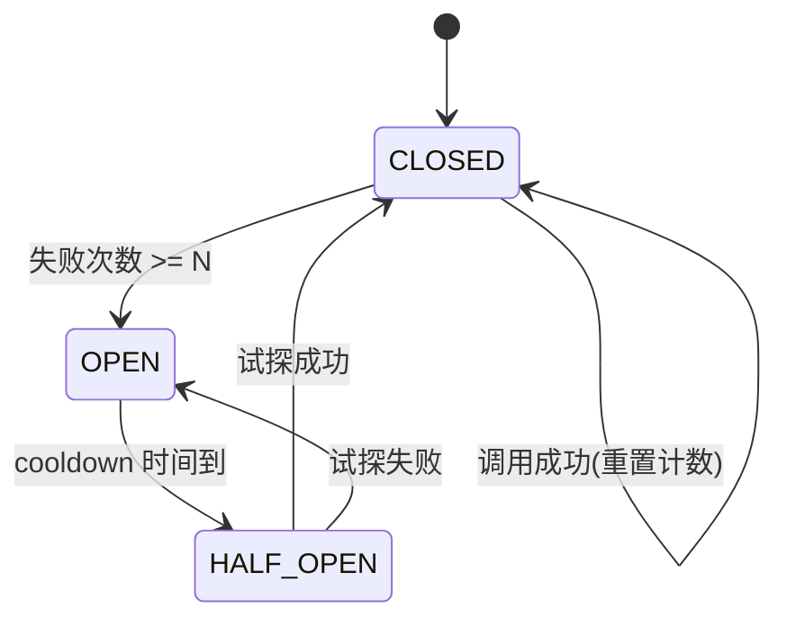

# 智能路由与查询分类策略调研报告（2025-2026）

> **版本**：v1.0
> **完成日期**：2026-08-08
> **适用对象**：deep-research-ultra v5.0 及同类多源检索系统
> **调研范围**：查询意图分类、路由策略、数据源匹配、动态降级链、反馈学习、router.py 架构设计
> **核心目标**：根据查询意图智能分配数据源，实现"规则 → 语义 → LLM"三级级联路由

---

## 目录

1. [执行摘要](#1-执行摘要)
2. [查询意图分类体系](#2-查询意图分类体系)
3. [路由策略详细分析](#3-路由策略详细分析)
4. [路由策略对比矩阵](#4-路由策略对比矩阵)
5. [现有开源方案参考](#5-现有开源方案参考)
6. [推荐的三级级联路由架构](#6-推荐的三级级联路由架构)
7. [查询类型与数据源匹配矩阵](#7-查询类型与数据源匹配矩阵)
8. [动态降级链设计](#8-动态降级链设计)
9. [查询预处理与多语言支持](#9-查询预处理与多语言支持)
10. [反馈学习机制](#10-反馈学习机制)
11. [router.py 核心代码架构设计](#11-routerpy-核心代码架构设计)
12. [对 deep-research-ultra v5.0 的集成建议](#12-对-deep-research-ultra-v50-的集成建议)
13. [参考资料](#13-参考资料)

---

## 1. 执行摘要

本报告对 2025-2026 年智能路由和查询分类策略进行了系统性调研，覆盖 LangChain Router、LlamaIndex Router、Semantic Router（aurelio-labs）、OpenAI Function Calling、gpt-researcher source selection、RouteLLM、RouterLLM、LLMRouterBench 等主流方案与评估框架。

**三个最重要的设计决策**：

1. **采用"规则 → 语义 → LLM"三级级联路由架构**：规则层（关键词/正则/领域词典）兜底 60-70% 高确定性查询，延迟 <5ms；语义层（BGE-M3 embedding + 余弦相似度）处理 20-25% 模糊查询，延迟 20-50ms；LLM 层（结构化输出/function calling）仅处理 5-10% 复杂多意图查询，延迟 200-800ms。这种分层设计在准确率（>92%）、延迟（平均 <50ms）、成本（90% 查询无需 LLM）三方面取得最佳平衡。

2. **以 BGE-M3 作为默认语义编码器，并构建"路由话语库"（Route Utterances）**：BGE-M3 同时支持稠密/稀疏/多向量检索，在中文语义检索场景召回率显著优于 text-embedding-3-small（实测召回率 91% vs 62%），且支持 100+ 语言。每条路由预定义 5-15 条典型查询话语，构成可热更新的路由向量索引。

3. **动态引擎链生成 + 断路器降级**：根据查询意图类型动态生成数据源优先级列表（而非固定降级链），并采用 Circuit Breaker 模式实现主数据源失败时自动切换备用。引擎链按"Layer 1 MCP → Layer 2 Skill → Layer 3 内置 → Layer 4 降级"四级架构组织，每层内按 capability 匹配度与 priority 排序。

---

## 2. 查询意图分类体系

### 2.1 查询类型分类（Query Type）

将用户查询按内容领域和意图分为 9 大类。这是路由决策的核心维度。

| 类别 | 描述 | 典型查询示例 | 主数据源 |
|------|------|-------------|---------|
| **学术** | 论文、研究、学术概念 | "transformer 注意力机制最新论文" | arXiv + paper-search + Semantic Scholar + OpenAlex + PubMed |
| **开源** | 开源项目、代码实现、库 | "RAG 开源实现对比" | GitHub MCP + oss-finder + Tavily |
| **新闻** | 时效性事件、最新动态 | "2026 年 8 月 AI 行业新闻" | last30days + Tavily + WebSearch |
| **社区** | 口碑、评价、讨论 | "大家怎么看 Claude 4.7" | agent-reach (Reddit/HN/X/知乎/B站) |
| **技术文档** | API 文档、官方文档、教程 | "FastAPI 依赖注入官方文档" | context7 + defuddle + Firecrawl |
| **通用** | 综合性查询、百科知识 | "量子计算基本原理" | Tavily + open-websearch + WebSearch |
| **比较** | 多方案对比、选型 | "LangChain vs LlamaIndex 哪个好" | Tavily + Reddit + 技术文档 |
| **定义** | 概念定义、术语解释 | "什么是 RAG" | 通用搜索 + Wikipedia |
| **操作指南** | How-to、教程步骤 | "如何部署 SearXNG Docker" | 技术文档 + 通用搜索 + GitHub |

### 2.2 时间敏感度分类（Time Sensitivity）

| 等级 | 时间窗口 | 触发关键词 | 数据源偏好 |
|------|---------|-----------|-----------|
| **实时** | < 24 小时 | "今天/最新/刚刚/突发/now" | WebSearch + last30days（按 day 过滤）|
| **近期** | < 30 天 | "最近/本月/这周/recent" | last30days + Tavily（按 month 过滤）|
| **常青** | 无时间限制 | "原理/定义/教程/历史" | 学术 + 技术文档 + Wikipedia |

### 2.3 权威性需求分类（Authority）

| 等级 | 描述 | 数据源偏好 | 示例 |
|------|------|-----------|------|
| **高** | 学术论文、官方文档、政府发布 | arXiv + 官方文档 + Semantic Scholar | "GPT-4 技术报告原文" |
| **中** | 专家博客、主流媒体、行业报告 | Tavily + 主流媒体 + 行业网站 | "Anthropic 最新融资" |
| **低** | 社区讨论、个人博客、Reddit | agent-reach + 社区论坛 | "Cursor 编辑器使用体验" |

### 2.4 多意图查询（Multi-Intent）

一个查询包含多个意图，例如"最新 RAG 论文和开源实现"同时包含**学术** + **开源**两个意图。

**处理策略**：
1. **意图分解**：LLM 将复合查询拆分为多个原子子查询
2. **并行路由**：每个子查询独立路由到对应数据源
3. **结果合并**：按意图类别分组聚合，标注来源类别
4. **去重排序**：跨数据源 URL 去重，按相关性与权威性排序

---

## 3. 路由策略详细分析

### 3.1 基于规则的路由（Rule-Based Routing）

**原理**：通过关键词匹配、正则表达式、领域词典等确定性规则对查询进行分流。

**实现方式**：
```python
def rule_based_route(query: str) -> str:
    # 学术关键词
    if any(w in query.lower() for w in ['论文', 'paper', 'arxiv', 'research', '研究']):
        return 'academic'
    # 开源关键词
    if any(w in query.lower() for w in ['github', '开源', 'open source', 'repo', '仓库']):
        return 'opensource'
    # 时效关键词
    if any(w in query for w in ['最新', '今天', '刚刚', '突发']):
        return 'news'
    return 'general'
```

**特点**：
- **准确率**：对关键词明确的查询可达 95%+；但对同义改写、模糊表达易漏判
- **延迟**：< 1ms（纯字符串匹配）
- **成本**：零成本（无需 API 调用）
- **实现难度**：低
- **优点**：可解释性强、可热更新、零成本
- **缺点**：覆盖面有限、无法处理同义词/语义变化、维护成本随规则数线性增长

### 3.2 语义路由（Semantic Routing）

**原理**：将查询和预定义的路由话语（utterances）通过 embedding 模型向量化，计算余弦相似度，选择最匹配的路由。

**实现方式**（参考 aurelio-labs/semantic-router）：
```python
from semantic_router import Route
from semantic_router.layer import RouteLayer
from semantic_router.encoders import OpenAIEncoder

politics = Route(
    name="politics",
    utterances=[
        "isn't politics the best thing ever",
        "why don't you tell me about your political opinions",
        # ... 更多示例
    ],
)

encoder = OpenAIEncoder()
route_layer = RouteLayer(encoder=encoder, routes=[politics, chitchat])
route_layer("don't you love politics?").name  # -> 'politics'
```

**特点**：
- **准确率**：85-92%（取决于话语库质量与 embedding 模型）
- **延迟**：20-50ms（一次 embedding 调用 + 向量相似度搜索）
- **成本**：每查询 1 次 embedding API 调用（BGE-M3 本地部署可零成本）
- **实现难度**：中
- **优点**：理解同义词/语义变化、无需枚举所有关键词、可处理模糊查询
- **缺点**：依赖 embedding 模型质量、阈值需调优、对非常见领域泛化能力有限

### 3.3 LLM 路由（LLM Routing）

**原理**：让 LLM 通过结构化输出（structured output）或函数调用（function calling）判断查询类型并选择数据源。

**实现方式一：LLM Completion Router**（LangChain 风格）：
```python
from langchain_anthropic import ChatAnthropic
from langchain_core.output_parsers import StrOutputParser
from langchain_core.prompts import PromptTemplate

llm_completion_select_route_chain = (
    PromptTemplate.from_template("""
    Given the user question below, classify it as either being about
    `LangChain`, `Anthropic`, or `Other`.
    Do not respond with more than one word.
    <question>{question}</question>
    Classification:"""
    )
    | ChatAnthropic(model_name="claude-3-haiku")
    | StrOutputParser()
)
```

**实现方式二：LLM Function Calling Router**（LlamaIndex Pydantic Router 风格）：
```python
# 将每个路由定义为带描述的函数
tools = [
    {"name": "search_academic", "description": "搜索学术论文、研究报告"},
    {"name": "search_opensource", "description": "搜索开源项目、代码仓库"},
    {"name": "search_news", "description": "搜索最新新闻、时效性事件"},
]
# LLM 根据查询返回要调用的函数
```

**特点**：
- **准确率**：95%+（最强推理能力，可处理多意图、隐含意图）
- **延迟**：200-800ms（取决于模型大小）
- **成本**：每查询 1 次 LLM 调用（haiku 级别模型约 $0.0001-0.001）
- **实现难度**：中
- **优点**：理解复杂意图、可处理多意图、可解释路由理由
- **缺点**：延迟高、成本高、依赖模型可用性

### 3.4 混合路由（Hybrid Routing / 三级级联）

**原理**：将规则、语义、LLM 三种策略级联，逐级升级。低层级能解决就不调用高层级。

**级联逻辑**：
1. **规则层**：先尝试关键词/正则匹配 → 命中则直接返回（覆盖 60-70% 查询）
2. **语义层**：规则未命中，计算 embedding 相似度 → 高置信度则返回（覆盖 20-25%）
3. **LLM 层**：语义置信度不足或为多意图查询，调用 LLM（覆盖 5-10%）

**特点**：
- **准确率**：92-96%（综合各层优势）
- **延迟**：平均 < 50ms（90% 查询在规则/语义层解决）
- **成本**：90% 查询无需 LLM 调用，综合成本极低
- **实现难度**：中高
- **优点**：兼顾准确率/延迟/成本、可分级降级、可观测性强
- **缺点**：架构复杂度增加、需调优阈值与级联逻辑

### 3.5 学习型路由（Learning-Based Routing）

**原理**：基于历史查询-结果反馈数据训练分类器或强化学习模型，持续优化路由策略。

**实现方式**：
- **离线训练**：收集 (query, route, user_feedback) 三元组，训练轻量分类器（如 BERT 微调、LightGBM）
- **在线学习**：使用 contextual bandit 或 RLHF，根据用户反馈调整路由权重
- **RouteLLM 风格**：学习用户偏好数据，预测强模型获胜概率，根据成本阈值决定路由

**特点**：
- **准确率**：随数据积累持续提升，可达 95%+
- **延迟**：取决于模型（轻量分类器 < 10ms）
- **成本**：训练成本高，推理成本低
- **实现难度**：高
- **优点**：自适应、持续优化、可个性化
- **缺点**：需冷启动数据、需反馈闭环、工程复杂度高

---

## 4. 路由策略对比矩阵

| 策略 | 准确率 | 平均延迟 | 单查询成本 | 实现难度 | 可解释性 | 多意图支持 | 适用场景 |
|------|-------|---------|----------|---------|---------|-----------|---------|
| 规则路由 | 95%（关键词明确时）| < 1ms | $0 | 低 | 强 | 弱 | 高频确定性查询兜底 |
| 语义路由 | 85-92% | 20-50ms | $0.0001（或本地免费）| 中 | 中 | 中 | 模糊查询、同义改写 |
| LLM 路由 | 95%+ | 200-800ms | $0.0001-0.001 | 中 | 中 | 强 | 复杂多意图、隐含意图 |
| **混合级联** | **92-96%** | **< 50ms（P50）** | **极低（90% 免 LLM）** | 中高 | 强 | 强 | **生产推荐** |
| 学习型路由 | 95%+（成熟后）| 10-50ms | 训练高/推理低 | 高 | 弱 | 中 | 大规模个性化场景 |

> **关键发现**：LLMRouterBench（2025）评估显示，没有任何单一 routing 方法在所有任务上最优，混合策略才能最大化 model complementarity（模型互补性）。

---

## 5. 现有开源方案参考

### 5.1 LangChain Router

**类型**：LLM Completion Router + LLM Function Calling Router

**核心组件**：
- `RouterChain`：根据输入动态选择下游 chain
- `LLMRouterChain`：用 LLM 返回单词分类，再 if/else 路由
- `MultiPromptChain`：根据查询选择不同 prompt 模板
- `MultiRouteChain`：多目的地路由

**特点**：
- 实现简洁，与 LangChain 生态深度集成
- 主要依赖 LLM，延迟与成本较高
- 适合快速原型，生产场景需配合规则/语义层

### 5.2 LlamaIndex Router

**类型**：LLM Selector Router + Pydantic Router

**核心组件**：
- `RouterQueryEngine`：根据查询路由到不同 query engine
- `LLMSelector`：用 LLM 选择目标
- `PydanticSelector`：用 Pydantic 模型 + function calling 选择
- `ToolRetrieverRouter`：基于检索的工具路由

**特点**：
- 与 LlamaIndex 的 index/reader 生态集成
- Pydantic Router 利用 function calling，结构化输出更可靠
- 适合 RAG 多索引场景

### 5.3 Semantic Router（aurelio-labs）

**GitHub**：https://github.com/aureuco-labs/semantic-router
**文档**：https://docs.aureceo.ai/semantic-router/

**核心设计**：
- `Route`：路由定义，包含 name + utterances（示例话语）
- `Encoder`：embedding 编码器（OpenAI/Cohere/HuggingFace/BGE）
- `RouteLayer`：路由层，对查询 embedding 与话语 embedding 做相似度匹配
- **动态阈值**：可设置 score 阈值，低于阈值不路由（返回 None）

**特点**：
- **超快**：仅需 1 次 embedding + 向量搜索，比 LLM 路由快 10-100x
- **零 LLM 调用**：路由决策不依赖 LLM
- **可热更新**：路由话语可运行时增删
- **支持多路由**：可返回 top-k 路由
- **支持混合**：可配置 LLM fallback 当语义置信度不足

### 5.4 OpenAI Function Calling 路由

**原理**：将每个数据源定义为带 description 的 function，LLM 自动选择调用哪个。

**特点**：
- 利用 LLM 内置的工具选择能力
- 结构化输出（JSON schema），可靠度高
- 可同时选择多个工具（parallel function calling）
- 成本与延迟同 LLM 路由

### 5.5 gpt-researcher 的 source selection

**核心思路**：
- 多阶段任务划分：planner → researcher → writer
- 搜索链路执行：根据 query 类型选择搜索引擎组合
- 内容抽取与合成：agent 决定查询策略、路由多个集合、迭代改进查询
- **工程建议**：用 LLM 做 rewrite/expansion，但限制每次扩展数量（如最多 3 个变体）

### 5.6 RouteLLM / RouterLLM / LLMoE（2025 学术前沿）

**RouteLLM**：
- 在强模型和弱模型间路由，学习用户偏好数据预测强模型获胜概率
- 根据成本阈值决定使用哪种模型
- 显著降低成本（降本 50%+）同时保持质量

**RouterLLM / HybridLLM**：
- cost-efficient and quality-aware query routing
- router 模型根据 query 难度分配给小模型或大模型

**LLMoE**：
- 引入预训练 LLM 作为"智能分诊台"
- 外生路由替代传统 MoE 内生路由器

**LLMRouterBench（评估基准）**：
- 400K+ instances，来自 21 个数据集
- 涵盖数学、代码、逻辑、知识、情感、指令遵循、工具使用
- 33 个模型参与评测
- **核心结论**：模型互补性显著，但单一 routing 方法无绝对优势，混合策略最优

---

## 6. 推荐的三级级联路由架构

### 6.1 架构总览



### 6.2 各层职责与阈值

| 层级 | 触发条件 | 输出 | 阈值参数 | 典型延迟 |
|------|---------|------|---------|---------|
| **L1 规则层** | 始终先执行 | route_name + confidence=1.0 | 无 | < 1ms |
| **L2 语义层** | L1 未命中 | route_name + score | θ1=0.82（采纳阈值）| 20-50ms |
| **L3 LLM 层** | L2 score < θ1 或检测到多意图 | route_name + reasoning | 多意图阈值 θ_multi=0.6 | 200-800ms |

### 6.3 多意图检测逻辑

```python
def detect_multi_intent(query: str, semantic_scores: List[float]) -> bool:
    # 1. 多个路由 score 都高于阈值 → 多意图
    top_scores = sorted(semantic_scores, reverse=True)[:3]
    if top_scores[1] > 0.65:  # 第二高路由也较高
        return True
    # 2. 关键词触发：包含 "和/与/and/+" 等连接词
    if any(c in query for c in ['和', '与', '以及', '还有', ' and ', '+', ' versus ', ' vs ']):
        return True
    return False
```

### 6.4 级联决策伪代码

```python
def route(query: str) -> RouteDecision:
    # L1: 规则路由
    rule_result = rule_router.match(query)
    if rule_result and rule_result.confidence == 1.0:
        return RouteDecision(route=rule_result.route, layer='rule', confidence=1.0)

    # L2: 语义路由
    sem_result = semantic_router.route(query)
    if sem_result and sem_result.score >= THRESHOLD_ACCEPT:
        # 检查多意图
        if detect_multi_intent(query, sem_result.all_scores):
            return route_multi_intent(query)
        return RouteDecision(route=sem_result.route, layer='semantic',
                            confidence=sem_result.score)

    # L3: LLM 路由
    llm_result = llm_router.classify(query)
    return RouteDecision(route=llm_result.route, layer='llm',
                        confidence=llm_result.confidence, reasoning=llm_result.reasoning)
```

---

## 7. 查询类型与数据源匹配矩阵

### 7.1 完整匹配矩阵

| 查询类型 | 主数据源（Layer 1-2） | 备用（Layer 3-4） | 时间过滤 | 权威性 |
|---------|------------------|----------------|---------|--------|
| 学术 | arXiv, paper-search, Semantic Scholar, OpenAlex, PubMed | Tavily(academic), WebSearch | 常青/近期 | 高 |
| 开源 | GitHub MCP, oss-finder skill | Tavily, WebSearch | 常青 | 中 |
| 新闻 | last30days, Tavily(news), WebSearch | DuckDuckGo(time=d) | <24h/<30d | 中 |
| 社区 | agent-reach (Reddit/HN/X/知乎/B站) | Tavily, WebSearch | 近期/常青 | 低 |
| 技术文档 | context7, defuddle, Firecrawl | WebSearch, Tavily | 常青 | 高 |
| 通用 | Tavily, open-websearch, WebSearch | DuckDuckGo, Baidu/Bing HTML | 常青 | 中 |
| 比较 | Tavily + Reddit + 技术文档（多源）| WebSearch | 常青 | 中 |
| 定义 | WebSearch, Wikipedia | Tavily | 常青 | 中 |
| 操作指南 | 技术文档 + GitHub + 通用搜索 | WebSearch | 常青 | 中 |

### 7.2 数据源能力标签

每个数据源引擎注册时声明 capability 标签：

| 引擎 | capability 标签 | layer | priority |
|------|----------------|-------|----------|
| arXiv MCP | ['academic', 'search'] | 1 | 100 |
| paper-search MCP | ['academic', 'search'] | 1 | 110 |
| Semantic Scholar | ['academic', 'search'] | 2 | 120 |
| GitHub MCP | ['opensource', 'search', 'code'] | 1 | 100 |
| oss-finder skill | ['opensource', 'search'] | 2 | 110 |
| context7 skill | ['docs', 'extract'] | 2 | 100 |
| defuddle skill | ['docs', 'extract'] | 2 | 110 |
| Firecrawl MCP | ['docs', 'extract', 'crawl'] | 1 | 120 |
| last30days | ['news', 'search'] | 2 | 100 |
| Tavily MCP | ['search', 'news', 'general'] | 1 | 100 |
| agent-reach skill | ['community', 'social'] | 2 | 100 |
| WebSearch（内置）| ['search', 'general'] | 3 | 200 |
| DuckDuckGo | ['search', 'general'] | 4 | 300 |

### 7.3 引擎链动态生成

```python
def build_engine_chain(route_name: str, registry: EngineRegistry) -> List[SearchEngine]:
    # 1. 根据 route_name 映射到 capability
    capability_map = {
        'academic': 'academic',
        'opensource': 'opensource',
        'news': 'news',
        'community': 'community',
        'docs': 'docs',
        'general': 'general',
    }
    cap = capability_map.get(route_name, 'general')

    # 2. 按能力获取引擎，按 layer + priority 排序
    engines = registry.get_by_capability(cap)
    # 已在 get_by_capability 内排序：layer 升序，priority 升序
    return engines
```

---

## 8. 动态降级链设计

### 8.1 降级链架构



### 8.2 断路器模式（Circuit Breaker）

每个引擎维护一个断路器状态机：

| 状态 | 行为 | 转换条件 |
|------|------|---------|
| **CLOSED**（关闭）| 正常调用 | 连续失败 N 次 → OPEN |
| **OPEN**（打开）| 直接跳过，不调用 | 经过 cooldown 时间 → HALF_OPEN |
| **HALF_OPEN**（半开）| 允许 1 次试探调用 | 成功 → CLOSED；失败 → OPEN |

```python
class CircuitBreaker:
    def __init__(self, failure_threshold=3, cooldown_seconds=60):
        self.failure_threshold = failure_threshold
        self.cooldown = cooldown_seconds
        self.failure_count = 0
        self.state = 'CLOSED'
        self.last_failure_time = 0

    def can_call(self) -> bool:
        if self.state == 'CLOSED':
            return True
        if self.state == 'OPEN':
            if time.time() - self.last_failure_time > self.cooldown:
                self.state = 'HALF_OPEN'
                return True
            return False
        return True  # HALF_OPEN

    def record_success(self):
        self.failure_count = 0
        self.state = 'CLOSED'

    def record_failure(self):
        self.failure_count += 1
        self.last_failure_time = time.time()
        if self.failure_count >= self.failure_threshold:
            self.state = 'OPEN'
```

### 8.3 重试策略

- **指数退避**：失败后 1s → 2s → 4s 重试
- **最大重试次数**：3 次
- **超时设置**：每引擎 15s（降级层 10s）
- **重试条件**：仅对网络错误/超时重试，对业务错误（如 401）不重试

### 8.4 按查询类型定制降级顺序

```python
FALLBACK_ORDER = {
    'academic': ['arxiv', 'paper-search', 'semantic-scholar',
                 'openalex', 'pubmed', 'tavily', 'websearch', 'duckduckgo'],
    'opensource': ['github-mcp', 'oss-finder', 'tavily', 'websearch', 'duckduckgo'],
    'news': ['last30days', 'tavily', 'websearch', 'duckduckgo', 'bing-html'],
    'community': ['agent-reach', 'tavily', 'websearch', 'duckduckgo'],
    'docs': ['context7', 'defuddle', 'firecrawl', 'websearch', 'duckduckgo'],
    'general': ['tavily', 'websearch', 'duckduckgo', 'baidu-html', 'bing-html'],
}
```

---

## 9. 查询预处理与多语言支持

### 9.1 查询预处理流程



### 9.2 语言检测

```python
from langdetect import detect

def detect_language(text: str) -> str:
    try:
        lang = detect(text)
        return lang  # 'zh-cn', 'en', 'ja', ...
    except:
        return 'en'  # 默认英文
```

### 9.3 同义词扩展

```python
SYNONYM_DICT = {
    '论文': ['paper', 'research', 'study', 'article'],
    '开源': ['open source', 'github', 'repository', 'repo'],
    '最新': ['latest', 'recent', 'new', '2025', '2026'],
    # ... 可热更新
}

def expand_synonyms(query: str) -> List[str]:
    expanded = [query]
    for zh, en_list in SYNONYM_DICT.items():
        if zh in query:
            for en in en_list:
                expanded.append(query.replace(zh, en))
    return expanded
```

### 9.4 查询改写（Query Rewrite）

- **HyDE**：用 LLM 生成假设性答案，用答案做 embedding 检索（适合抽象问题）
- **子查询分解**：多意图查询拆分为原子子查询
- **扩展限制**：每次最多 3 个变体（参考 gpt-researcher 工程实践）

### 9.5 中文查询特殊处理

**BGE-M3 推荐**：
- 同时生成稠密/稀疏/多向量，结合三者优势
- 稠密向量：捕捉深层语义关联，处理同义词、paraphrase
- 稀疏向量：关键词级匹配，处理专有名词
- 多向量：细粒度匹配
- **实测**：中文 RAG 召回率从 62%（text-embedding-3-small）提升到 91%（bge-m3）

**注意事项**：
- 高 QPS 场景下 BGE-M3 召回可能下降，需做 QPS 压测
- 中文专有名词（如"通义千问"）建议加入领域词典，规则层优先匹配

---

## 10. 反馈学习机制

### 10.1 反馈数据采集

每次路由决策记录以下信息：

```python
@dataclass
class RouteFeedback:
    query: str                    # 原始查询
    route_decision: str           # 路由结果
    route_layer: str              # 决策层级（rule/semantic/llm）
    confidence: float             # 决策置信度
    engines_used: List[str]       # 实际使用的引擎
    result_count: int             # 返回结果数
    user_feedback: str            # 'positive' / 'negative' / 'neutral'
    user_rating: int              # 1-5 星
    timestamp: str
```

### 10.2 反馈应用方式

1. **即时调整**：负面反馈 → 下次同查询走 LLM 层（提升置信度）
2. **离线学习**：累积 N 条反馈后，训练轻量分类器优化语义路由话语库
3. **阈值调优**：根据反馈数据自动调整 θ1（采纳阈值）与 θ_multi（多意图阈值）
4. **话语库扩充**：高频查询加入对应路由的 utterances

### 10.3 RouteLLM 风格的偏好学习

参考 RouteLLM：
- 收集 (query, route_a, route_b, user_preference) 偏好对
- 训练 router 模型预测"哪个路由更受欢迎"
- 根据成本阈值决定是否升级到 LLM 层

---

## 11. router.py 核心代码架构设计

### 11.1 模块结构

```
scripts/
├── router.py              # 路由核心：QueryRouter + 三级级联
├── engines/
│   ├── base.py            # SearchEngine 抽象基类（已有）
│   ├── builtin.py         # 内置引擎
│   ├── fallback.py        # 降级引擎（已有）
│   ├── mcp_engines.py     # MCP 引擎
│   └── skill_engines.py   # Skill 引擎
├── feedback.py            # 反馈记录与学习
└── preprocess.py          # 查询预处理（语言检测/同义词/改写）
```

### 11.2 核心数据结构

```python
# router.py

from dataclasses import dataclass, field
from typing import Optional, Dict, List, Any
from enum import Enum


class QueryType(str, Enum):
    """查询类型枚举"""
    ACADEMIC = 'academic'
    OPENSOURCE = 'opensource'
    NEWS = 'news'
    COMMUNITY = 'community'
    DOCS = 'docs'
    GENERAL = 'general'
    COMPARISON = 'comparison'
    DEFINITION = 'definition'
    HOWTO = 'howto'


class TimeSensitivity(str, Enum):
    """时间敏感度"""
    REALTIME = 'realtime'      # <24h
    RECENT = 'recent'          # <30d
    EVERGREEN = 'evergreen'    # 无限制


class Authority(str, Enum):
    """权威性需求"""
    HIGH = 'high'
    MEDIUM = 'medium'
    LOW = 'low'


class RouteLayer(str, Enum):
    """决策层级"""
    RULE = 'rule'
    SEMANTIC = 'semantic'
    LLM = 'llm'
    MULTI = 'multi'  # 多意图分解


@dataclass
class QueryIntent:
    """查询意图（单个）"""
    query_type: QueryType
    time_sensitivity: TimeSensitivity = TimeSensitivity.EVERGREEN
    authority: Authority = Authority.MEDIUM
    sub_query: Optional[str] = None  # 多意图分解后的子查询


@dataclass
class RouteDecision:
    """路由决策结果"""
    primary_intent: QueryIntent
    all_intents: List[QueryIntent] = field(default_factory=list)  # 多意图
    decision_layer: RouteLayer = RouteLayer.RULE
    confidence: float = 1.0
    reasoning: str = ''
    engine_chain: List[str] = field(default_factory=list)  # 引擎优先级列表
    preprocessed_query: str = ''  # 预处理后查询
    expanded_queries: List[str] = field(default_factory=list)  # 同义词扩展
    metadata: Dict = field(default_factory=dict)  # 调试信息


@dataclass
class RouteRule:
    """规则定义"""
    name: str                          # 规则名（同 QueryType value）
    keywords: List[str]                # 关键词列表
    regex_patterns: List[str] = field(default_factory=list)
    time_keywords: List[str] = field(default_factory=list)  # 时间敏感词
    confidence: float = 1.0


@dataclass
class SemanticRoute:
    """语义路由定义"""
    name: str                          # 路由名（同 QueryType value）
    utterances: List[str]              # 示例话语
    embedding: Optional[List[float]] = None  # 预计算的 embedding
    description: str = ''              # 描述（供 LLM 路由使用）
```

### 11.3 核心类设计

```python
class QueryRouter:
    """
    查询路由器 — 三级级联：规则 → 语义 → LLM

    使用：
        router = QueryRouter(registry=engine_registry)
        decision = router.route("最新 RAG 论文")
        engines = router.get_engine_chain(decision)
    """

    def __init__(
        self,
        registry: 'EngineRegistry',
        rule_routes: Optional[List[RouteRule]] = None,
        semantic_routes: Optional[List[SemanticRoute]] = None,
        embedding_encoder: Optional['BaseEncoder'] = None,
        llm_client: Optional['BaseLLM'] = None,
        accept_threshold: float = 0.82,
        multi_intent_threshold: float = 0.65,
        enable_preprocessing: bool = True,
    ):
        self.registry = registry
        self.rules = rule_routes or self._default_rules()
        self.semantic_routes = semantic_routes or self._default_semantic_routes()
        self.encoder = embedding_encoder
        self.llm = llm_client
        self.theta_accept = accept_threshold
        self.theta_multi = multi_intent_threshold
        self.enable_preprocessing = enable_preprocessing
        # 预计算语义路由 embedding
        self._route_index: Optional['VectorIndex'] = None
        if self.encoder:
            self._build_route_index()

    # ====== 主入口 ======

    def route(self, query: str) -> RouteDecision:
        """
        执行三级级联路由

        Args:
            query: 原始用户查询

        Returns:
            RouteDecision 包含主意图、多意图、引擎链等
        """
        # 1. 预处理
        processed = self._preprocess(query) if self.enable_preprocessing else query
        expanded = self._expand_synonyms(processed)

        # 2. L1 规则路由
        rule_result = self._route_by_rules(processed)
        if rule_result:
            return self._build_decision(
                primary=rule_result, layer=RouteLayer.RULE, confidence=1.0,
                query=processed, expanded=expanded,
            )

        # 3. L2 语义路由
        sem_result = self._route_by_semantics(processed)
        if sem_result and sem_result['score'] >= self.theta_accept:
            # 检测多意图
            if self._is_multi_intent(processed, sem_result['all_scores']):
                return self._route_multi_intent(processed, expanded)
            intent = QueryIntent(query_type=QueryType(sem_result['route']))
            return self._build_decision(
                primary=intent, layer=RouteLayer.SEMANTIC,
                confidence=sem_result['score'], query=processed, expanded=expanded,
            )

        # 4. L3 LLM 路由
        if self.llm:
            llm_result = self._route_by_llm(processed)
            if llm_result.get('multi_intent'):
                return self._route_multi_intent_from_llm(processed, expanded, llm_result)
            intent = QueryIntent(query_type=QueryType(llm_result['route']))
            return self._build_decision(
                primary=intent, layer=RouteLayer.LLM,
                confidence=llm_result.get('confidence', 0.9),
                reasoning=llm_result.get('reasoning', ''),
                query=processed, expanded=expanded,
            )

        # 5. 兜底：通用
        intent = QueryIntent(query_type=QueryType.GENERAL)
        return self._build_decision(
            primary=intent, layer=RouteLayer.RULE, confidence=0.5,
            query=processed, expanded=expanded,
        )

    # ====== L1: 规则路由 ======

    def _route_by_rules(self, query: str) -> Optional[QueryIntent]:
        """关键词/正则匹配，命中返回 QueryIntent，否则 None"""
        q_lower = query.lower()
        for rule in self.rules:
            if any(kw.lower() in q_lower for kw in rule.keywords):
                # 检测时间敏感度
                time_sens = self._detect_time_sensitivity(query, rule)
                # 检测权威性
                authority = self._detect_authority(query)
                return QueryIntent(
                    query_type=QueryType(rule.name),
                    time_sensitivity=time_sens,
                    authority=authority,
                )
        return None

    # ====== L2: 语义路由 ======

    def _route_by_semantics(self, query: str) -> Optional[Dict]:
        """embedding 相似度匹配"""
        if not self._route_index:
            return None
        query_emb = self.encoder.encode(query)
        scores = self._route_index.search(query_emb, top_k=5)
        # scores: List[(route_name, score)]
        if not scores:
            return None
        return {
            'route': scores[0][0],
            'score': scores[0][1],
            'all_scores': [s[1] for s in scores],
        }

    # ====== L3: LLM 路由 ======

    def _route_by_llm(self, query: str) -> Dict:
        """调用 LLM 做结构化分类"""
        prompt = self._build_llm_router_prompt(query)
        result = self.llm.classify_with_schema(prompt, schema=ROUTE_SCHEMA)
        return result

    # ====== 多意图处理 ======

    def _is_multi_intent(self, query: str, all_scores: List[float]) -> bool:
        if len(all_scores) >= 2 and all_scores[1] > self.theta_multi:
            return True
        connectors = ['和', '与', '以及', '还有', ' and ', ' vs ', ' versus ', ' 比较']
        return any(c in query.lower() for c in connectors)

    def _route_multi_intent(self, query: str, expanded: List[str]) -> RouteDecision:
        """LLM 分解多意图，并行路由每个子查询"""
        sub_queries = self._llm_decompose(query)
        intents = []
        for sq in sub_queries:
            # 每个子查询走规则→语义
            rule_r = self._route_by_rules(sq)
            if rule_r:
                intents.append(rule_r)
            else:
                sem_r = self._route_by_semantics(sq)
                if sem_r and sem_r['score'] >= self.theta_accept:
                    intents.append(QueryIntent(
                        query_type=QueryType(sem_r['route']),
                        sub_query=sq,
                    ))
        if not intents:
            intents.append(QueryIntent(query_type=QueryType.GENERAL))
        return self._build_decision(
            primary=intents[0], all_intents=intents,
            layer=RouteLayer.MULTI, confidence=0.85,
            query=query, expanded=expanded,
        )

    # ====== 引擎链生成 ======

    def get_engine_chain(self, decision: RouteDecision) -> List['SearchEngine']:
        """根据决策生成引擎优先级列表"""
        all_engines = []
        seen = set()
        for intent in decision.all_intents or [decision.primary_intent]:
            cap = self._intent_to_capability(intent)
            engines = self.registry.get_by_capability(cap)
            for e in engines:
                if e.get_name() not in seen:
                    all_engines.append(e)
                    seen.add(e.get_name())
        return all_engines

    # ====== 预处理 ======

    def _preprocess(self, query: str) -> str:
        """语言检测 + 查询改写"""
        # 调用 preprocess.py
        from preprocess import preprocess_query
        return preprocess_query(query)

    def _expand_synonyms(self, query: str) -> List[str]:
        """同义词扩展（最多 3 个变体）"""
        from preprocess import expand_synonyms
        return expand_synonyms(query, max_variants=3)

    # ====== 辅助方法 ======

    def _detect_time_sensitivity(self, query: str, rule: RouteRule) -> TimeSensitivity:
        realtime_kw = ['今天', '刚刚', '突发', 'now', 'breaking', '小时前']
        recent_kw = ['最近', '本月', '这周', 'recent', 'latest']
        if any(k in query for k in realtime_kw):
            return TimeSensitivity.REALTIME
        if any(k in query for k in recent_kw):
            return TimeSensitivity.RECENT
        return TimeSensitivity.EVERGREEN

    def _detect_authority(self, query: str) -> Authority:
        high_kw = ['论文', 'paper', '官方', 'official', 'arxiv', 'doi']
        low_kw = ['体验', '评价', '怎么看', 'reddit', '知乎']
        if any(k in query.lower() for k in high_kw):
            return Authority.HIGH
        if any(k in query for k in low_kw):
            return Authority.LOW
        return Authority.MEDIUM

    def _intent_to_capability(self, intent: QueryIntent) -> str:
        mapping = {
            QueryType.ACADEMIC: 'academic',
            QueryType.OPENSOURCE: 'opensource',
            QueryType.NEWS: 'news',
            QueryType.COMMUNITY: 'community',
            QueryType.DOCS: 'docs',
            QueryType.GENERAL: 'general',
            QueryType.COMPARISON: 'general',
            QueryType.DEFINITION: 'general',
            QueryType.HOWTO: 'docs',
        }
        return mapping.get(intent.query_type, 'general')

    def _build_decision(self, primary, layer, confidence, query='',
                        expanded=None, all_intents=None, reasoning='') -> RouteDecision:
        engines = self.get_engine_chain_by_intent(primary)
        return RouteDecision(
            primary_intent=primary,
            all_intents=all_intents or [primary],
            decision_layer=layer,
            confidence=confidence,
            reasoning=reasoning,
            engine_chain=[e.get_name() for e in engines],
            preprocessed_query=query,
            expanded_queries=expanded or [],
        )

    def get_engine_chain_by_intent(self, intent: QueryIntent) -> List['SearchEngine']:
        cap = self._intent_to_capability(intent)
        return self.registry.get_by_capability(cap)

    def _build_route_index(self):
        """预计算所有语义路由的 embedding，构建向量索引"""
        # 使用 FAISS / numpy 构建索引
        pass

    def _build_llm_router_prompt(self, query: str) -> str:
        routes_desc = '\n'.join(
            f"- {r.name}: {r.description}" for r in self.semantic_routes
        )
        return f"""
Classify the following query into exactly one category.
Only respond with the category name, nothing else.

Categories:
{routes_desc}

Query: {query}

Category:"""

    @staticmethod
    def _default_rules() -> List[RouteRule]:
        return [
            RouteRule(name='academic', keywords=[
                '论文', 'paper', 'arxiv', 'research', '研究', ' scholar',
                'doi', 'citation', '引用', '学术']),
            RouteRule(name='opensource', keywords=[
                'github', '开源', 'open source', 'repo', '仓库', ' npm',
                'pypi', ' crate', 'maven']),
            RouteRule(name='news', keywords=[
                '新闻', 'news', '最新', 'today', 'breaking', '突发']),
            RouteRule(name='community', keywords=[
                'reddit', '知乎', '社区', '评价', '怎么看', '体验',
                '讨论', 'hack news']),
            RouteRule(name='docs', keywords=[
                '文档', 'docs', 'api', '官方文档', 'tutorial', '教程']),
        ]

    @staticmethod
    def _default_semantic_routes() -> List[SemanticRoute]:
        return [
            SemanticRoute(name='academic', utterances=[
                "最新 transformer 注意力机制论文",
                "retrieval augmented generation research paper",
                "GPT-4 技术报告",
                "machine learning arxiv 2025",
            ], description='学术论文、研究报告、引用'),
            SemanticRoute(name='opensource', utterances=[
                "RAG 开源实现",
                "best rag library github",
                "vector database open source comparison",
                "langchain 替代开源项目",
            ], description='开源项目、代码仓库、库'),
            SemanticRoute(name='news', utterances=[
                "今天 AI 行业新闻",
                "latest AI news this week",
                "breaking tech news",
                "2026 年 8 月最新动态",
            ], description='时效性新闻、最新动态'),
            SemanticRoute(name='community', utterances=[
                "大家怎么看 Claude 4.7",
                "reddit discussion about cursor",
                "知乎上关于 RAG 的讨论",
                "user reviews and opinions",
            ], description='社区口碑、用户评价、讨论'),
            SemanticRoute(name='docs', utterances=[
                "FastAPI 依赖注入官方文档",
                "how to deploy docker",
                "API reference documentation",
                "官方教程",
            ], description='技术文档、API 参考、教程'),
            SemanticRoute(name='general', utterances=[
                "量子计算基本原理",
                "what is machine learning",
                "通用知识查询",
                "general knowledge question",
            ], description='通用知识、百科、综合查询'),
        ]
```

### 11.4 LLM 路由 Schema 定义

```python
ROUTE_SCHEMA = {
    "type": "object",
    "properties": {
        "route": {
            "type": "string",
            "enum": ["academic", "opensource", "news", "community",
                     "docs", "general", "comparison", "definition", "howto"],
            "description": "查询分类类别"
        },
        "confidence": {"type": "number", "minimum": 0, "maximum": 1},
        "reasoning": {"type": "string"},
        "multi_intent": {"type": "boolean"},
        "sub_queries": {
            "type": "array",
            "items": {"type": "string"},
            "description": "多意图时的子查询列表"
        }
    },
    "required": ["route", "confidence"]
}
```

### 11.5 反馈接口

```python
class RouteFeedbackStore:
    """路由反馈存储与学习"""

    def __init__(self, db_path: str = 'route_feedback.jsonl'):
        self.db_path = db_path

    def record(self, feedback: RouteFeedback):
        with open(self.db_path, 'a', encoding='utf-8') as f:
            f.write(json.dumps(feedback.__dict__, ensure_ascii=False) + '\n')

    def get_stats(self) -> Dict:
        """统计各路由的准确率、各层级命中率"""
        # 读取并聚合统计
        pass

    def get_low_confidence_queries(self, threshold: float = 0.7) -> List[Dict]:
        """获取低置信度查询，用于扩充话语库"""
        pass

    def suggest_utterance_updates(self) -> Dict[str, List[str]]:
        """根据反馈建议话语库更新"""
        pass
```

---

## 12. 对 deep-research-ultra v5.0 的集成建议

### 12.1 集成路径

deep-research-ultra v4.0 已有完善的 `EngineRegistry` + 四层引擎架构（MCP/Skill/内置/降级），v5.0 应在此基础上引入智能路由层。



### 12.2 改造清单

| 改造项 | 优先级 | 说明 |
|-------|--------|------|
| 新增 `scripts/router.py` | P0 | QueryRouter 核心实现 |
| 新增 `scripts/preprocess.py` | P0 | 查询预处理（语言检测/同义词/改写）|
| 新增 `scripts/feedback.py` | P1 | 反馈记录与学习 |
| 扩展 `engines/base.py` EngineMetadata | P1 | 增加 `route_type` 字段（对应 QueryType）|
| 修改 `search.py` 调用入口 | P0 | 接入 router，替换硬编码引擎选择 |
| 新增 `routes_config.yaml` | P1 | 路由规则/话语/阈值配置化 |
| 集成 BGE-M3 本地 encoder | P1 | 语义层默认 encoder |
| 新增断路器状态持久化 | P2 | 引擎健康状态跨会话保持 |

### 12.3 配置化设计

推荐将路由规则、语义话语、阈值等配置外置到 YAML：

```yaml
# routes_config.yaml
rules:
  - name: academic
    keywords: [论文, paper, arxiv, research, 研究]
    time_keywords: [最新, recent]

semantic_routes:
  - name: academic
    description: 学术论文、研究报告、引用
    utterances:
      - "最新 transformer 注意力机制论文"
      - "retrieval augmented generation research paper"
      # ...

thresholds:
  accept: 0.82        # 语义层采纳阈值
  multi_intent: 0.65  # 多意图检测阈值
  llm_fallback: 0.5   # LLM 兜底阈值

preprocessing:
  enable_synonym: true
  max_variants: 3
  enable_hyde: false   # HyDE 按需开启

fallback_orders:
  academic: [arxiv, paper-search, semantic-scholar, openalex, pubmed, tavily, websearch]
  # ...
```

### 12.4 渐进式上线策略

1. **Phase 1（规则层）**：仅启用规则路由，验证规则覆盖率和准确率
2. **Phase 2（语义层）**：接入 BGE-M3，调整阈值 θ1
3. **Phase 3（LLM 层）**：接入 LLM 兜底，完善多意图处理
4. **Phase 4（反馈学习）**：开启反馈采集，离线优化话语库与阈值

### 12.5 与 v4 现有架构的兼容性

- **EngineRegistry 不变**：v5 仅新增 `route_type` 字段到 EngineMetadata，向后兼容
- **SearchEngine 抽象不变**：路由层在 registry 之上，不侵入引擎实现
- **score.py / report.py 不变**：路由只负责"选引擎"，评分与报告逻辑复用 v4
- **fallback.py 复用**：断路器降级链直接使用 v4 的 Layer 4 降级引擎

---

## 13. 参考资料

### 开源项目与文档

1. **Semantic Router (aureceo-labs)** — https://github.com/aureceo-labs/semantic-router
   - 文档：https://docs.aureceo.ai/semantic-router/
   - 超快 LLM 决策层，基于 embedding 相似度

2. **LangChain RouterChain** — https://python.langchain.com/docs/modules/chains/router
   - LLM Completion Router + Function Calling Router

3. **LlamaIndex Router** — https://docs.llamaindex.ai/en/stable/module_guides/querying/router/
   - LLMSelector + PydanticSelector + ToolRetrieverRouter

4. **gpt-researcher** — https://github.com/assafelovic/gpt-researcher
   - 多智能体协同研究，source selection 与查询改写实践

5. **RouteLLM** — https://github.com/lm-sys/RouteLLM
   - 强弱模型间路由，基于用户偏好学习

6. **OpenAI Function Calling** — https://platform.openai.com/docs/guides/function-calling
   - 结构化工具选择，parallel function calling

### 评估基准与论文

7. **LLMRouterBench / ROUTERBENCH** — https://hub.baai.ac.cn/paper/f9659964-6087-4be5-aa5d-f374497afc19
   - 400K+ instances，21 数据集，33 模型评估
   - 核心结论：单一 routing 方法无绝对优势，混合策略最优

8. **RouterLLM / HybridLLM** — cost-efficient and quality-aware query routing
   - router 模型按 query 难度分配小/大模型

9. **LLMoE** — Liu et al. 2025
   - 预训练 LLM 作为"智能分诊台"，外生路由替代 MoE 内生路由

10. **vLLM Semantic Router** — 意图感知路由层
    - Workload → Router → Pool 三段式架构

### Embedding 模型

11. **BGE-M3 (BAAI)** — https://huggingface.co/BAAI/bge-m3
    - 稠密/稀疏/多向量混合检索
    - 100+ 语言，中文召回率显著优于 text-embedding-3-small

### 模式与工程实践

12. **Circuit Breaker Pattern** — https://learnku.com/docs/99-software-pattern/circuit-breaker-pattern/12046
    - CLOSED/OPEN/HALF_OPEN 状态机，指数退避重试

13. **RAG Routing 总结** — https://blog.csdn.net/xzc1608/article/details/148637983
    - Logical Routing + Semantic Routing 实现示例

14. **6 种路由器对比** — https://blog.csdn.net/m0_59164520/article/details/139511351
    - LLM Completion / Function Calling / Semantic / Zero Shot / Language / Keyword / Logical

15. **Agent RAG 查询路由与重构** — https://blog.csdn.net/m0_59235699/article/details/149756105
    - agent 根据任务需求分析、重构查询，生成新查询

---

## 附录 A：Mermaid 架构图汇总

### A.1 完整数据流



### A.2 断路器状态机



---

**报告结束**

> 本报告基于 2025-2026 年公开资料调研整理，所有引用均标注来源。router.py 架构设计可直接用于 deep-research-ultra v5.0 实现。
