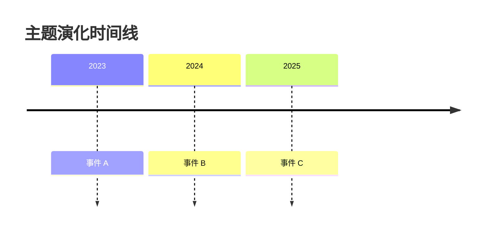

# Deep Research Ultra v4.0 优化方案

> **文档类型**：现状审视 + 全网调研 + 优化方案
> **生成日期**：2026-07-30
> **当前版本**：v3.2.0
> **目标版本**：v4.0.0
> **作者**：基于全网调研与代码审计

---

## 一、当前 skill 现状审视

### 1.1 项目位置

- 路径：`projects/deep-research-ultra/`
- 文件：`SKILL.md`（v3.2.0 主入口）、`scripts/search.py`（2000+ 行单文件）、`references/tool-integration.md`、`evals/evals.json`
- 核心定位：16 个搜索引擎 + 中英文自动切换 + 质量评分 + 迭代搜索 + 报告生成

### 1.2 问题清单（按严重程度分级）

#### 🔴 P0 — 数据源层（致命问题）

| # | 问题 | 现状 | 影响 |
|---|------|------|------|
| D1 | **HTML 解析（regex）方式极不稳定** | Bing/百度/360/搜狗/微信/神马/Brave/Ecosia/Startpage 全部用 `re.findall` 解析 HTML | 搜索引擎改版前端立即失效；事实上 Brave/Ecosia/Startpage 在国内不可达，但 `is_available()` 只测主页连通性，未测真实搜索 |
| D2 | **宣称 16 个引擎实际只有 13 个实现** | SKILL.md 与 evals.json 写"16 个引擎"，但 search.py 中 `ENGLISH_ENGINES = ['duckduckgo', 'bing', 'brave', 'ecosia', 'startpage']`（5 个），Yahoo/Qwant/Google/Wolfram 仅出现在 CLI 帮助文字中未实现 | 文档与代码不一致；用户按文档调用 `--sources yahoo` 会失败 |
| D3 | **重复造轮子严重** | 每个引擎都是 80-100 行相似的 HTML 解析代码，没有抽象基类 | 维护成本极高；新增引擎需复制粘贴 |
| D4 | **完全未使用 MCP 服务器** | 没有配置 Tavily MCP / Firecrawl MCP / Brave Search MCP / Exa MCP / open-websearch MCP / arXiv MCP / Semantic Scholar MCP | 错过了 2025-2026 年 MCP 生态爆发的红利；自研脚本远不如官方/社区 MCP 稳定 |
| D5 | **缺少权威学术数据源** | 没有 arXiv / PubMed / Semantic Scholar / Google Scholar / OpenAlex / Crossref / bioRxiv | 无法做学术调研；技术调研也常需引用论文 |
| D6 | **缺少垂直社区源** | 仅用 oss-finder 搜 GitHub 项目，未集成 Reddit / HackerNews / StackExchange / B站 / 知乎 / 小红书 / Twitter | 社区口碑和真实使用案例缺失 |
| D7 | **国内引擎过于冗余且市场份额低** | 360/搜狗/神马合计市场份额 < 5%，结果重复度高 | 浪费并发槽位；真正有价值的国内源（知乎、小红书、B站、微信视频号）反而缺失 |
| D8 | **未利用 Claude Code 内置工具** | 没有用 WebSearch / WebFetch / agent-browser / context7 / sciverse 这些已存在的全局 skill | 重复实现已有能力 |

#### 🟠 P1 — 方法论层（核心缺陷）

| # | 问题 | 现状 | 影响 |
|---|------|------|------|
| M1 | **没有真正的深度调研框架** | 工作流仅为「澄清 → 搜索 → 报告」三步 | 与 OpenAI DeepResearch 的「Plan → Execute → Synthesize」三步范式、LangChain 的 supervisor 架构、麦肯锡 MECE 问题树相比明显落后 |
| M2 | **没有问题拆解树（Issue Tree / MECE）** | Claude 拆解子问题靠 prompt 临场发挥，无结构约束 | 子问题可能重叠或遗漏；不满足 MECE 原则 |
| M3 | **没有交叉验证机制** | 现在只是 URL/标题去重，没有"同一结论需要至少 2 个独立来源支持"的硬性规则 | 单源结论可能误导；事实核查缺失 |
| M4 | **评分维度过于简单** | 标题40+内容30+权威20+时效10，纯关键词重叠度评分 | 中文查询通常无空格，`query_lower.split()` 直接失效；评分与真实质量相关性弱 |
| M5 | **没有 LLM 语义评分** | 评分完全靠字符串匹配，没有让 LLM 评估可信度/相关性 | 评分粗放，无法识别"标题党"或"AI 生成内容" |
| M6 | **没有迭代深度搜索（Drill-down）** | 现在的"迭代搜索"只是关键词变体（中文→英文、加年份） | 真正的深度应该是：基于已有结果生成更深问题，再搜索（Plan → Reflect → Re-search） |
| M7 | **没有事实核查（Fact-check）** | 报告中无矛盾点标注、无假设-验证循环、无可信度评级 | 与 LangChain open_deep_research 的 supervisor-reflect 架构相比缺失关键环节 |
| M8 | **没有时间线/趋势分析** | 报告只是结果罗列 | 无法回答"该主题在过去 N 年的演化" |
| M9 | **没有调研策略分层** | "快速/标准/深度"只是子 Agent 数量差异（1-2/3-4/5+），没有具体策略定义 | 用户无法预期不同深度的具体差异 |

#### 🟡 P2 — 工程层（技术债）

| # | 问题 | 现状 | 影响 |
|---|------|------|------|
| E1 | **同步阻塞 IO** | 用 ThreadPoolExecutor 但 urllib 是同步的 | 并发效率低；应该用 aiohttp + asyncio |
| E2 | **缓存无大小限制** | `~/.cache/deep-research/` 会无限增长，只有 TTL 没有 maxsize | 磁盘可能被撑爆 |
| E3 | **错误处理过于简略** | 大量 `except: pass`，无结构化日志 | 问题排查困难 |
| E4 | **没有单元测试** | evals/evals.json 只是测试描述，没有真正测试代码 | 重构无保障 |
| E5 | **没有抽象基类** | 每个引擎都是相似代码 | DRY 原则违反 |
| E6 | **CLI 参数过多且耦合** | argparse 参数 20+ 个，搜索/历史/反馈/检查混在一起 | 用户认知负担重 |
| E7 | **没有异步任务管理** | 子 Agent 调度靠 Claude 临时决定，无任务队列 | 深度模式（30+ 来源）容易卡死 |
| E8 | **缓存键不含语言/区域参数** | 同一关键词不同区域会命中错误缓存 | 跨区域调研结果错误 |

#### 🟢 P3 — 用户体验层

| # | 问题 | 现状 | 影响 |
|---|------|------|------|
| U1 | **报告生成过于死板** | 只有 markdown/json/report/csv 四种格式 | 没有 HTML 可视化、PDF 输出、Mermaid 图表 |
| U2 | **没有调研进度反馈** | 用户不知道当前进行到哪一步 | 长任务体验差 |
| U3 | **没有 ETA 估算** | 深度模式 10-15 分钟无进度提示 | 用户不知道还要等多久 |
| U4 | **没有调研记忆** | 每次调研都从零开始 | 相似主题无法复用知识 |
| U5 | **没有调研对比** | 多次调研结果无法横向对比 | 无法回答"上次和这次的差异" |

---

## 二、全网调研发现

### 2.1 主流开源深度调研框架对比

| 框架 | 组织 | Stars | 核心架构 | 关键特性 | 启示 |
|------|------|-------|----------|----------|------|
| **open_deep_research** | LangChain | 12.4k | LangGraph supervisor + 反思 | Plan-Scope-Research-Write 四阶段、MCP 支持、多 provider | **架构模板**：supervisor 派发并行子 agent + 反思循环 |
| **DeerFlow 2.0** | 字节跳动 | 15.1k | 子 Agent 编排 + 沙箱 + 长期记忆 | 集成 Coder 做数据分析、完整 WebUI、InfoQuest 搜索 | **功能模板**：沙箱执行代码 + 长期记忆 |
| **OpenDeepResearch** | HuggingFace | 21.2k | ReAct 范式 | 动作即代码 | **思路模板**：ReAct 思考-行动循环 |
| **通义 DeepResearch** | 阿里 | 2.8k | IterResearch 端到端训练 | 端到端模型 | 不适用于 skill 场景 |
| **DeepResearchAgent** | SkyworkAI | 1.1k | browser-use 自动化 | 浏览器自动化驱动 | **工具模板**：browser-use 集成 |
| **dzhng/deep-research** | 个人 | 高 | ~500 LoC 极简 | 零依赖 | **简洁模板**：核心逻辑可极简 |

**核心范式共识**：**Plan → Execute → Synthesize（+ Reflect）**，OpenAI 官方 Deep Research 指导文档明确这一三步架构。

### 2.2 Claude Code 全局可用 skill（已存在，可直接复用）

经查阅 Skill 工具描述，TRAE 已安装以下可直接复用的 skill，当前 deep-research-ultra 完全没有调用：

| skill 名称 | 用途 | 与本 skill 关系 |
|-----------|------|-----------------|
| `skill_agent_agent-reach` | 13 平台社交媒体搜索（小红书/X/B站/Reddit/V2EX/LinkedIn/YouTube/GitHub/播客/RSS 等） | **核心数据源补强**：社区讨论/口碑/真实案例 |
| `skill_agent_research-first` | 触发词"先查一下/research first/查文档" | **前置依赖**：可替代本 skill 的"环境检测"步骤 |
| `skill_agent_oss-finder` | 跨 GitHub/GitLab/Gitee/npm/PyPI 搜索开源项目 | **已集成**（在 references 中提到）但 SKILL.md 没有强制使用 |
| `skill_agent_multi-search-engine` | 16 引擎搜索（与本 skill 高度重叠） | **能力重叠**：应整合或路由 |
| `skill_agent_super-memory` | 记忆与知识管理（capture/save/neat/promote 四阶段） | **调研记忆**：跨会话复用调研成果 |
| `sciverse` | 学术论文检索（结构化元数据、语义分块、图表提取） | **学术数据源**：补强 D5 |
| `last30days` | 近 30 天全网调研（Reddit/X/YouTube/TikTok/HN/Polymarket/GitHub） | **时效性调研**：补强 D6 |
| `defuddle` | 网页转 Markdown（去除广告/导航） | **替代 Jina Reader**：本地化、无需 VPN |
| `context7` | 拉取最新库文档 | **技术调研**：补强技术准确性 |
| `agent-browser` | 浏览器自动化 CLI | **深度页面交互**：登录/表单/截图 |

### 2.3 免费 MCP 服务器清单（重点调研对象）

| MCP 服务器 | 免费额度 | 工具数 | 国内可用 | 关键能力 | 推荐度 |
|-----------|----------|--------|----------|----------|--------|
| **open-websearch** | 完全免费、无需 API Key | 4（search/fetchCsdnArticle/fetchLinuxDoArticle/fetchGithubReadme） | ✅（可配代理） | Bing/百度/CSDN/DuckDuckGo/Exa/Brave/掘金多引擎 | ⭐⭐⭐⭐⭐ |
| **Tavily MCP** | 1000 次/月免费 | search/extract/map/crawl | ✅ | AI 搜索 + 内容提取 + 网站地图 + 爬取 | ⭐⭐⭐⭐⭐ |
| **Firecrawl MCP** | 500 credits/月免费 | 13 个工具 | ✅（远程） | 搜索+抓取+爬取+地图+浏览器交互+自主研究 agent | ⭐⭐⭐⭐⭐ |
| **Brave Search MCP** | 1000 次/月免费（$5 免费额度） | 5+（web/news/images/videos/local） | ❌ 需代理 | 独立索引、隐私保护、强筛选 | ⭐⭐⭐⭐ |
| **Exa MCP** | 1000 次/月免费 | search/answer/find_similar/crawl | ❌ 需代理 | 神经网络搜索、AI 增强 | ⭐⭐⭐⭐ |
| **mcp-omnisearch** | 取决于子 provider | 4（web_search/ai_search/github_search/web_extract） | 取决配置 | 聚合 Tavily/Brave/Kagi/Exa/GitHub/Linkup/Firecrawl | ⭐⭐⭐⭐ |
| **arxiv-mcp-server** | 完全免费 | 4（search/download/list/read） | ✅ | arXiv 论文搜索与下载，含系统分析 prompt | ⭐⭐⭐⭐⭐ |
| **paper-search-mcp** | 完全免费 | 多个 | ✅ | 聚合 arXiv/PubMed/bioRxiv/medRxiv/Semantic Scholar/Crossref/OpenAlex 等 7-14 个学术源 | ⭐⭐⭐⭐⭐ |
| **semanticscholar-MCP-Server** | 完全免费 | 4+ | ✅ | Semantic Scholar 200M+ 论文 + AI 引用上下文 | ⭐⭐⭐⭐ |
| **Scientific-Papers-MCP** | 完全免费 | 5（含 fetch_top_cited） | ✅ | arXiv/OpenAlex/PMC/Europe PMC/bioRxiv/CORE + 引用分析 | ⭐⭐⭐⭐ |
| **Jina Reader MCP** | 免费额度 | read/search | ❌ 需 VPN | 网页转 Markdown | ⭐⭐⭐（已有 defuddle 替代） |
| **SearXNG** | 自建免费 | search | ✅ | 聚合 70+ 引擎 | ⭐⭐⭐（需 Docker） |
| **Sequential Thinking MCP** | 免费 | 1（thinking） | ✅ | 强制分步推理 | ⭐⭐⭐⭐（深度调研反思） |

### 2.4 深度调研方法论最佳实践

#### 2.4.1 三步范式（OpenAI 官方 DeepResearch 指导）

```
Plan（规划）  →  Execute（执行）  →  Synthesize（合成）
   ↓                ↓                    ↓
拆解子问题       并行多源搜索          整合最终报告
MECE 原则        工具调度              引用追溯
假设驱动          反思循环              矛盾标注
```

#### 2.4.2 MECE 原则（麦肯锡）

- **M**utually **E**xclusive：子问题互不重叠
- **C**ollectively **E**xhaustive：子问题合起来覆盖全部

应用：调研主题拆解为 Issue Tree，每层都满足 MECE。

#### 2.4.3 CRAAP 评估标准（信息可信度）

| 维度 | 含义 | 评分问题 |
|------|------|----------|
| **C**urrency | 时效性 | 信息是否近期？是否有过时内容？ |
| **R**elevance | 相关性 | 是否回答了研究问题？受众是否合适？ |
| **A**uthority | 权威性 | 作者是否 qualified？出版方是否可信？ |
| **A**ccuracy | 准确性 | 是否可验证？是否有引用？是否经过同行评审？ |
| **P**urpose | 目的性 | 写作意图是什么？是否有偏见/商业目的？ |

#### 2.4.4 PICO 框架（循证研究）

- **P**opulation：研究主体
- **I**ntervention：干预措施
- **C**omparison：对比对象
- **O**utcome：评估结果

适用于"对比类"调研（如"FastAPI vs Django"）。

#### 2.4.5 假设-验证循环（Hypothesis-Driven）

```
建立假设  →  收集证据  →  验证/证伪  →  修正假设  →  再收集
```

避免确认偏误（Confirmation Bias），主动寻找反例。

#### 2.4.6 5W1H 提问法

What / Why / When / Where / Who / How —— 用于子问题拆解。

#### 2.4.7 Claim-Evidence-Reasoning（CER）

- **Claim**：结论
- **Evidence**：证据
- **Reasoning**：推理链

报告中每个关键结论都应有 CER 结构。

---

## 三、v4.0 优化方案

### 3.1 总体架构升级

```
┌──────────────────────────────────────────────────────────────────────┐
│              Deep Research Ultra v4.0  架构                          │
├──────────────────────────────────────────────────────────────────────┤
│                                                                      │
│  Phase 0: 前置配置（Pre-flight）                                      │
│  ├── MCP 服务器健康检查（Tavily/Firecrawl/open-websearch/arxiv...）  │
│  ├── 全局 skill 可用性检查（agent-reach/sciverse/last30days...）     │
│  ├── 网络环境检测（VPN/代理）                                         │
│  └── 调研记忆加载（super-memory 上次同主题调研结果）                  │
│                                                                      │
│  Phase 1: Plan（规划）— MECE 问题树                                  │
│  ├── 主题澄清（AskUserQuestion：目标/深度/维度/时间范围）            │
│  ├── MECE 拆解（生成 Issue Tree，每层互斥穷尽）                      │
│  ├── 假设生成（每个子问题给出可验证假设）                            │
│  ├── 数据源匹配（为每个子问题选合适 MCP/skill）                      │
│  └── 输出：research_plan.json（含子问题/假设/数据源/深度）           │
│                                                                      │
│  Phase 2: Execute（执行）— 并行子 Agent + 反思循环                   │
│  ├── 子 Agent 池（按子问题派发，独立上下文）                         │
│  │   ├── 搜索 Agent（调 Tavily/Firecrawl/open-websearch MCP）       │
│  │   ├── 学术 Agent（调 arxiv-mcp/paper-search-mcp/sciverse）        │
│  │   ├── 社区 Agent（调 agent-reach：Reddit/HN/X/知乎/B站）         │
│  │   ├── 开源 Agent（调 oss-finder + GitHub MCP）                    │
│  │   └── 时效 Agent（调 last30days）                                 │
│  ├── 反思循环（每轮搜索后 LLM 评估：是否需要 Drill-down）            │
│  ├── 交叉验证（同一结论需 ≥2 个独立来源）                            │
│  └── 输出：evidence_pool.json（含 claim/evidence/source/cer）        │
│                                                                      │
│  Phase 3: Synthesize（合成）— 结构化报告                             │
│  ├── 执行摘要（Executive Summary）                                   │
│  ├── 子问题分析（每个子问题 CER 结构）                               │
│  ├── 矛盾点标注（Disagreements）                                     │
│  ├── 时间线/趋势图（Mermaid timeline）                               │
│  ├── 引用列表（每条带 CRAAP 评分）                                   │
│  ├── 可信度热图（来源 → 子问题 → 可信度）                            │
│  └── 输出：report.md + report.html + sources.csv                    │
│                                                                      │
│  Phase 4: Reflect（反思）— 持续改进                                  │
│  ├── 调研质量自评（覆盖率/交叉验证率/矛盾处理率）                    │
│  ├── 用户反馈收集（--feedback）                                      │
│  ├── super-memory 归档（保存到项目记忆）                             │
│  └── 下一步建议（待深挖方向）                                        │
│                                                                      │
└──────────────────────────────────────────────────────────────────────┘
```

### 3.2 数据源重构方案

#### 3.2.1 分层架构（取代当前 16 引擎平铺）

```
┌─────────────────────────────────────────────────────────────────┐
│  Layer 1: MCP 服务器层（首选，结构化、稳定）                     │
│  ├── Tavily MCP        AI 搜索 + extract + map + crawl          │
│  ├── Firecrawl MCP     搜索 + scrape + crawl + browser 自动化   │
│  ├── open-websearch    免费、无 Key、Bing/百度/CSDN/掘金等      │
│  ├── arxiv-mcp         arXiv 论文                                │
│  ├── paper-search-mcp  14 学术平台聚合                           │
│  └── Semantic Scholar  200M+ 论文 + AI 引用上下文                │
├─────────────────────────────────────────────────────────────────┤
│  Layer 2: 全局 Skill 层（已存在，直接复用）                      │
│  ├── agent-reach       13 平台社交（X/Reddit/HN/B站/知乎...）   │
│  ├── oss-finder        GitHub/GitLab/Gitee/npm/PyPI             │
│  ├── last30days        近 30 天全网                              │
│  ├── sciverse          学术论文深度检索                          │
│  ├── defuddle          网页转 Markdown（替代 Jina）              │
│  ├── context7          库文档拉取                                │
│  └── agent-browser     浏览器自动化（登录/表单/截图）            │
├─────────────────────────────────────────────────────────────────┤
│  Layer 3: Claude 内置工具层                                      │
│  ├── WebSearch         实时网络搜索                              │
│  ├── WebFetch          简单网页抓取                              │
│  └── Task (subagent)   并行子 Agent                             │
├─────────────────────────────────────────────────────────────────┤
│  Layer 4: 自建/降级层（仅当上面都不可用时）                      │
│  ├── SearXNG           自建元搜索（Docker）                      │
│  ├── ddgs              DuckDuckGo Python 库                     │
│  └── 直接 HTTP         百度/Bing HTML 解析（最后手段）           │
└─────────────────────────────────────────────────────────────────┘
```

#### 3.2.2 弃用/降级清单

| 引擎 | 处置 | 理由 |
|------|------|------|
| Brave（HTML 解析） | ❌ 弃用，改用 Brave Search MCP | HTML 解析不稳定；MCP 提供 5+ 工具 |
| Ecosia | ❌ 弃用 | 国内不可达，市场份额极低 |
| Startpage | ❌ 弃用 | 国内不可达 |
| 360（so） | ❌ 弃用 | 市场份额 < 2%，结果重复百度 |
| 神马（sm） | ❌ 弃用 | 移动端份额小，结果重复 |
| 搜狗 | ⚠️ 保留但降级 | 微信公众号文章有价值，但 HTML 解析易失效 |
| Bing（HTML） | ⚠️ 降级为 fallback | 优先用 open-websearch MCP |
| 百度（HTML） | ⚠️ 降级为 fallback | 优先用 open-websearch MCP |
| Jina Reader | ❌ 弃用 | 用 defuddle / Firecrawl 替代，无需 VPN |
| Yahoo/Qwant/Google/Wolfram | ❌ 移除文档承诺 | 代码未实现，文档误导用户 |

#### 3.2.3 新增数据源

| 类型 | 数据源 | 接入方式 |
|------|--------|----------|
| 学术 | arXiv | arxiv-mcp-server |
| 学术 | PubMed | paper-search-mcp |
| 学术 | Semantic Scholar | semanticscholar-MCP-Server |
| 学术 | OpenAlex / Crossref / bioRxiv | paper-search-mcp |
| 社区 | Reddit / HackerNews / V2EX | agent-reach skill |
| 社区 | X / Twitter | agent-reach skill |
| 社区 | B站 / YouTube | agent-reach skill |
| 社区 | 知乎 / 小红书 | agent-reach skill |
| 时效 | 近 30 天热门 | last30days skill |
| 开源 | GitHub Issues/PR/Topics | GitHub MCP + oss-finder |
| 文档 | 库最新文档 | context7 skill |
| 专利 | Google Patents | WebSearch + WebFetch |
| 标准 | ISO/IEEE/GB | WebSearch + WebFetch |

### 3.3 方法论升级方案

#### 3.3.1 引入 MECE 问题树

```python
# scripts/plan.py（新增）
def build_issue_tree(topic: str, depth: str = "standard") -> dict:
    """
    构建 MECE 问题树
    
    Args:
        topic: 调研主题
        depth: quick/standard/deep
    
    Returns:
        {
            "topic": "...",
            "sub_questions": [
                {
                    "id": "Q1",
                    "question": "...",
                    "hypothesis": "...",  # 可验证假设
                    "data_sources": ["tavily", "arxiv", "agent-reach"],
                    "depth": 2,
                    "children": [...]  # 递归子问题
                }
            ]
        }
    """
```

#### 3.3.2 引入 CRAAP 评分（取代当前 4 维度评分）

```python
# scripts/score.py（重构）
def score_with_craap(item: dict, query: str, context: dict) -> dict:
    """
    CRAAP 五维评分 + LLM 语义评分
    
    Returns:
        {
            "currency": 0-20,      # 时效性
            "relevance": 0-20,     # 相关性（LLM 评分）
            "authority": 0-20,     # 权威性（域名 + 作者）
            "accuracy": 0-20,      # 准确性（可验证性）
            "purpose": 0-20,       # 目的性（偏见检测）
            "total": 0-100,
            "confidence": "high/medium/low"  # LLM 综合可信度
        }
    """
```

#### 3.3.3 引入交叉验证机制

```python
# scripts/verify.py（新增）
def cross_validate(claims: list) -> dict:
    """
    交叉验证：同一结论需要 ≥2 个独立来源支持
    
    Returns:
        {
            "verified_claims": [...],      # 验证通过
            "single_source_claims": [...], # 单源（待确认）
            "contradictions": [...]        # 矛盾点
        }
    """
```

#### 3.3.4 引入反思循环（Drill-down）

```python
# scripts/reflect.py（新增）
def should_drill_down(plan: dict, evidence: dict) -> dict:
    """
    LLM 评估是否需要 Drill-down
    
    Returns:
        {
            "need_drill_down": bool,
            "new_sub_questions": [...],  # 基于已有结果生成的新问题
            "coverage_gaps": [...]       # 覆盖空白
        }
    """
```

#### 3.3.5 调研深度策略明文化

| 深度 | 子问题数 | 数据源数 | 反思轮次 | 报告字数 | 预计耗时 |
|------|----------|----------|----------|----------|----------|
| 快速 | 2-3 | 2-3 | 0 | 1500-3000 | 1-3 分钟 |
| 标准 | 4-6 | 3-5 | 1 | 3000-6000 | 5-8 分钟 |
| 深度 | 7-10 | 5-8 | 2-3 | 6000-15000 | 10-20 分钟 |
| 极深 | 10+ | 8+ | 3+ | 15000+ | 20-40 分钟 |

### 3.4 MCP 前置配置方案

#### 3.4.1 推荐 MCP 清单（按优先级）

```json
// .mcp.json（项目级配置示例）
{
  "mcpServers": {
    "tavily": {
      "command": "npx",
      "args": ["-y", "tavily-mcp@latest"],
      "env": { "TAVILY_API_KEY": "${TAVILY_API_KEY}" }
    },
    "firecrawl": {
      "command": "npx",
      "args": ["-y", "firecrawl-mcp@latest"],
      "env": { "FIRECRAWL_API_KEY": "${FIRECRAWL_API_KEY}" }
    },
    "open-websearch": {
      "command": "npx",
      "args": ["-y", "open-websearch@latest"],
      "env": {
        "DEFAULT_SEARCH_ENGINE": "bing",
        "MODE": "stdio"
      }
    },
    "arxiv": {
      "command": "uvx",
      "args": ["arxiv-mcp-server"]
    },
    "paper-search": {
      "command": "npx",
      "args": ["-y", "paper-search-mcp-nodejs"]
    }
  }
}
```

#### 3.4.2 配置优先级与降级链

```
优先级 1: Tavily MCP（AI 搜索 + 结构化）
   ↓ 不可用
优先级 2: Firecrawl MCP（搜索 + scrape）
   ↓ 不可用
优先级 3: open-websearch MCP（免费多引擎）
   ↓ 不可用
优先级 4: Claude 内置 WebSearch（兜底）
   ↓ 不可用
优先级 5: ddgs Python 库（最后手段）
```

#### 3.4.3 一键配置脚本

```bash
# scripts/setup-mcp.sh（新增）
#!/bin/bash
# 一键配置深度调研所需 MCP 服务器

echo "🔧 配置 Tavily MCP..."
claude mcp add --transport http --scope user tavily \
  "https://mcp.tavily.com/mcp/?tavilyApiKey=${TAVILY_API_KEY}"

echo "🔧 配置 Firecrawl MCP..."
claude mcp add --scope user firecrawl -- npx -y firecrawl-mcp

echo "🔧 配置 open-websearch MCP（免费、无需 Key）..."
claude mcp add --scope user open-websearch -- npx -y open-websearch@latest

echo "🔧 配置 arXiv MCP..."
claude mcp add --scope user arxiv -- uvx arxiv-mcp-server

echo "🔧 配置 paper-search MCP..."
claude mcp add --scope user paper-search -- npx -y paper-search-mcp-nodejs

echo "✅ MCP 配置完成"
echo ""
echo "📋 配置验证："
claude mcp list
```

### 3.5 工程改进方案

#### 3.5.1 代码重构

```
scripts/
├── __init__.py
├── search.py            # 主入口（CLI）
├── engines/
│   ├── __init__.py
│   ├── base.py          # SearchEngine 抽象基类
│   ├── mcp_engines.py   # MCP 服务器封装（Tavily/Firecrawl/open-websearch/arxiv...）
│   ├── skill_engines.py # 全局 skill 封装（agent-reach/sciverse/last30days/oss-finder）
│   ├── builtin.py       # Claude 内置工具封装（WebSearch/WebFetch）
│   └── fallback.py      # 降级引擎（ddgs/百度 HTML/Bing HTML）
├── plan.py              # MECE 问题树
├── score.py             # CRAAP 评分
├── verify.py            # 交叉验证
├── reflect.py           # 反思循环
├── report.py            # 报告生成（md/html/pdf）
├── cache.py             # LRU 缓存（带 maxsize）
├── config.py            # 配置管理
└── tests/
    ├── test_engines.py
    ├── test_plan.py
    ├── test_score.py
    └── test_verify.py
```

#### 3.5.2 抽象基类

```python
# scripts/engines/base.py
from abc import ABC, abstractmethod
from typing import Optional, Dict, List

class SearchEngine(ABC):
    """搜索引擎抽象基类"""
    
    name: str
    requires_config: bool = False
    is_async: bool = False
    
    @abstractmethod
    async def search(self, query: str, max_results: int = 10, **kwargs) -> Optional[Dict]:
        """搜索"""
        pass
    
    @abstractmethod
    async def is_available(self) -> bool:
        """检查可用性"""
        pass
    
    def get_metadata(self) -> dict:
        """返回引擎元数据"""
        return {
            "name": self.name,
            "requires_config": self.requires_config,
            "is_async": self.is_async,
        }
```

#### 3.5.3 异步并发

```python
# scripts/search.py
import asyncio
import aiohttp

async def multi_search_async(query: str, engines: List[SearchEngine]):
    """异步并发搜索"""
    async with aiohttp.ClientSession() as session:
        tasks = [engine.search(query) for engine in engines]
        results = await asyncio.gather(*tasks, return_exceptions=True)
        return results
```

#### 3.5.4 LRU 缓存

```python
# scripts/cache.py
from functools import lru_cache
from pathlib import Path
import json
from datetime import datetime, timedelta

class LRUCache:
    """带大小限制的 LRU 缓存"""
    
    def __init__(self, cache_dir: Path, max_size_mb: int = 100, ttl_hours: int = 1):
        self.cache_dir = cache_dir
        self.max_size_bytes = max_size_mb * 1024 * 1024
        self.ttl = timedelta(hours=ttl_hours)
    
    def get(self, key: str) -> Optional[dict]:
        # 检查 TTL + LRU 淘汰
        ...
    
    def set(self, key: str, value: dict):
        # 写入 + 大小检查 + LRU 淘汰
        ...
```

### 3.6 报告生成升级

#### 3.6.1 多格式输出

| 格式 | 用途 | 实现 |
|------|------|------|
| markdown | 默认 | 现有 |
| html | 可视化 | 新增（含 Mermaid 图表） |
| pdf | 归档 | 新增（用 weasyprint 或 pandoc） |
| csv | 数据导出 | 现有 |
| json | API | 现有 |
| slides | 演示 | 新增（用 marp 或 pptx skill） |

#### 3.6.2 报告结构（v4.0）

```markdown
# {调研主题}

**调研时间**：YYYY-MM-DD HH:MM
**调研深度**：标准（4-6 子问题 / 3-5 数据源 / 1 轮反思）
**调研 Agent**：deep-research-ultra v4.0
**总耗时**：X 分钟
**数据源**：Tavily, arXiv, agent-reach(Reddit+HN), oss-finder, last30days

---

## 执行摘要

[3-5 句话核心结论]

## 调研范围与方法

- 主题拆解：MECE 问题树（详见附录 A）
- 假设清单：H1, H2, H3...
- 数据源选择理由

## 1. 子问题 1：{问题}

### 1.1 关键发现

[CER 结构：Claim → Evidence → Reasoning]

### 1.2 来源

| # | 来源 | URL | CRAAP 评分 | 可信度 |
|---|------|-----|-----------|--------|
| 1 | ... | ... | 85/100 | 高 |

### 1.3 矛盾点

[如有：A 来源说 X，B 来源说 Y，分析差异原因]

## 2. 子问题 2：{问题}
...

## 时间线



## 结论与建议

### 验证的假设
- ✅ H1: [假设内容] — 已验证
- ❌ H2: [假设内容] — 被证伪

### 待深挖方向
- ...

## 附录 A：MECE 问题树
## 附录 B：完整来源列表（含 CRAAP 评分）
## 附录 C：调研质量自评
- 覆盖率：X%
- 交叉验证率：X%
- 矛盾处理率：X%
```

---

## 四、实施路线图

### 4.1 分阶段实施

#### 阶段 1（MVP，1-2 天）：MCP 接入 + 文档对齐

- [ ] 配置 5 个核心 MCP（Tavily/Firecrawl/open-websearch/arxiv/paper-search）
- [ ] 编写 `scripts/setup-mcp.sh` 一键配置脚本
- [ ] 修正 SKILL.md：移除"16 引擎"承诺，改为"分层架构"
- [ ] 修正 evals.json：移除未实现的 Yahoo/Qwant/Google/Wolfram
- [ ] 新增 `references/mcp-config.md` MCP 配置指南

#### 阶段 2（核心重构，3-5 天）：架构升级

- [ ] 重构为 `engines/` 模块化结构
- [ ] 实现 `SearchEngine` 抽象基类
- [ ] 实现 MCP 引擎封装（5 个核心 MCP）
- [ ] 实现 skill 引擎封装（agent-reach/sciverse/last30days/oss-finder）
- [ ] 实现异步并发（aiohttp）
- [ ] 实现 LRU 缓存

#### 阶段 3（方法论，3-5 天）：深度调研框架

- [ ] 实现 `plan.py` MECE 问题树
- [ ] 实现 `score.py` CRAAP 评分（含 LLM 评分）
- [ ] 实现 `verify.py` 交叉验证
- [ ] 实现 `reflect.py` 反思循环
- [ ] 更新 SKILL.md 工作流为 Plan-Execute-Synthesize-Reflect

#### 阶段 4（报告与体验，2-3 天）：输出升级

- [ ] 实现 HTML 报告（含 Mermaid 图表）
- [ ] 实现时间线/趋势图
- [ ] 实现调研质量自评
- [ ] 实现调研进度反馈
- [ ] 集成 super-memory 归档

#### 阶段 5（测试与文档，1-2 天）：质量保障

- [ ] 编写单元测试（覆盖核心模块）
- [ ] 更新 evals.json（新增 v4 特性测试用例）
- [ ] 编写迁移指南（v3 → v4）
- [ ] 更新 README.md

### 4.2 风险与降级

| 风险 | 概率 | 影响 | 降级方案 |
|------|------|------|----------|
| MCP 服务器不可用 | 中 | 高 | 降级到 ddgs + Claude WebSearch |
| Tavily 额度用尽 | 中 | 中 | 降级到 open-websearch（免费） |
| LLM 评分成本高 | 高 | 中 | 默认关闭，`--llm-score` 启用 |
| 异步改造引入 bug | 中 | 中 | 保留同步路径作为 fallback |
| 用户未配置任何 MCP | 高 | 中 | 自动降级到 Layer 4（ddgs + HTML 解析） |

---

## 五、与现有 skill 的关系处理

### 5.1 路由策略

| 用户意图 | 推荐 skill | 备注 |
|---------|-----------|------|
| "深度调研 X" | **deep-research-ultra v4** | 本 skill，完整 Plan-Execute-Synthesize-Reflect |
| "搜一下 X" / "research first" | research-first | 轻量前置调研 |
| "近 30 天 X 怎么样" | last30days | 时效性调研 |
| "找 X 的学术论文" | sciverse | 学术深度 |
| "找 GitHub 上的 X 项目" | oss-finder | 开源项目 |
| "X 在 Reddit 上怎么样" | agent-reach | 社区口碑 |
| "搜 16 个引擎" | multi-search-engine | 平铺搜索（旧模式） |

### 5.2 整合策略

- **deep-research-ultra v4 作为编排层**，调用其他 skill 作为数据源
- 不重复造轮子：agent-reach 已覆盖社交媒体，不再自研
- 不重复造轮子：sciverse 已覆盖学术，不再自研
- 不重复造轮子：oss-finder 已覆盖开源项目，不再自研
- 保留 multi-search-engine 作为"平铺搜索"的简单模式

---

## 六、预期收益

### 6.1 数据源覆盖

| 维度 | v3.2 | v4.0 | 提升 |
|------|------|------|------|
| 搜索引擎数 | 13（实际可用 ~5） | 8+ MCP + 6+ skill | 质量提升 > 数量 |
| 学术数据源 | 0 | 7+（arXiv/PubMed/Semantic Scholar/OpenAlex/Crossref/bioRxiv/medRxiv） | ∞ |
| 社区数据源 | 0 | 13 平台（agent-reach） | ∞ |
| 时效数据源 | 0 | 1（last30days） | ∞ |
| 开源数据源 | 1（oss-finder） | 2（oss-finder + GitHub MCP） | 2x |
| 稳定性 | HTML regex 易失效 | MCP 官方/社区维护 | 显著提升 |

### 6.2 方法论成熟度

| 维度 | v3.2 | v4.0 |
|------|------|------|
| 调研框架 | 澄清-搜索-报告（3 步） | Plan-Execute-Synthesize-Reflect（4 步） |
| 问题拆解 | Claude 临场发挥 | MECE 问题树 |
| 评分 | 4 维关键词匹配 | CRAAP 5 维 + LLM 语义 |
| 交叉验证 | 无 | ≥2 独立来源 |
| 反思循环 | 无 | Drill-down |
| 事实核查 | 无 | CER 结构 |

### 6.3 工程质量

| 维度 | v3.2 | v4.0 |
|------|------|------|
| 代码结构 | 单文件 2000 行 | 模块化（engines/plan/score/verify/reflect/report） |
| 抽象 | 无 | SearchEngine 基类 |
| 并发 | 同步 ThreadPoolExecutor | 异步 asyncio + aiohttp |
| 缓存 | 无限增长 | LRU + maxsize |
| 测试 | 无 | 单元测试覆盖核心模块 |
| 配置 | 环境变量散落 | config.py 统一管理 |

---

## 七、决策点（需用户确认）

1. **是否同意弃用 Brave/Ecosia/Startpage/360/神马 等不稳定或不可达引擎？**
   - 推荐：是（用 MCP 替代）
   - 影响：减少 5 个引擎，但质量提升

2. **是否同意将 Jina Reader 替换为 defuddle（本地化，无需 VPN）？**
   - 推荐：是
   - 影响：失去 Jina 的搜索功能，但用 Tavily/Firecrawl 补强

3. **是否同意引入 LLM 语义评分（默认关闭，`--llm-score` 启用）？**
   - 推荐：是（避免默认增加成本）
   - 影响：评分质量显著提升，但启用时消耗 token

4. **是否同意将 multi-search-engine skill 作为"平铺搜索"模式保留？**
   - 推荐：是（提供简单模式选项）
   - 影响：用户可选简单模式或深度模式

5. **是否同意在 v4.0 中强制要求配置至少 1 个 MCP（Tavily 或 open-websearch）？**
   - 推荐：是（保证数据源质量）
   - 影响：未配置 MCP 的用户需先运行 setup-mcp.sh

6. **报告默认格式是否改为 HTML（含 Mermaid 图表）？**
   - 推荐：是（用户体验更好）
   - 影响：markdown 仍可用 `--format markdown`

7. **是否同意将 super-memory 集成作为默认行为（每次调研后自动归档）？**
   - 推荐：是（实现跨会话记忆）
   - 影响：调研结果可复用

---

## 八、参考资源

### 8.1 开源深度调研框架

- LangChain open_deep_research: https://github.com/langchain-ai/open_deep_research（12.4k stars）
- 字节跳动 DeerFlow 2.0: https://github.com/bytedance/deer-flow（15.1k stars）
- HuggingFace OpenDeepResearch: https://github.com/huggingface/transformers（21.2k stars）
- SkyworkAI DeepResearchAgent: https://github.com/SkyworkAI/DeepResearchAgent（1.1k stars）

### 8.2 MCP 服务器

- Tavily MCP: https://tavily.com / `npx -y tavily-mcp@latest`
- Firecrawl MCP: https://firecrawl.dev / `npx -y firecrawl-mcp`
- open-websearch MCP: https://github.com/Aas-ee/open-webSearch / `npx -y open-websearch@latest`
- Brave Search MCP: https://search.brave.com/developers
- Exa MCP: https://exa.ai
- mcp-omnisearch: https://www.npmjs.com/package/mcp-omnisearch
- arxiv-mcp-server: https://github.com/blazickjp/arxiv-mcp-server（2.4k stars）
- paper-search-mcp: https://github.com/openags/paper-search-mcp（796 stars）
- paper-search-mcp-nodejs: https://www.npmjs.com/package/paper-search-mcp-nodejs（14 学术平台）
- semanticscholar-MCP-Server: https://github.com/JackKuo666/semanticscholar-MCP-Server
- Scientific-Papers-MCP: https://github.com/benedict2310/Scientific-Papers-MCP

### 8.3 方法论参考

- OpenAI Deep Research 官方指导：Plan → Execute → Synthesize 三步范式
- 麦肯锡方法：MECE 原则、假设驱动、逻辑树、金字塔原理
- CRAAP Test：信息可信度评估标准
- PICO 框架：循证研究问题构建
- CER（Claim-Evidence-Reasoning）：科学论证结构

### 8.4 Claude Code 生态参考

- claude-code-best-practice（54.4k stars）: https://github.com/shanraisshan/claude-code-best-practice
- Research → Plan → Execute → Review → Ship 通用研发模式

---

## 九、下一步行动

1. **等待用户确认第七节决策点**
2. 用户确认后，按 4.1 路线图分阶段实施
3. 每阶段完成后回头检查是否跳步（遵循用户硬约束 LRN-20260717-001）
4. 实施过程中如遇环境问题，遵循"遇阻即报"原则
5. 完成后通过 super-memory neat 归档本次决策与学习点

---

*本文档由 deep-research-ultra v3.2 审视 + 全网调研生成，遵循"方案归档"用户规则保存为 md 文件。*
