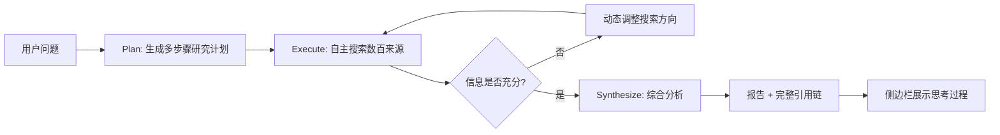
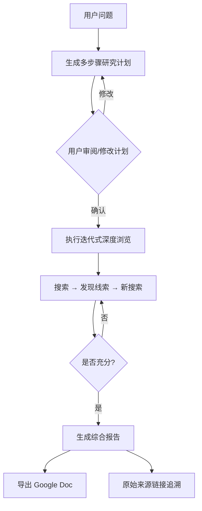
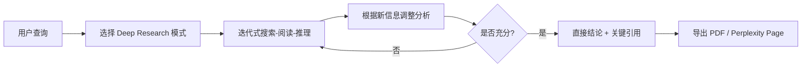
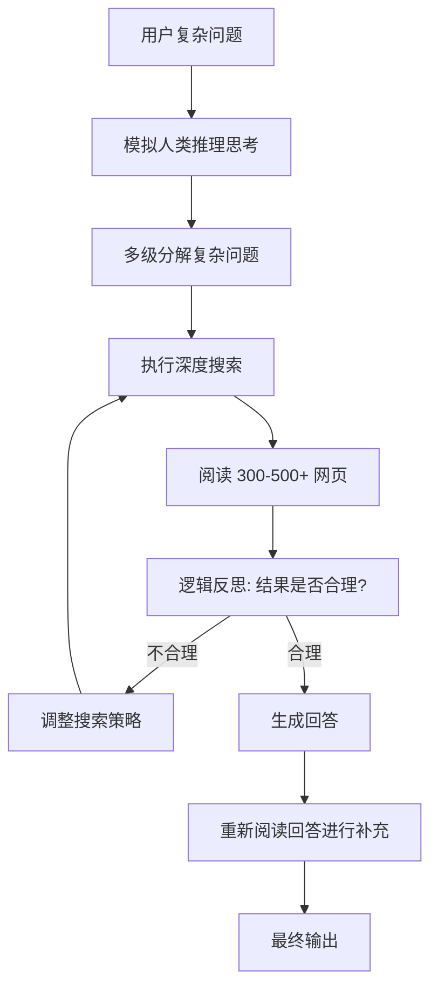
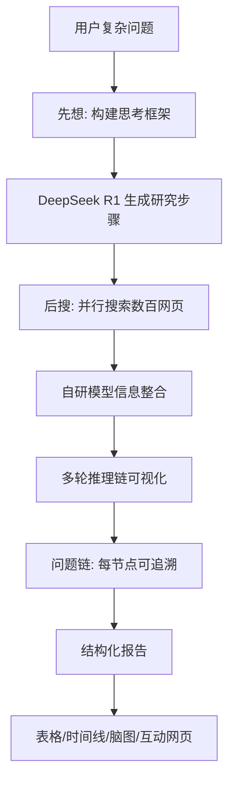
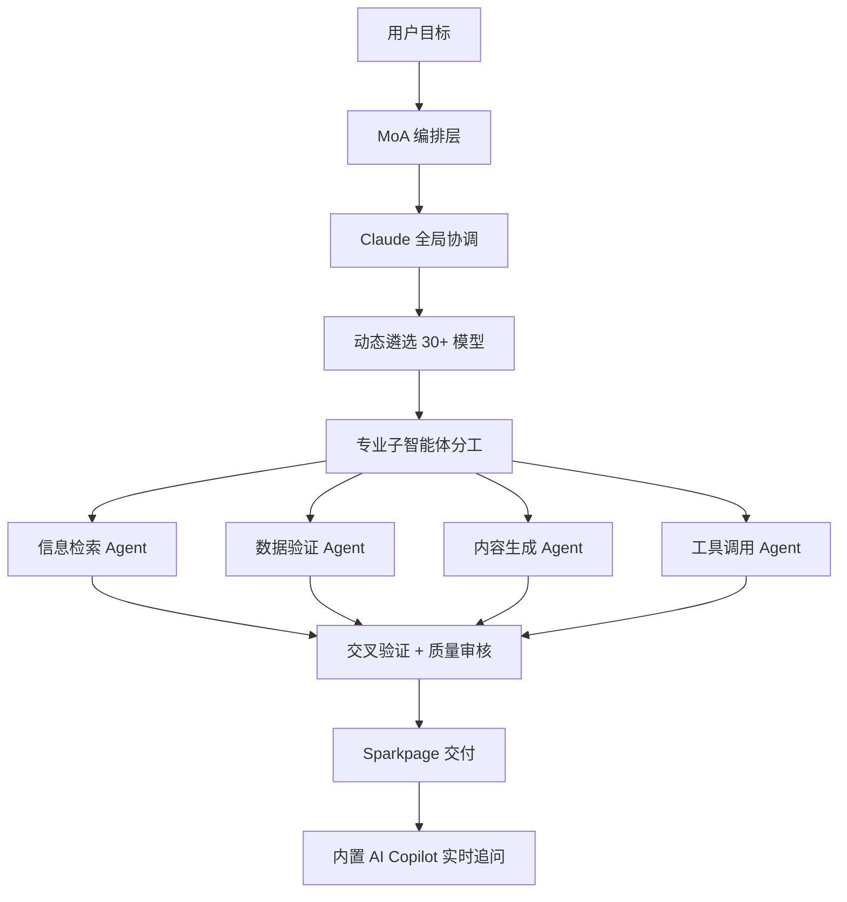
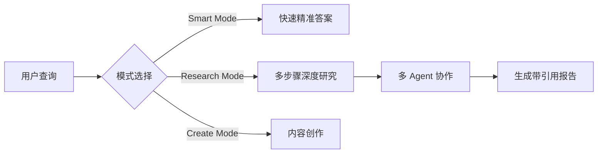
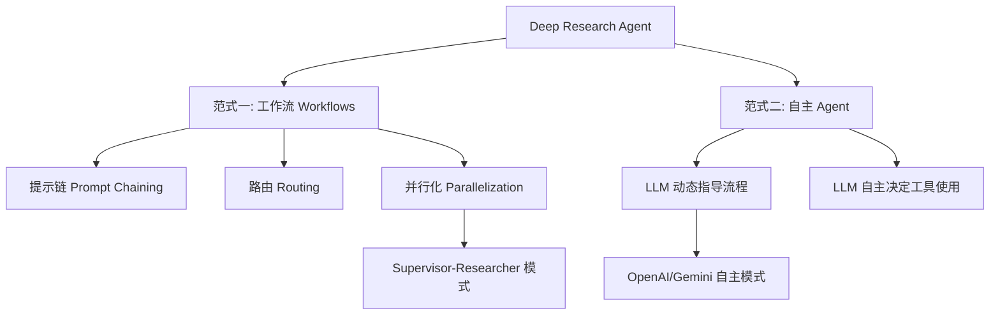
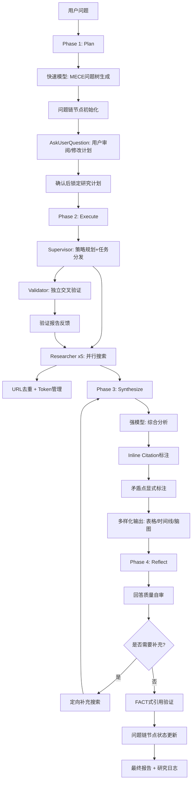

# 2025-2026 大厂深度研究方法论调研报告

> **文档类型**：全网调研报告
> **生成日期**：2026-08-08
> **调研对象**：Kimi、秘塔、Perplexity、OpenAI、Gemini、Genspark、You.com
> **目标**：提炼可复用方法论，为 deep-research-ultra v5.0 提供优化依据

---

## 目录

- [一、调研概述与行业排名](#一调研概述与行业排名)
- [二、各厂商深度研究方法论详解](#二各厂商深度研究方法论详解)
  - [2.1 OpenAI Deep Research — 行业标杆](#21-openai-deep-research--行业标杆)
  - [2.2 Google Gemini Deep Research — 搜索巨头进化](#22-google-gemini-deep-research--搜索巨头进化)
  - [2.3 Perplexity Deep Research — 快速精准派](#23-perplexity-deep-research--快速精准派)
  - [2.4 Kimi 探索版 / Kimi Researcher — 反思驱动](#24-kimi-探索版--kimi-researcher--反思驱动)
  - [2.5 秘塔 AI 深度研究 — 问题链可视化](#25-秘塔-ai-深度研究--问题链可视化)
  - [2.6 Genspark — MoA 多智能体协作](#26-genspark--moa-多智能体协作)
  - [2.7 You.com Research Assistant — 多模式研究](#27-youcom-research-assistant--多模式研究)
- [三、工作流步骤对比表](#三工作流步骤对比表)
- [四、架构范式深度剖析](#四架构范式深度剖析)
- [五、可复用模式总结](#五可复用模式总结)
- [六、对 deep-research-ultra v5.0 的优化建议](#六对-deep-research-ultra-v50-的优化建议)
- [七、参考资料](#七参考资料)

---

## 一、调研概述与行业排名

### 1.1 DeepResearch Bench 权威排名（2025年6月）

DeepResearch Bench（arXiv:2506.11763）是首个面向深度研究智能体的综合性基准，包含 22 个领域、100 项任务，采用 RACE（报告质量）和 FACT（引用可信度）双框架评估。

| 排名 | 产品 | RACE 总分 | 核心优势 | 单任务有效引用数 |
|------|------|-----------|----------|------------------|
| 🥇 1 | Gemini 2.5 Pro Deep Research | **48.9** | 信息丰富度领先 | 111.21 条 |
| 🥈 2 | OpenAI Deep Research | **46.5** | 指令遵循度第一 | 较高 |
| 🥉 3 | Claude Research | **45.0** | 通用模型竞争力强 | — |
| 4 | Kimi Researcher | **44.6** | 国产第一，反思机制 | — |
| 5 | 豆包 DeepResearch | **44.3** | 国产第二 | — |
| 6 | Open Deep Research (LangChain) | **43.44** | 开源最佳，Supervisor 架构 | — |

**关键发现**：
- Gemini 在**信息丰富度**（有效引用数）上遥遥领先
- OpenAI 在**指令遵循度**上超越 Gemini
- Perplexity 在**引用准确率（C.Acc.）**上领先
- 国产模型（Kimi/豆包）与国际第一梯队差距已缩小至 4 分以内

### 1.2 评测框架说明

```
RACE 框架（报告质量）            FACT 框架（引用可信度）
┌─────────────────────┐        ┌─────────────────────┐
│ 全面性 (Comprehensiveness)    │ │ 引用准确率 C.Acc.    │
│ 洞察深度 (Insight Depth)      │ │ → 每条陈述的URL是否  │
│ 指令遵循度 (Instruction)      │ │   能提供充分证据     │
│ 可读性 (Readability)          │ │                     │
│ + 动态权重 + 参考报告对比     │ │ 平均有效引用数 E.Cit.│
└─────────────────────┘        │ → 每任务可验证引用数 │
                                └─────────────────────┘
```

---

## 二、各厂商深度研究方法论详解

### 2.1 OpenAI Deep Research — 行业标杆

**发布时间**：2025年2月
**核心模型**：o3 推理模型优化版（后增加 o4-mini 轻量版）
**定位**：面向金融、科学、政策、工程的深度知识工作

#### 工作流：Plan → Execute → Synthesize



#### 核心能力

| 能力 | 实现细节 |
|------|----------|
| **多步骤自主研究** | 接收问题后自动生成研究计划；根据发现的信息动态调整搜索方向；可处理文本、图像、PDF 等多模态信息源 |
| **长时间运行** | 单次研究耗时 5-30 分钟；搜索、分析、综合数百个在线来源；用户可离开，完成后自动通知 |
| **完整引用与推理链** | 每个结论都有明确来源标注；侧边栏展示研究步骤；输出可直接作为工作成果使用 |

#### 迭代演进时间线

| 时间 | 更新内容 |
|------|----------|
| 2025年2月 | 首发，面向 Pro 用户 |
| 2025年2月25日 | 开放给所有 Plus 用户 |
| 2025年4月 | 增加轻量版（o4-mini），准确率 45.6%，提升使用次数 |
| 2025年7月 | 集成视觉浏览器，支持 ChatGPT Agent 模式 |
| 2026年2月 | 支持 MCP 连接，可对接任意工具和应用 |

#### 方法论创新点

1. **o3 推理内化 Tool Use**：将 tool use 通过 CoT 内化到模型中，模型可以用写代码调用的方式执行任务，而非外化成 OS 中的 computer use
2. **browsing 策略**：模拟人类研究行为——搜索 → 发现线索 → 新搜索 → 迭代精炼
3. **异步通知机制**：用户可离开页面，研究完成后自动通知

---

### 2.2 Google Gemini Deep Research — 搜索巨头进化

**发布时间**：2024年12月（最早推出）
**核心模型**：Gemini 1.5 Pro → Gemini 2.5 Pro（100万 token 上下文窗口）
**定位**：Gemini Advanced 订阅用户的 AI 研究助手

#### 工作流：透明研究计划 + 迭代浏览



#### 核心能力

| 能力 | 实现细节 |
|------|----------|
| **研究计划可视化** | 输入问题后先生成多步骤研究计划；用户可审阅、修改计划后再执行；增强人机协作与可控性 |
| **迭代式深度浏览** | 模拟人类研究行为：搜索→发现线索→新搜索；多次迭代 refining 分析结果；持续数分钟深度探索 |
| **一键导出报告** | 输出格式化为易读的综合报告；可导出为 Google Doc；包含原始来源链接 |

#### 方法论创新点

1. **人机协作的计划审阅**：唯一允许用户在执行前审阅并修改研究计划的主流产品——这是**可控性**的关键创新
2. **Google 搜索技术底座**：利用 Google 搜索领域的深厚积累，构建专门的研究导向浏览系统
3. **100万 token 上下文**：支持处理大量资料，这是信息丰富度领先的根本原因（单任务 111.21 条有效引用）
4. **Interactions API 开放**：2025年同步发布 Interactions API 并首次面向开发者开放，开源 DeepSearch 评估基准

---

### 2.3 Perplexity Deep Research — 快速精准派

**发布时间**：2025年2月13日
**定位**：专注快速、精准答案，非长篇报告生成

#### 工作流：迭代搜索-阅读-推理循环



#### 核心能力

| 能力 | 实现细节 |
|------|----------|
| **迭代式方法** | 不断搜索、阅读各类文档，根据新获得的信息持续调整分析过程 |
| **速度优先** | 大多数查询在 3 分钟内完成（vs OpenAI 5-30分钟）；执行 30-60 次连续搜索；读取 50-100+ 份文档 |
| **Inline Citation** | 直接在答案中嵌入引用标记；用户可即时验证每条信息的来源 |
| **引用准确率领先** | FACT 框架评测中 C.Acc. 指标领先所有竞品 |

#### 方法论创新点

1. **Inline Citation（行内引用）**：引用不放在文末，而是直接嵌入正文对应位置，用户点击即可跳转原始来源——这是**透明度**的关键创新
2. **速度-精度平衡**：不追求长篇报告，专注找到正确答案；快速迭代搜索-阅读-推理循环
3. **Humanity's Last Exam 得分 21.1%**：远超 Gemini Thinking（6.2%）和 GPT-4.0（3.3%）
4. **Steps 透明化**：展示每一步搜索和推理过程

---

### 2.4 Kimi 探索版 / Kimi Researcher — 反思驱动

**发布时间**：2024年10月11日（探索版）→ 2025年持续迭代
**核心模型**：Kimi K2（2025年7月，MoE 1T 参数/32B 激活）→ K2 Thinking（2025年11月）
**定位**：AI 自主搜索能力，模拟人类推理思考

#### 工作流：分解 → 搜索 → 反思 → 补充



#### 核心能力

| 能力 | 实现细节 |
|------|----------|
| **AI 自主搜索** | 模拟人类推理思考过程；多级分解复杂问题；执行深度搜索；一次可精读 300-500+ 个网页 |
| **即时反思改进** | 根据搜索结果进行逻辑反思，保证内容合乎情理；非简单的搜索整合 |
| **自我补充** | 回答问题后重新阅读回答进行补充；处理开放式问题时提供更全面见解 |
| **K2 Thinking 推理** | 2025年11月发布，Agent 与推理能力全面革新；可融入 software agents 处理多步骤开发工作流 |

#### 方法论创新点

1. **即时反思机制（Reflect-after-Answer）**：这是 Kimi 最独特的方法论——回答生成后**重新阅读自身回答**进行反思和补充，形成"搜索 → 回答 → 反思 → 补充"的闭环
2. **多级问题分解**：将复杂问题层层分解为子问题，模拟人类研究者的思考路径
3. **10倍搜索量**：探索版搜索量是普通版的 10 倍，一次搜索可精读超 500 个页面
4. **DeepResearch Bench 第4名（44.6分）**：国产深度研究产品第一

---

### 2.5 秘塔 AI 深度研究 — 问题链可视化

**发布时间**：2025年2月（"先想后搜"模式）→ 2025年7月（"深度研究"模块）
**定位**：国内首个面向公众免费开放的深度研究级搜索服务

#### 工作流：先想后搜 + 问题链



#### 双引擎架构

```
┌─────────────────────────────────────┐
│         秘塔"先想后搜"架构           │
├─────────────────────────────────────┤
│                                     │
│  小模型 (DeepSeek R1)               │
│  ├── 构建研究框架                   │
│  ├── 研究步骤拆解                   │
│  └── 逻辑推理任务                   │
│                                     │
│  大模型 (自研)                      │
│  ├── 信息检索                       │
│  ├── 资料汇总                       │
│  └── 报告生成                       │
│                                     │
│  协同: 2-3分钟完成数百网页分析      │
└─────────────────────────────────────┘
```

#### 核心能力

| 能力 | 实现细节 |
|------|----------|
| **多轮推理链可视化（问题链）** | 自动拆解复杂问题为多个子问题；动态生成推理路径；每个节点展示思考过程、引用资料及信源来源 |
| **结构化与互动式报告** | 支持表格、段落、时间线、脑图、互动网页五种输出形式；结论可溯源 |
| **分段强化学习** | 将复杂任务拆解为多个子任务并行处理；子任务独立完成后结果整合；大幅降低算力消耗 |
| **信源可控** | 所有引用可一键跳转原始出处；用户可自定义优先或屏蔽某些信源 |

#### 方法论创新点

1. **问题链（Problem Chain）可视化**：每个推理节点可点击展开，查看详细引用资料、信源出处和推理说明；用不同颜色标注节点状态（绿色=结论明确，橙色=信息待补充）——这是**透明度**的极致实现
2. **"先想后搜"双模型协同**：小模型负责逻辑推理（框架构建、步骤拆解），大模型负责信息检索——成本与质量的精准平衡
3. **分段强化学习策略**：任务拆解 + 并行处理 + 结果整合，使免费开放成为可能（每日3-5次）
4. **信源优先级自定义**：用户可自定义优先或屏蔽某些信源——学术、法律、媒体等对信源要求极高的场景的刚需

---

### 2.6 Genspark — MoA 多智能体协作

**成立时间**：2023年（前百度高管景鲲创立）
**融资**：2025年11月完成 2.75 亿美元 B 轮，估值 12.5 亿美元
**定位**：通过多智能体混合架构（MoA）实现"AI 自动完成"工作流

#### 架构：Mixture-of-Agents



#### 核心能力

| 能力 | 实现细节 |
|------|----------|
| **MoA 架构** | 从 30+ 主流/开源模型中动态遴选适配模型；Claude 负责全局协调与交叉验证；按任务类型拆分专业子智能体 |
| **150+ 自研工具** | Python 代码执行、幻灯片生成、语音通话等；20+ 高质量数据集；无缝对接数百种工作软件 |
| **Sparkpage** | 基于用户查询实时生成定制化网页；整合多源信息；内置 AI Copilot 实时响应追问 |
| **质量评估体系** | 验证智能体持续交叉核对信息；剔除广告与 SEO 干扰内容；确保交付结果准确性与完成度 |

#### 方法论创新点

1. **Mixture-of-Agents（MoA）动态调度**：不是固定的工作流，而是根据任务类型动态遴选最适配的模型组合——这是**多模型协同**的标杆实践
2. **验证智能体（Validator Agent）**：独立的质量审核智能体，持续交叉核对信息，剔除广告与 SEO 干扰——**质量保证**的专用机制
3. **交互式知识交付（Sparkpage）**：不是静态报告，而是内置 AI Copilot 的交互式页面，可实时追问——**交付形态**的创新
4. **现实世界交互**：语音与电话自动化能力，连接虚拟与物理场景——拓展任务边界

---

### 2.7 You.com Research Assistant — 多模式研究

**定位**：多模式 AI 搜索与研究助手

#### 工作流：多模式适配



#### 核心能力

| 能力 | 实现细节 |
|------|----------|
| **多模式切换** | Smart Mode（快速）、Research Mode（深度）、Create Mode（创作）；用户按需选择 |
| **Research Mode** | 多步骤研究流程；多 Agent 协作；生成带完整引用的报告 |
| **多源整合** | 集成多个搜索引擎和 API；学术、新闻、社交媒体多源整合 |

#### 方法论创新点

1. **模式分级**：不同深度需求匹配不同模式——简单问题用 Smart Mode，复杂研究用 Research Mode，避免资源浪费
2. **多 Agent 协作**：Research Mode 采用多 Agent 协作架构

---

## 三、工作流步骤对比表

### 3.1 四阶段映射对比

| 厂商 | Plan（规划） | Execute（执行） | Synthesize（综合） | Reflect（反思） |
|------|-------------|-----------------|-------------------|----------------|
| **OpenAI** | 自动生成多步骤计划 | 动态调整搜索方向，数百来源 | 完整引用链综合报告 | 侧边栏展示思考过程 |
| **Gemini** | 生成计划 + **用户审阅修改** | 迭代式深度浏览 | 一键导出 Google Doc | 多次迭代 refining |
| **Perplexity** | 迭代式搜索-阅读-推理 | 30-60次连续搜索 | 直接结论 + Inline Citation | 根据新信息调整分析 |
| **Kimi** | 多级分解复杂问题 | 深度搜索 300-500+ 网页 | 生成回答 | **重新阅读回答补充** |
| **秘塔** | **先想**: R1构建框架 | **后搜**: 并行数百网页 | 结构化报告（5种形式） | 问题链节点状态标注 |
| **Genspark** | MoA 动态遴选模型 | 多 Agent 分工并行 | Sparkpage 交互交付 | **验证 Agent 交叉核对** |
| **You.com** | 模式选择 | 多 Agent 协作 | 带引用报告 | — |

### 3.2 关键维度对比

| 维度 | OpenAI | Gemini | Perplexity | Kimi | 秘塔 | Genspark |
|------|--------|--------|------------|------|------|----------|
| **耗时** | 5-30分钟 | 数分钟 | <3分钟 | 2-5分钟 | 2-3分钟 | 数分钟 |
| **搜索来源数** | 数百个 | 100+ 有效引用 | 50-100+ 文档 | 300-500+ 网页 | 数百网页 | 多源整合 |
| **引用方式** | 来源标注 | 来源链接 | **Inline Citation** | 来源追溯 | **一键跳转+信源可控** | 交叉验证 |
| **可控性** | 自动为主 | **计划可审阅修改** | 自动为主 | 自动为主 | **信源优先级自定义** | 自动为主 |
| **透明度** | 侧边栏思考过程 | 研究计划可见 | Steps 透明化 | 反思过程可见 | **问题链可视化** | 验证过程 |
| **输出形式** | 报告+引用 | Google Doc | PDF/Page | 文本回答 | **表格/时间线/脑图/网页** | **Sparkpage 交互页** |
| **免费额度** | 5次/月 | 每月数次 | 每天3次 | 5次/天 | **3-5次/天** | 200日免费 |
| **核心模型** | o3/o4-mini | Gemini 2.5 Pro | 自研 | K2 Thinking | R1+自研 | 30+模型MoA |

---

## 四、架构范式深度剖析

### 4.1 两种架构范式（Anthropic 分类）



### 4.2 Supervisor-Researcher 模式（开源最佳实践）

基于 LangChain Open Deep Research（DeepResearch Bench 第6名，43.44分）的架构分析：

```
┌──────────────────────────────────────────────┐
│           Supervisor-Researcher 架构          │
├──────────────────────────────────────────────┤
│                                              │
│  状态机节点:                                  │
│  1. clarify_with_user    → 智能问题澄清      │
│  2. write_research_brief → 研究简报生成      │
│  3. research_supervisor  → 监督者(核心)       │
│  4. supervisor_tools     → 工具执行层        │
│  5. researcher           → 研究员(并行)       │
│  6. compress_research    → 研究结果压缩      │
│  7. write_final_report   → 最终报告生成      │
│                                              │
│  Supervisor 三种核心工具:                     │
│  ├── ConductResearch  → 委派研究任务         │
│  ├── ResearchComplete → 标记研究完成         │
│  └── think_tool       → 策略思考和反思       │
│                                              │
│  并发: 最多 5 个并发研究单元                  │
│  去重: URL 级别去重                          │
│  Token: 智能管理，80% 阈值检查               │
└──────────────────────────────────────────────┘
```

#### 状态管理核心代码模式

```python
# override_reducer: 同一字段支持累加和覆盖两种更新模式
def override_reducer(current_value, new_value):
    if isinstance(new_value, dict) and new_value.get("type") == "override":
        return new_value.get("value", new_value)
    else:
        return operator.add(current_value, new_value)

class AgentState(MessagesState):
    supervisor_messages: Annotated[list, override_reducer]  # 可覆盖
    research_brief: Optional[str]
    raw_notes: Annotated[list[str], override_reducer] = []  # 可覆盖
    notes: Annotated[list[str], override_reducer] = []
    final_report: str
```

#### 分层模型选择策略

```python
class Configuration(BaseModel):
    search_api: SearchAPI = Field(default=SearchAPI.TAVILY)
    summarization_model: str = Field(default="openai:gpt-4.1-mini")  # 摘要用小模型
    research_model: str = Field(default="openai:gpt-4.1")            # 研究用大模型
    compression_model: str = Field(default="openai:gpt-4.1")         # 压缩用大模型
    final_report_model: str = Field(default="openai:gpt-4.1")        # 报告用大模型
```

### 4.3 核心算法：搜索-阅读-推理循环

```
1. 规划: 基于当前问题，生成搜索策略
2. 搜索: 调用搜索工具获取相关信息
3. 阅读: 提取网页/文档中的关键内容
4. 推理: 分析信息，识别知识缺口
5. 判断: 是否已足够回答? 是→生成报告; 否→回到步骤1
```

#### 关键技术挑战与解决方案

| 挑战 | 解决方案 | 代表厂商 |
|------|----------|----------|
| 信息过载 | 智能筛选，优先高可信度来源 | OpenAI、Gemini |
| 信息矛盾 | 交叉验证，标注不确定性 | Genspark（验证 Agent） |
| 搜索方向偏差 | 动态调整策略，基于发现重新规划 | OpenAI、Perplexity |
| 幻觉问题 | 强制引用来源，推理链透明化 | Perplexity（Inline Citation） |
| 成本爆炸 | 设置 token 预算，轻量版模型兜底 | OpenAI（o4-mini）、秘塔（分段 RL） |

---

## 五、可复用模式总结

### 模式 1：透明研究计划 + 用户审阅（来自 Gemini）

**核心思想**：在执行研究前，先生成可视化的多步骤研究计划，让用户审阅并修改后再执行。

**实现要点**：
```
用户问题 → 生成研究计划(多步骤) → 展示给用户 → 用户审阅/修改 → 确认后执行
```

**可集成到 deep-research-ultra 的方式**：
- 在 Phase 1 Plan 阶段，生成 MECE 问题树后，增加一个"计划审阅"步骤
- 使用 AskUserQuestion 让用户确认/修改/补充子问题
- 用户可删除不感兴趣的子问题、添加自定义子问题、调整优先级

**价值**：增强可控性，避免研究方向偏差，减少无效搜索。

---

### 模式 2：即时反思 + 自我补充（来自 Kimi）

**核心思想**：回答生成后，重新阅读自身回答进行反思和补充，形成"搜索→回答→反思→补充"闭环。

**实现要点**：
```
生成初版回答 → 重新阅读回答 → 识别遗漏/矛盾/可补充点 → 生成补充内容 → 合并输出
```

**可集成到 deep-research-ultra 的方式**：
- 在 Phase 4 Reflect 阶段，不仅评估"是否需要再搜索"，还增加"回答质量自审"
- 自审维度：逻辑一致性、证据充分性、矛盾点、遗漏维度
- 自审发现的问题反馈到 Phase 2 执行定向补充搜索

**价值**：闭环质量保证，模拟人类研究者的"写完复查"习惯。

---

### 模式 3：问题链可视化 + 节点状态标注（来自秘塔）

**核心思想**：将推理过程建模为"问题链"，每个节点可点击展开查看详细引用、信源出处和推理说明，并用颜色标注节点状态。

**实现要点**：
```
复杂问题 → 拆解为子问题链 → 每个节点:
  ├── 思考过程
  ├── 引用资料
  ├── 信源来源
  └── 状态标注 (绿色=结论明确, 橙色=信息待补充, 红色=矛盾)
```

**可集成到 deep-research-ultra 的方式**：
- 将 MECE 问题树的每个节点扩展为"问题链节点"
- 每个节点记录：子问题、搜索查询、发现的关键证据、来源、置信度、状态
- 在报告中输出可追溯的"研究日志"——每个结论可追溯到具体子问题和证据链
- 节点状态用 emoji/颜色标注：✅ 已验证 / ⚠️ 待补充 / ❌ 矛盾

**价值**：极致透明度，用户可验证每一步推理，大幅降低幻觉风险。

---

### 模式 4：验证 Agent + 交叉核对（来自 Genspark）

**核心思想**：设立独立的验证智能体，持续交叉核对其他 Agent 产出的信息，剔除广告与 SEO 干扰内容。

**实现要点**：
```
研究 Agent 产出 → 验证 Agent 独立核对:
  ├── 事实是否准确?
  ├── 来源是否可靠?
  ├── 是否有广告/SEO干扰?
  ├── 多源是否一致?
  └── 产出验证报告 → 反馈给研究 Agent 修正
```

**可集成到 deep-research-ultra 的方式**：
- 在 Phase 2 Execute 阶段，增加独立的"验证 Agent"角色
- 验证 Agent 职责：对每个子 Agent 的发现进行独立交叉验证
- 验证维度：CRAAP 五维 + 多源一致性 + 广告/SEO干扰检测
- 验证不通过的发现降级或标注"待验证"

**价值**：独立的质量保证层，避免研究 Agent 的"自说自话"。

---

### 模式 5：分层模型选择 + 成本控制（来自 Open Deep Research）

**核心思想**：针对不同任务环节使用不同模型——摘要/压缩用小模型，研究/报告用大模型，实现成本与质量的平衡。

**实现要点**：
```python
# 分层模型配置
summarization_model = "gpt-4.1-mini"   # 摘要: 小模型，快且便宜
research_model = "gpt-4.1"             # 研究: 大模型，质量优先
compression_model = "gpt-4.1"          # 压缩: 大模型
final_report_model = "gpt-4.1"         # 报告: 大模型
```

**可集成到 deep-research-ultra 的方式**：
- 在 scripts/research.py 中增加分层模型配置
- 搜索结果摘要/去重/初步筛选 → 用快速模型（Haiku/flash）
- 深度分析/CRAAP评分/交叉验证 → 用强模型（Sonnet/Opus）
- 最终报告生成 → 用最强模型
- Token 管理：80% 阈值检查，超出时自动压缩历史消息

**价值**：在保证质量的前提下控制成本，使深度模式可持续。

---

### 模式 6：Inline Citation + 引用准确率优化（来自 Perplexity）

**核心思想**：引用不放在文末，而是直接嵌入正文对应位置，用户点击即可跳转原始来源。

**实现要点**：
```
正文段落 [1] 继续论述 [2] 更多分析 [1][3]

[1] Source: https://example.com/article1
[2] Source: https://example.com/paper2
[3] Source: https://example.com/report3
```

**可集成到 deep-research-ultra 的方式**：
- 在 Phase 3 Synthesize 阶段，报告生成时强制要求每个事实性陈述附带行内引用标记
- 引用格式：`[来源编号]` 或 `[来源标题](URL)`
- 增加 FACT 式引用验证：检查每个引用 URL 是否确实支持对应陈述
- 引用准确率作为质量评分的硬性指标

**价值**：可验证性最大化，每个结论可即时追溯，降低幻觉风险。

---

### 模式 7：双模型协同 — 先想后搜（来自秘塔）

**核心思想**：小模型负责逻辑推理（框架构建、步骤拆解），大模型负责信息检索与整合，两者协同。

**实现要点**：
```
小模型(逻辑推理强): 生成研究框架 + 步骤拆解
    ↓ 传递框架
大模型(信息整合强): 并行搜索 + 资料汇总 + 报告生成
```

**可集成到 deep-research-ultra 的方式**：
- Phase 1 Plan：用快速模型生成 MECE 问题树（逻辑推理任务）
- Phase 2 Execute：用强模型执行搜索和分析
- Phase 4 Reflect：用快速模型做初步质量评估，发现问题时再用强模型深入

**价值**：成本优化，规划阶段不需要最强模型，节省 60%+ token 成本。

---

## 六、对 deep-research-ultra v5.0 的优化建议

### 6.1 当前 v4.0 现状

deep-research-ultra v4.0 已实现：
- Plan → Execute → Synthesize → Reflect 四阶段范式
- MECE 问题树 + CRAAP 评分 + 交叉验证 + CER 结构
- MCP 服务器 + 全局 Skill + 内置工具 + 降级引擎的四层数据源架构
- 分层降级机制

### 6.2 v5.0 优化建议（按优先级排序）

#### 🔴 P0 — 方法论增强（核心竞争力）

| # | 优化项 | 来源 | 实现方案 | 预期收益 |
|---|--------|------|----------|----------|
| V5-1 | **研究计划审阅机制** | Gemini | Phase 1 生成问题树后，用 AskUserQuestion 让用户确认/修改/补充，确认后再执行 | 增强可控性，避免研究方向偏差 |
| V5-2 | **即时反思 + 自我补充** | Kimi | Phase 4 增加"回答质量自审"：逻辑一致性、证据充分性、矛盾点、遗漏维度；自审发现问题反馈到 Phase 2 定向补充 | 闭环质量保证，模拟人类"写完复查" |
| V5-3 | **问题链节点状态标注** | 秘塔 | MECE 问题树每个节点增加状态：✅已验证 / ⚠️待补充 / ❌矛盾 / 🔄搜索中；在报告中输出可追溯研究日志 | 极致透明度，降低幻觉风险 |
| V5-4 | **独立验证 Agent** | Genspark | Phase 2 增加验证 Agent 角色，对子 Agent 发现进行独立交叉验证：CRAAP + 多源一致性 + 广告/SEO检测 | 独立质量保证层，避免"自说自话" |
| V5-5 | **Inline Citation 强制** | Perplexity | Phase 3 报告生成时，每个事实性陈述强制附带行内引用标记 `[编号]`；增加 FACT 式引用验证 | 可验证性最大化 |

#### 🟠 P1 — 架构优化（工程效率）

| # | 优化项 | 来源 | 实现方案 | 预期收益 |
|---|--------|------|----------|----------|
| V5-6 | **分层模型选择** | Open Deep Research | 配置化模型选择：摘要/去重→快速模型，深度分析/评分→强模型，报告→最强模型；Token 80%阈值管理 | 成本降低 60%+，深度模式可持续 |
| V5-7 | **双模型协同** | 秘塔 | Phase 1 用快速模型生成问题树（逻辑推理），Phase 2 用强模型执行搜索分析 | 规划阶段成本优化 |
| V5-8 | **Supervisor-Researcher 架构** | Open Deep Research | 引入 Supervisor（策略规划+任务分发）+ Researcher（并行执行）模式；支持最多 5 个并发研究单元 | 并发效率提升，深度模式不卡死 |
| V5-9 | **override_reducer 状态管理** | Open Deep Research | 状态字段支持累加和覆盖两种更新模式，避免传统累加模式的状态污染 | 长时间运行任务的状態一致性 |
| V5-10 | **异步并发搜索** | Open Deep Research | 搜索环节全面异步化（asyncio.gather），URL 级去重 | 并发效率提升 3-5 倍 |

#### 🟡 P2 — 用户体验（差异化）

| # | 优化项 | 来源 | 实现方案 | 预期收益 |
|---|--------|------|----------|----------|
| V5-11 | **信源优先级自定义** | 秘塔 | 用户可配置信源白名单/黑名单；学术调研优先 arXiv/PubMed，商业调研优先行业报告 | 场景化适配 |
| V5-12 | **多样化输出形式** | 秘塔 | 报告支持表格/时间线/脑图/互动网页四种形式，用户可选择 | 输出适配不同场景 |
| V5-13 | **研究进度透明化** | Perplexity/OpenAI | 展示每一步搜索查询、发现的关键证据、当前研究进度（X/N 子问题完成） | 用户可监控研究过程 |
| V5-14 | **矛盾点显式标注** | 秘塔 | 当多个来源信息矛盾时，在报告中显式标注"⚠️ 信息矛盾"并展示各方观点 | 诚实呈现不确定性 |

### 6.3 v5.0 架构蓝图



### 6.4 配置示例

```yaml
# deep-research-ultra v5.0 配置
version: 5.0.0

# 分层模型选择
models:
  planning_model: "claude-haiku"      # 规划用快速模型
  research_model: "claude-sonnet"     # 研究用强模型
  validation_model: "claude-sonnet"   # 验证用强模型
  report_model: "claude-opus"         # 报告用最强模型

# 问题链节点状态
node_status:
  - searching: "🔄"    # 搜索中
  - verified: "✅"     # 已验证
  - pending: "⚠️"      # 待补充
  - conflict: "❌"     # 矛盾

# 架构
architecture:
  mode: "supervisor-researcher"
  max_concurrent_researchers: 5
  validator_enabled: true
  token_threshold: 0.8  # 80% 阈值

# 用户可控性
controllability:
  plan_review: true           # 研究计划审阅
  source_priority: true       # 信源优先级自定义
  output_format: "auto"       # auto/table/timeline/mindmap/web

# 引用
citation:
  inline: true                # Inline Citation
  fact_validation: true       # FACT 式验证
  min_sources_per_claim: 2    # 每个结论至少2个独立来源

# 反思
reflection:
  self_review: true           # 回答质量自审
  review_dimensions:
    - logical_consistency     # 逻辑一致性
    - evidence_sufficiency    # 证据充分性
    - contradiction_detection # 矛盾点检测
    - gap_identification      # 遗漏维度识别
  max_reflection_rounds: 2    # 最大反思轮次
```

---

## 七、参考资料

### 官方资料
1. OpenAI Deep Research 官方介绍：https://openai.com/index/introducing-deep-research/
2. Google Gemini Deep Research 博客：https://blog.google/products/gemini/google-gemini-deep-research/
3. Anthropic Building Effective Agents：https://www.anthropic.com/engineering/building-effective-agents
4. Jina AI DeepSearch 开源实现：https://github.com/jina-ai/node-DeepResearch
5. Jina AI DeepSearch 实现指南：https://jina.ai/news/a-practical-guide-to-implementing-deepsearch-deepresearch
6. OpenAI Agents SDK：https://github.com/openai/openai-agents-python
7. MCP (Model Context Protocol)：https://modelcontextprotocol.io

### 评测基准
8. DeepResearch Bench 论文：https://arxiv.org/pdf/2506.11763
9. DeepResearch Bench 开源：https://github.com/Ayanami0730/deep_research_bench
10. DeepResearch Bench 榜单：https://agi-eval.cn/evaluation/detail?id=67

### 技术分析
11. AI Deep Research Agent 深度调研报告（今日头条）
12. Deep Research 架构演进：从 Multi Agent 到 Supervisor-Researcher 模式（掘金）
13. o3 深度解读：OpenAI 终于发力 tool use（人人都是产品经理）
14. 秘塔 AI 搜索"深度研究"模块全方位解析（CSDN）
15. Kimi 探索版深度测试（CSDN）
16. Perplexity DeepResearch 产品分析（搜狐）
17. Genspark MoA 架构分析（今日头条）
18. 2025年多款 Deep Research 智能体框架全面对比（网易）

### 产品链接
19. Kimi：https://kimi.com
20. 秘塔 AI 搜索：https://metaso.cn
21. Perplexity：https://perplexity.ai
22. OpenAI Deep Research：https://chatgpt.com
23. Gemini Deep Research：https://gemini.google.com
24. Genspark：https://genspark.ai
25. You.com：https://you.com

---

> **报告说明**：本报告基于 2025-2026 年公开资料、技术文档、评测基准和用户评测撰写。DeepResearch 领域发展迅速，建议关注官方渠道获取最新动态。报告中的 DeepResearch Bench 数据引用自 arXiv:2506.11763（2025年6月13日发布）。
