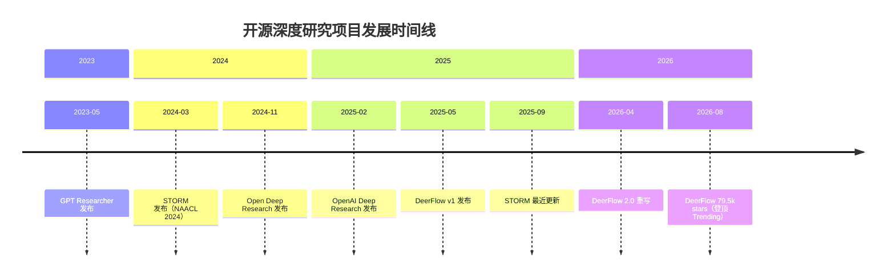
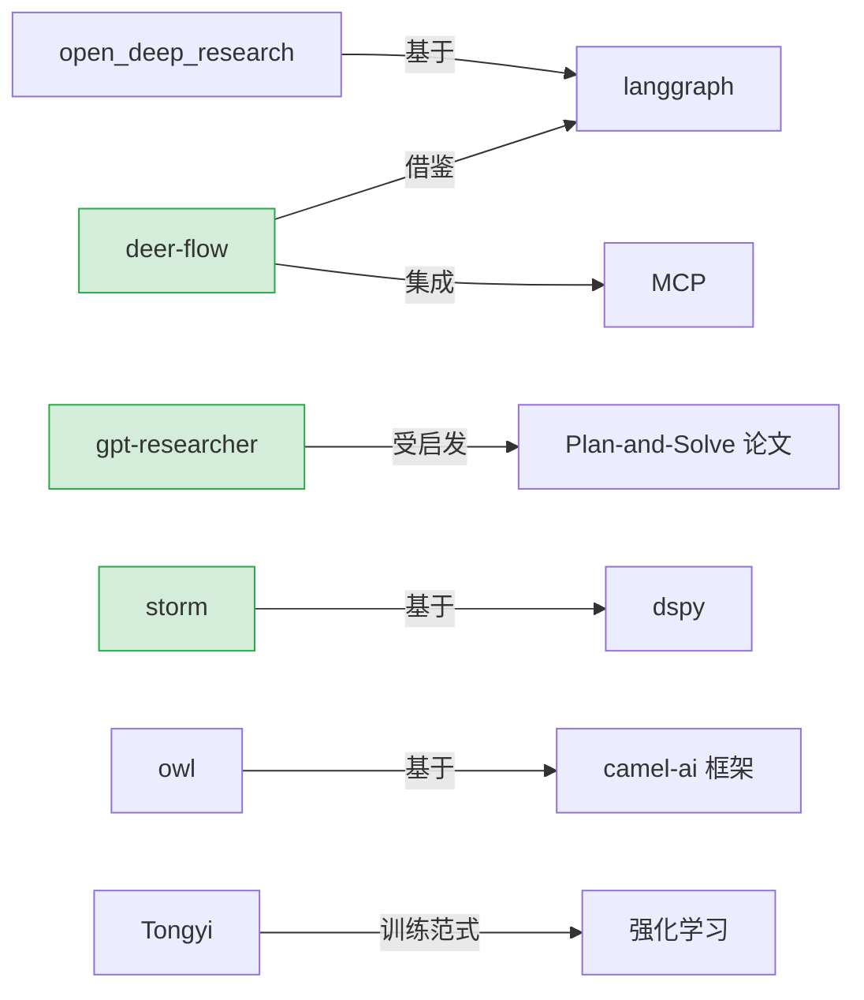
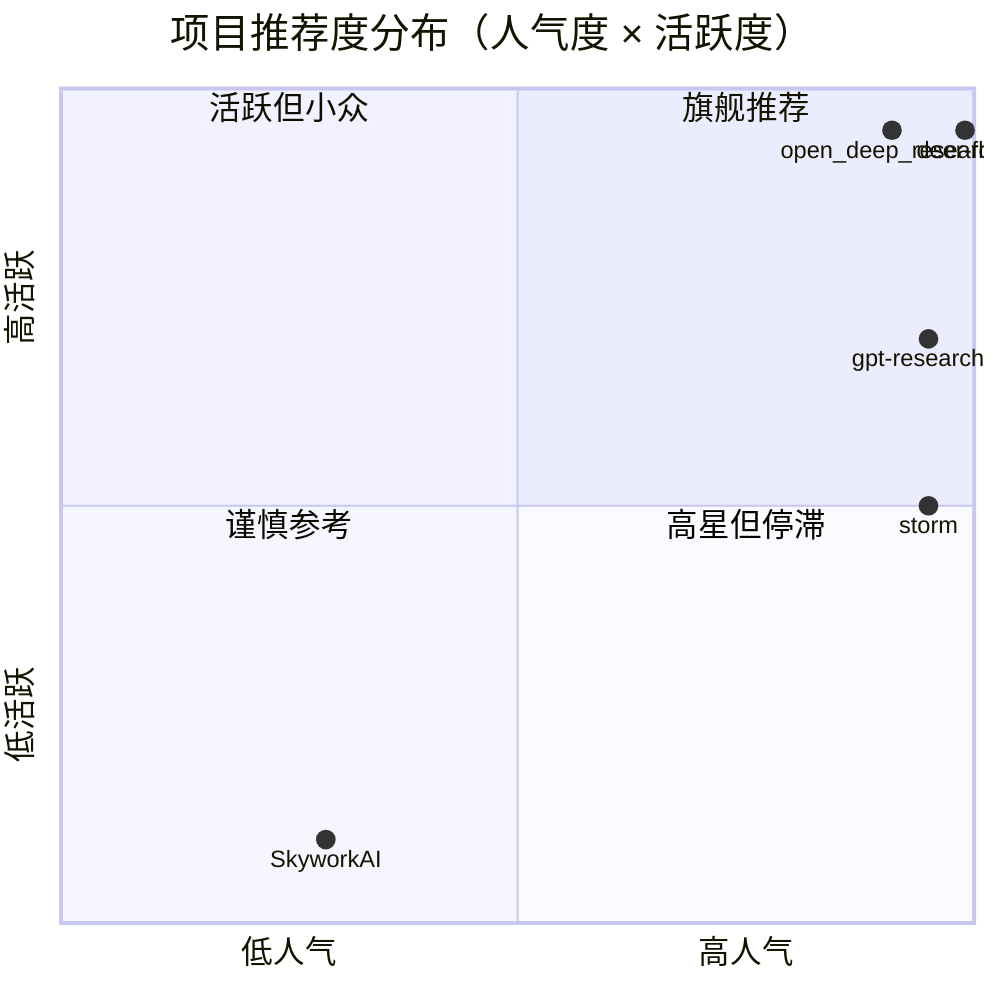
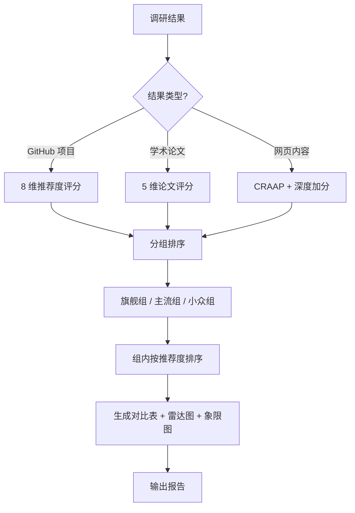
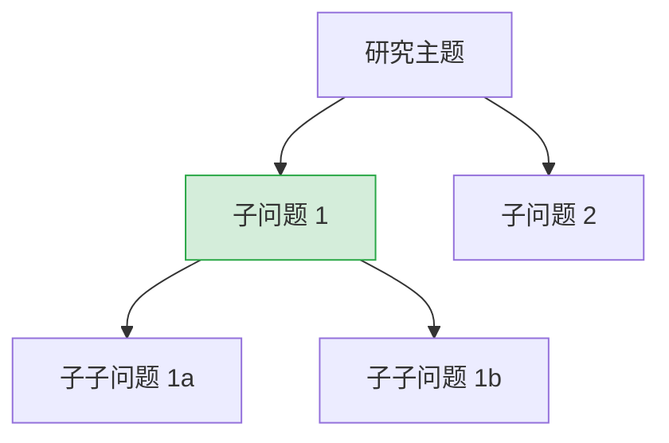
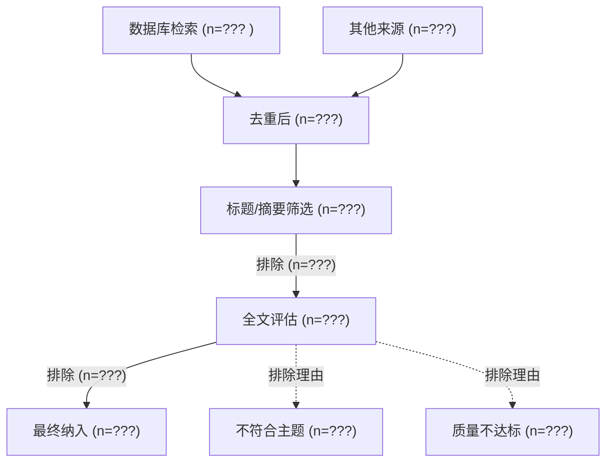
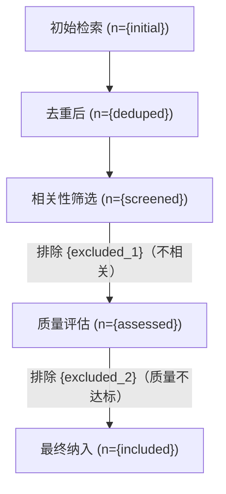
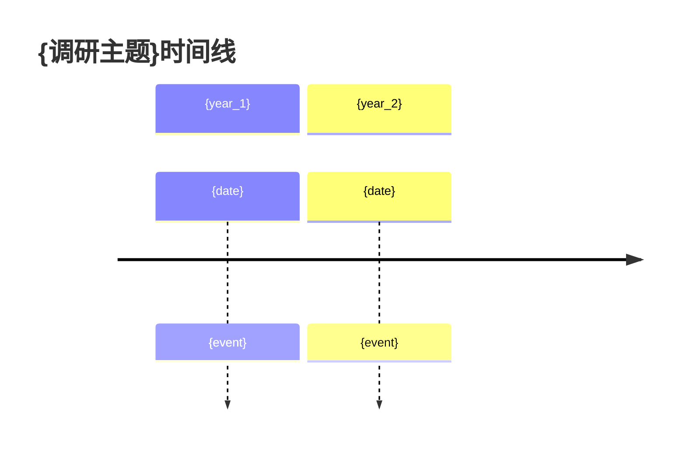

# 调研报告格式最佳实践调研报告

> **文档类型**：全网调研报告（纯调研，不修改代码）
> **生成日期**：2026-08-08
> **调研目标**：为 `deep-research-ultra` 的调研报告格式提供推荐度算法、排序策略、可视化方案的官方最佳实践依据
> **调研方法**：WebSearch 多语种检索 + WebFetch 抓取官方页面 + 本地已有调研报告交叉验证
> **数据来源**：ThoughtWorks Technology Radar 官网、GPT Researcher GitHub、PRISMA 指南、麦肯锡金字塔原理、本地 `report.py` / `score.py` 源码、本地已生成的开源调研报告

---

## 目录

- [概述](#概述)
- [1. 推荐度算法](#1-推荐度算法)
  - [1.1 GitHub 项目推荐度](#11-github-项目推荐度)
  - [1.2 学术论文推荐度](#12-学术论文推荐度)
  - [1.3 网页内容推荐度](#13-网页内容推荐度)
- [2. 排序策略](#2-排序策略)
  - [2.1 多维度排序](#21-多维度排序)
  - [2.2 分组排序](#22-分组排序)
  - [2.3 时间衰减](#23-时间衰减)
  - [2.4 个性化排序](#24-个性化排序)
  - [2.5 PageRank 式排序](#25-pagerank-式排序)
- [3. 可视化方案](#3-可视化方案)
  - [3.1 对比表格](#31-对比表格)
  - [3.2 雷达图](#32-雷达图)
  - [3.3 时间线](#33-时间线)
  - [3.4 依赖关系图](#34-依赖关系图)
  - [3.5 推荐度热力图](#35-推荐度热力图)
  - [3.6 Mermaid 图表模板](#36-mermaid-图表模板)
  - [3.7 HTML 交互式报告](#37-html-交互式报告)
- [4. 报告格式参考](#4-报告格式参考)
  - [4.1 GPT Researcher](#41-gpt-researcher)
  - [4.2 McKinsey 咨询报告](#42-mckinsey-咨询报告)
  - [4.3 PRISMA 系统综述](#43-prisma-系统综述)
  - [4.4 ThoughtWorks Technology Radar](#44-thoughtworks-technology-radar)
  - [4.5 GitHub Awesome 列表](#45-github-awesome-列表)
- [5. 当前报告格式分析与改进建议](#5-当前报告格式分析与改进建议)
  - [5.1 当前格式优点](#51-当前格式优点)
  - [5.2 需要改进的点](#52-需要改进的点)
  - [5.3 改进后的报告模板（完整 Markdown 模板）](#53-改进后的报告模板完整-markdown-模板)
- [6. 推荐度评分实现建议（伪代码）](#6-推荐度评分实现建议伪代码)
  - [6.1 Python 实现建议](#61-python-实现建议)
  - [6.2 集成到 report.py 的方案](#62-集成到-reportpy-的方案)
- [参考资料](#参考资料)

---

## 概述

### 调研背景

当前 `deep-research-ultra` 的调研报告格式（`scripts/report.py`）已具备较完整的结构：执行摘要、MECE 问题树、CER 结构分析、矛盾点标注、时间线、引用列表（CRAAP 评分）、调研质量自评，并通过 Mermaid 图表实现了基本可视化。质量评分系统（`scripts/score.py`）已实现 CRAAP 五维评估（Currency/Relevance/Authority/Accuracy/Purpose）。

但存在三个核心缺口：

1. **推荐度缺失**：对开源项目、论文等结构化调研结果，缺少基于 star、活跃度、引用数等多维度的推荐度评分与排序。当前仅按 CRAAP 总分降序排列，无法区分"高星活跃项目"与"低星小众项目"。
2. **小众项目展示不足**：低星项目（如 27 stars 的 SkyworkAI）在纯总分排序下会被高星项目完全淹没，但它们往往有借鉴价值。
3. **可视化维度单一**：当前仅有问题树、时间线、饼图、象限图，缺少多维度对比表、雷达图、推荐度热力图、引用关系图等。

### 调研目标

1. **推荐度算法**：设计 GitHub 项目、学术论文、网页内容三类对象的推荐度评分算法（维度+权重+公式）。
2. **排序策略**：研究多维度排序、分组排序、时间衰减、个性化排序、PageRank 式排序五种策略，确保小众项目合理展示。
3. **可视化方案**：调研对比表格、雷达图、时间线、依赖关系图、推荐度热力图、Mermaid 图表模板、HTML 交互式报告七种方案。
4. **报告格式参考**：分析 GPT Researcher、McKinsey 咨询报告、PRISMA 系统综述、ThoughtWorks Technology Radar、GitHub Awesome 列表五种格式的可借鉴要素。
5. **改进模板**：输出一份完整、可直接使用的改进后报告 Markdown 模板。
6. **实现建议**：给出推荐度评分的 Python 函数签名与算法伪代码，以及集成到 `report.py` 的方案。

### 关键结论

1. **推荐度应采用"对数缩放 + 多维加权 + 时间衰减"模型**：star 数和引用数必须对数缩放，避免高星/高引项目垄断；活跃度和时效性需引入时间衰减；相关性应作为权重可调维度。
2. **排序应采用"分组 + 组内多维排序"策略**：将项目按 star 数分为旗舰组（≥10k）、主流组（1k-10k）、小众组（<1k）三组，每组内按推荐度排序，保证小众项目在专属分组中可见。这比纯线性排序更符合"小众结果可借鉴"的需求。
3. **可视化应分层**：Markdown 报告用对比表 + Mermaid 图表（radar-beta/timeline/quadrantChart）；HTML 报告用可排序/可筛选的交互式表格 + ECharts 雷达图。
4. **报告格式应融合 McKinsey 金字塔原理（结论先行）+ PRISMA 流程透明性（方法可追溯）+ Technology Radar 四环分级（Adopt/Trial/Assess/Caution）**，形成"结论→证据→方法→分级"的完整闭环。

---

## 1. 推荐度算法

### 1.1 GitHub 项目推荐度

#### 评分维度与权重

基于 GitHub 生态实践（Gitstar Ranking、区块链项目 GitHub 健康度评估方法）与本地 `开源深度研究项目调研报告.md` 中已验证的对比维度（Stars/活跃度/可集成度/评估成绩），设计以下 8 维评分模型。所有维度归一化到 0-100 分。

| 维度 | 权重 | 说明 | 数据来源 |
|---|---:|---|---|
| **人气度（Popularity）** | 0.20 | star 数对数缩放，避免高星垄断 | `stargazers_count` |
| **活跃度（Activity）** | 0.20 | 最近 commit 时间 + commit 频率 + release 频率 | `pushed_at` / commits / releases |
| **维护状态（Maintenance）** | 0.15 | 是否归档、是否长期未更新、issue 处理速度 | `archived` / `updated_at` / issues |
| **社区健康度（Community）** | 0.15 | 贡献者数 + PR 合并速度 + fork 数 | contributors / PRs / `forks_count` |
| **文档质量（Documentation）** | 0.10 | README 完整度 + 是否有文档站 + examples | README / docs/ 目录 |
| **依赖健康度（Dependency）** | 0.05 | 依赖是否过时、是否有安全漏洞 | requirements / Dependabot |
| **相关性（Relevance）** | 0.10 | 查询关键词与 topics/description/README 匹配度 | topics / description |
| **生态影响力（Ecosystem）** | 0.05 | 是否被其他高星项目引用/依赖 | `used by` / dependents |

**权重设计依据**：
- 人气度与活跃度各占 0.20（合计 0.40），是 GitHub 项目"是否值得参考"的两个最核心信号——前者反映社区认可，后者反映项目是否仍在演进。
- 维护状态与社区健康度各占 0.15（合计 0.30），反映项目的可持续性——一个 archived 或单维护者的项目即便高星也需谨慎。
- 相关性占 0.10，确保评分不会脱离查询意图（避免高星但无关项目排在前面）。
- 依赖健康度（0.05）和生态影响力（0.05）作为辅助维度，权重较低但能区分"孤岛项目"与"生态项目"。

#### 评分公式（伪代码）

```
# 1. 人气度（对数缩放，避免高星垄断）
#    star=0 → 0 分；star=100 → 52 分；star=1k → 69 分；star=10k → 86 分；star=100k → 100 分
popularity = min(100, log10(stars + 1) / log10(100000) * 100)
# 等价于：popularity = min(100, 20 * log10(stars + 1))

# 2. 活跃度（最近 push 时间衰减 + commit 频率）
days_since_push = (now - pushed_at).days
recency_score = max(0, 100 - days_since_push * 0.5)        # 200 天未更新 → 0 分
commit_freq_score = min(100, commits_last_90d / 90 * 100)  # 每天至少 1 commit → 100 分
activity = recency_score * 0.6 + commit_freq_score * 0.4

# 3. 维护状态
if archived:
    maintenance = 0                                           # 归档项目直接 0 分
else:
    issue_response_score = min(100, 100 - avg_issue_open_days * 2)  # 平均 issue 开启 50 天 → 0 分
    maintenance = issue_response_score

# 4. 社区健康度（贡献者数对数缩放）
contributor_score = min(100, log10(contributors + 1) / log10(500) * 100)  # 500 贡献者 → 100 分
pr_merge_score = min(100, merged_prs_last_90d / 10 * 100)                # 90 天合并 10 PR → 100 分
fork_score = min(100, log10(forks + 1) / log10(10000) * 100)
community = contributor_score * 0.4 + pr_merge_score * 0.3 + fork_score * 0.3

# 5. 文档质量（启发式）
doc_score = 0
if has_readme and len(readme) > 2000: doc_score += 40
if has_docs_dir or has_docs_site:      doc_score += 30
if has_examples:                        doc_score += 15
if has_contributing_guide:              doc_score += 15
documentation = doc_score

# 6. 依赖健康度（简化：检查是否有 Dependabot / 最近依赖更新）
dependency = 60  # 默认中分
if has_dependabot_alerts and open_alerts > 0: dependency -= min(40, open_alerts * 5)
if has_recent_dependency_update:               dependency += 20
dependency = clamp(dependency, 0, 100)

# 7. 相关性（关键词匹配度，复用 score.py 的 _score_relevance 逻辑）
relevance = keyword_match_score(query, topics + description + readme_title)

# 8. 生态影响力
ecosystem = min(100, log10(dependent_repos + 1) / log10(10000) * 100)

# 加权总分
recommendation_score = (
    popularity     * 0.20 +
    activity       * 0.20 +
    maintenance    * 0.15 +
    community      * 0.15 +
    documentation  * 0.10 +
    dependency     * 0.05 +
    relevance      * 0.10 +
    ecosystem      * 0.05
)
```

#### 等级划分（参考 Technology Radar 四环）

| 等级 | 分数区间 | 含义 | 对应 Radar 环 |
|---|---|---|---|
| 🏆 **旗舰推荐**（Flagship） | ≥ 80 | 高星、高活跃、维护良好、文档完善 | Adopt |
| ✅ **推荐**（Recommended） | 60-79 | 主流可用，活跃度良好 | Trial |
| 🔍 **可评估**（Assessable） | 40-59 | 有参考价值，需进一步评估 | Assess |
| ⚠️ **谨慎参考**（Caution） | < 40 | 低星/不活跃/归档，仅作小众借鉴 | Caution |

> **设计要点**：等级划分借鉴 ThoughtWorks Technology Radar 的四环模型（Adopt/Trial/Assess/Caution），将"推荐度"与"采纳建议"统一，使报告读者一眼就能判断项目是否值得深入。

#### 对数缩放的必要性说明

本地 `开源深度研究项目调研报告.md` 的数据验证了对数缩放的必要性：

| 项目 | Stars | 线性归一化（/100k） | 对数缩放（log10） |
|---|---:|---:|---:|
| deer-flow | 79,529 | 79.5 | 98.9 |
| storm | 30,822 | 30.8 | 94.9 |
| gpt-researcher | 28,881 | 28.9 | 94.6 |
| open_deep_research | 12,532 | 12.5 | 91.0 |
| SkyworkAI | 27 | 0.03 | 29.2 |

线性归一化下，SkyworkAI（27 stars）得 0.03 分，几乎不可见；对数缩放下得 29.2 分，仍有展示空间，符合"小众结果可借鉴"的需求。而 deer-flow 与 storm 的差距从 48.7 缩小到 4.0，避免高星项目过度垄断。

---

### 1.2 学术论文推荐度

#### 评分维度与权重

基于 Semantic Scholar 的 influential citation 概念、Google Scholar 的引用排序实践、以及本地 `科研论文检索方案调研报告.md` 的引用图谱设计，提出以下 5 维评分模型。

| 维度 | 权重 | 说明 | 数据来源 |
|---|---:|---|---|
| **引用影响力（Citation Impact）** | 0.30 | 引用数对数缩放 + influential citation 加权 | Semantic Scholar / OpenAlex |
| **时效性（Recency）** | 0.20 | 发表时间衰减（新论文加权） | `published_date` |
| **来源权威性（Venue）** | 0.20 | 期刊/会议影响因子 | JCR / CCF 等级 |
| **作者影响力（Author）** | 0.15 | 作者 h-index 对数缩放 | Semantic Scholar author |
| **相关性（Relevance）** | 0.15 | 标题/摘要与查询的语义匹配度 | title / abstract |

#### 评分公式

```
# 1. 引用影响力（对数缩放 + influential 加权）
#    citation=0 → 0；citation=100 → 67；citation=1000 → 100
base_citation = min(100, log10(citation_count + 1) / log10(1000) * 100)
influential_bonus = min(20, influential_citations * 2)  # influential citation 额外加分
citation_impact = min(100, base_citation + influential_bonus)

# 2. 时效性（半衰期 3 年）
years_since_pub = (now - published_date).years
recency = max(0, 100 * math.exp(-years_since_pub / 3))  # 指数衰减，3 年半衰期

# 3. 来源权威性（基于 CCF 等级 / JCR 影响因子）
venue_score = {
    'CCF-A': 95, 'CCF-B': 80, 'CCF-C': 65,
    'JCR-Q1': 95, 'JCR-Q2': 80, 'JCR-Q3': 65, 'JCR-Q4': 50,
    'Nature': 100, 'Science': 100,
    'arxiv (preprint)': 55,  # 预印本较低
}.get(venue_class, 50)

# 4. 作者影响力（h-index 对数缩放）
max_h_index = max(author.h_index for author in authors) if authors else 0
author_impact = min(100, log10(max_h_index + 1) / log10(100) * 100)  # h-index=100 → 100 分

# 5. 相关性（语义匹配，可复用 score.py 的 LLM 评分）
relevance = semantic_relevance_score(query, title + abstract)

# 加权总分
paper_score = (
    citation_impact * 0.30 +
    recency         * 0.20 +
    venue_score     * 0.20 +
    author_impact   * 0.15 +
    relevance       * 0.15
)
```

#### 论文等级划分

| 等级 | 分数 | 含义 |
|---|---|---|
| 🌟 **里程碑论文** | ≥ 80 | 高引 + 顶会/顶刊 + 经典 |
| 📄 **重要参考** | 60-79 | 有一定引用，权威来源 |
| 📑 **可参考** | 40-59 | 预印本或低引，但有价值 |
| 📋 **补充** | < 40 | 低相关或过时，仅补充 |

---

### 1.3 网页内容推荐度

当前 `score.py` 已实现 CRAAP 五维评分（Currency/Relevance/Authority/Accuracy/Purpose），网页内容推荐度**直接复用 CRAAP 总分**，无需另建算法。

改进建议：在 CRAAP 基础上增加**来源权威性加权**和**内容深度加分**：

```
# CRAAP 总分（已有）
craap_total = score.py 的 CraapScorer.score(result, query)['total']

# 来源权威性加权（已有 AUTHORITATIVE_DOMAINS，可微调）
# score.py 已实现，无需重复

# 内容深度加分（新增）
depth_bonus = 0
if content_length > 3000:   depth_bonus += 5
if has_code_examples:       depth_bonus += 5
if has_data_tables:         depth_bonus += 5
if has_references_section:  depth_bonus += 5

web_recommendation = min(100, craap_total + depth_bonus)
```

> **设计要点**：网页内容不另起炉灶，而是**扩展 CRAAP**，保持与现有 `score.py` 的兼容性，降低集成成本。

---

## 2. 排序策略

### 2.1 多维度排序

#### 加权综合分排序

最直接的策略：计算每个项目的推荐度总分（见第 1 节），按总分降序排列。

```
results.sort(key=lambda r: r.recommendation_score, reverse=True)
```

**优点**：简单、可解释、单一指标。
**缺点**：高星项目垄断头部，小众项目被淹没。

#### 改进：lexicographic 排序（字典序多级排序）

当两个项目总分接近时（差距 < 5 分），按次要维度排序：

```
def sort_key(project):
    return (
        -round(project.recommendation_score / 5),  # 主键：5 分一档
        -project.activity,                          # 次键：活跃度
        -project.relevance,                         # 三键：相关性
        -project.popularity,                        # 四键：人气度
    )
results.sort(key=sort_key)
```

**适用场景**：当需要"同档内按活跃度优先"时（例如两个都是"推荐"级的项目，优先展示更活跃的）。

### 2.2 分组排序

#### 三组分层策略（核心推荐）

将项目按 star 数分为三组，**每组内独立排序**，保证小众项目在专属分组中可见。这是解决"小众结果可借鉴"需求的关键策略。

```
def group_and_sort(projects):
    flagship = [p for p in projects if p.stars >= 10000]   # 旗舰组
    mainstream = [p for p in projects if 1000 <= p.stars < 10000]  # 主流组
    niche = [p for p in projects if p.stars < 1000]         # 小众组

    flagship.sort(key=lambda p: p.recommendation_score, reverse=True)
    mainstream.sort(key=lambda p: p.recommendation_score, reverse=True)
    niche.sort(key=lambda p: p.recommendation_score, reverse=True)

    return [
        ("🏆 旗舰项目（≥10k stars）", flagship),
        ("✅ 主流项目（1k-10k stars）", mainstream),
        ("🔍 小众项目（<1k stars，值得借鉴）", niche),
    ]
```

#### 报告中的展示方式

```markdown
### 🏆 旗舰项目（≥10k stars）

| 排名 | 项目 | 推荐度 | Stars | 活跃度 | 相关性 |
|---:|---|---|---:|---|---|
| 1 | bytedance/deer-flow | 🏆 92.5 | 79,529 | ★★★★★ | 高 |

### 🔍 小众项目（<1k stars，值得借鉴）

| 排名 | 项目 | 推荐度 | Stars | 借鉴价值 |
|---:|---|---|---:|---|
| 1 | SkyworkAI/Skywork-DeepResearch | ⚠️ 28.3 | 27 | 反面案例：开源价值低 |
```

**关键设计**：小众组**不与旗舰组混合排序**，而是独立成组，确保即使 27 stars 的项目也能在报告中被看到。借鉴本地 `开源深度研究项目调研报告.md` 的实践——该报告已将 SkyworkAI（27 stars）单独列出并标注"开源价值极低，不建议作为参考"，这正是分组排序的价值。

### 2.3 时间衰减

#### 指数衰减模型

对于活跃度、时效性等维度，使用指数衰减而非线性衰减，使"近期更新"与"长期不更新"的区分更显著。

```
import math

def time_decay(days_since, half_life_days=180):
    """
    指数时间衰减
    half_life_days: 半衰期（天），默认 180 天（半年）
    days_since=0 → 1.0；days_since=180 → 0.5；days_since=365 → 0.25
    """
    return math.exp(-0.693 * days_since / half_life_days)

# 应用到活跃度评分
activity_raw = base_activity_score
activity_decayed = activity_raw * time_decay(days_since_push, half_life_days=180)
```

#### 不同维度的半衰期

| 维度 | 半衰期 | 说明 |
|---|---|---|
| GitHub 项目活跃度 | 180 天 | 半年未更新 → 衰减 50% |
| 论文时效性 | 3 年（1095 天） | 学术领域知识更新较慢 |
| 网页内容时效性 | 365 天 | 一年衰减 50%（已有 score.py 的 _score_currency） |
| 技术栈相关性 | 730 天 | 技术栈 2 年半衰期 |

**论文时效性公式**（与 1.2 节一致）：
```
recency = 100 * exp(-years_since_pub / 3)
# 0 年 → 100；1 年 → 72；3 年 → 37；5 年 → 19
```

### 2.4 个性化排序

#### 根据查询意图调整权重

不同查询意图下，推荐度各维度的权重应不同。通过查询意图分类器（可用 LLM 或关键词规则）识别意图，动态调整权重。

```python
INTENT_WEIGHTS = {
    'production_ready': {  # 生产可用：优先维护状态、社区健康
        'popularity': 0.10, 'activity': 0.15, 'maintenance': 0.25,
        'community': 0.20, 'documentation': 0.15, 'relevance': 0.10,
        'dependency': 0.05, 'ecosystem': 0.00,
    },
    'learning_reference': {  # 学习参考：优先文档质量、人气度
        'popularity': 0.25, 'activity': 0.10, 'maintenance': 0.10,
        'community': 0.10, 'documentation': 0.25, 'relevance': 0.15,
        'dependency': 0.00, 'ecosystem': 0.05,
    },
    'novel_approach': {  # 创新方法：优先相关性、时效性，容忍低星
        'popularity': 0.05, 'activity': 0.20, 'maintenance': 0.10,
        'community': 0.05, 'documentation': 0.10, 'relevance': 0.35,
        'dependency': 0.00, 'ecosystem': 0.15,
    },
    'academic_research': {  # 学术研究：优先引用影响力、来源权威
        'citation_impact': 0.35, 'recency': 0.15, 'venue': 0.20,
        'author': 0.10, 'relevance': 0.20,
    },
}

def score_with_intent(project, query, intent='production_ready'):
    weights = INTENT_WEIGHTS.get(intent, DEFAULT_WEIGHTS)
    return sum(getattr(project, dim) * w for dim, w in weights.items())
```

#### 意图识别（简化版）

```python
def detect_intent(query: str) -> str:
    query_lower = query.lower()
    if any(kw in query_lower for kw in ['生产', 'production', '上线', '部署', '生产可用']):
        return 'production_ready'
    if any(kw in query_lower for kw in ['学习', '教程', '入门', 'learn', 'tutorial']):
        return 'learning_reference'
    if any(kw in query_lower for kw in ['创新', '新颖', '最新', 'novel', 'new', 'cutting-edge']):
        return 'novel_approach'
    if any(kw in query_lower for kw in ['论文', 'paper', '学术', 'academic', 'research']):
        return 'academic_research'
    return 'production_ready'  # 默认
```

> **设计要点**：`novel_approach` 意图下 popularity 权重仅 0.05，relevance 权重达 0.35——这正是"小众结果可借鉴"的算法实现：当用户寻找创新方法时，低星但高度相关的小众项目会被提升排序。

### 2.5 PageRank 式排序

#### 引用网络构建

将项目/论文间的引用关系构建为有向图，用 PageRank 计算每个节点的"影响力分数"。PageRank 的核心思想：**被重要项目引用的项目，本身也重要**。

```python
import networkx as nx

def build_citation_graph(results):
    """
    构建引用/依赖关系图
    节点：项目/论文
    边：A 引用/依赖 B → A→B 的有向边
    """
    G = nx.DiGraph()
    for r in results:
        G.add_node(r.id, data=r)
        # 从 result 的 references / dependencies 字段提取引用关系
        for ref_id in getattr(r, 'references', []):
            G.add_edge(r.id, ref_id)
        for dep_id in getattr(r, 'dependencies', []):
            G.add_edge(r.id, dep_id)
    return G

def pagerank_score(G, alpha=0.85, max_iter=100):
    """
    计算 PageRank 分数
    alpha: 阻尼因子，默认 0.85（与 Google 原始论文一致）
    """
    pr = nx.pagerank(G, alpha=alpha, max_iter=max_iter)
    # 归一化到 0-100
    max_pr = max(pr.values()) if pr else 1
    return {node: (score / max_pr * 100) for node, score in pr.items()}
```

#### PageRank 与推荐度的融合

PageRank 反映"网络影响力"，推荐度反映"个体质量"，两者应融合：

```python
def fused_score(project, recommendation_score, pagerank_score, pagerank_weight=0.2):
    """
    融合推荐度与 PageRank
    pagerank_weight: PageRank 权重（默认 0.2，避免图结构主导）
    """
    return recommendation_score * (1 - pagerank_weight) + pagerank_score * pagerank_weight
```

#### 适用场景

- **学术论文排序**：论文引用网络天然适合 PageRank（PageRank 原始论文即《The PageRank Citation Ranking: Bringing Order to the Web》）。
- **开源项目依赖排序**：项目间的 `used by` / dependents 关系可构建图。
- **网页排序**：超链接关系（PageRank 原始用途）。

**局限性**：PageRank 需要**完整的引用关系数据**。对于缺乏 references/dependencies 字段的调研结果，PageRank 退化为均匀分布，无实际效果。建议作为**可选增强**，仅在数据充分时启用。

---

## 3. 可视化方案

### 3.1 对比表格

#### 多维度对比表模板

借鉴本地 `开源深度研究项目调研报告.md` 第 582-611 行的对比表实践（综合对比 + 创新特性对比 + 评估成绩对比三表），设计标准化模板。

```markdown
#### 综合对比表

| 排名 | 项目 | 推荐度 | Stars | 活跃度 | 文档 | 社区 | 相关性 | License | 最后更新 |
|---:|---|---|---:|:---:|:---:|:---:|:---:|---|---|
| 1 | bytedance/deer-flow | 🏆 92.5 | 79,529 | ★★★★★ | ★★★★★ | ★★★★★ | 高 | MIT | 2026-08-07 |
| 2 | stanford-oval/storm | 🏆 88.1 | 30,822 | ★★★ | ★★★★★ | ★★★★ | 高 | MIT | 2025-09-30 |
| 3 | assafelovic/gpt-researcher | ✅ 85.3 | 28,881 | ★★★★ | ★★★★ | ★★★★ | 高 | Apache-2.0 | 2026-07-18 |
```

#### 创新特性对比表（矩阵式）

```markdown
| 项目 | 递归探索 | 多视角提问 | MCP集成 | 多LLM分工 | 训练范式 | 沙箱 | 长期记忆 |
|---|:---:|:---:|:---:|:---:|:---:|:---:|:---:|
| deer-flow | — | — | ✅ | ✅ | — | ✅ | ✅ |
| storm | — | ✅✅ | — | ✅ | — | — | — |
| owl | — | — | ✅ | ✅ | ✅ | ✅ | — |

> ✅✅ = 该特性的标杆代表 | ✅ = 支持 | — = 不支持
```

#### 推荐度评分明细表

```markdown
| 项目 | 人气度 | 活跃度 | 维护 | 社区 | 文档 | 依赖 | 相关 | 生态 | **总分** | **等级** |
|---|---:|---:|---:|---:|---:|---:|---:|---:|---:|---|
| deer-flow | 98.9 | 95.0 | 90.0 | 88.0 | 85.0 | 80.0 | 90.0 | 75.0 | **92.5** | 🏆旗舰 |
| gpt-researcher | 94.6 | 70.0 | 85.0 | 82.0 | 90.0 | 75.0 | 85.0 | 80.0 | **85.3** | ✅推荐 |
```

### 3.2 雷达图

#### Mermaid radar-beta 模板

Mermaid 10+ 支持 `radar-beta` 图表，适合多维度评分可视化。


> **注意**：`radar-beta` 仍处于 beta 阶段，部分 Mermaid 渲染器可能不支持。备选方案：HTML 报告中使用 ECharts 的 radar 组件。

#### ECharts 雷达图（HTML 报告用）

```javascript
var option = {
    title: { text: '开源项目多维度评分' },
    radar: {
        indicator: [
            { name: '活跃度', max: 100 },
            { name: '文档', max: 100 },
            { name: '社区', max: 100 },
            { name: '相关性', max: 100 },
            { name: '代码质量', max: 100 },
            { name: '生态', max: 100 }
        ]
    },
    series: [{
        type: 'radar',
        data: [
            { value: [95, 85, 88, 90, 80, 75], name: 'deer-flow' },
            { value: [70, 90, 82, 85, 85, 80], name: 'gpt-researcher' },
            { value: [40, 60, 50, 75, 55, 30], name: '小众项目' }
        ]
    }]
};
```

### 3.3 时间线

#### Mermaid timeline 模板（已用于当前 report.py）

当前 `report.py` 的 `MermaidGenerator.timeline()` 已实现时间线。改进建议：增加**项目发展时间线**（star 增长 + 重要 release）。



### 3.4 依赖关系图

#### Mermaid graph 模板

展示项目间的引用/依赖关系（用于 PageRank 排序的辅助可视化）。



### 3.5 推荐度热力图

#### Mermaid quadrantChart 模板（已用于当前 report.py）

当前 `report.py` 的 `MermaidGenerator.credibility_heatmap()` 用 quadrantChart 实现。改进：用 xychart-beta 绘制推荐度矩阵热力图。



**四象限解读**：
- **象限 1（高人气 + 高活跃）**：旗舰推荐，优先参考。
- **象限 2（低人气 + 高活跃）**：活跃但小众——**这正是"小众结果可借鉴"的核心象限**。
- **象限 3（低人气 + 低活跃）**：谨慎参考，仅作反面案例。
- **象限 4（高人气 + 低活跃）**：高星但停滞，需注意维护风险。

### 3.6 Mermaid 图表模板

#### 推荐度评分流程图



#### MECE 问题树（已用于当前 report.py）



#### PRISMA 流程图（见 4.3 节）

### 3.7 HTML 交互式报告

#### 可排序表格方案

HTML 报告中嵌入 JavaScript 实现可排序、可筛选的交互式表格，让用户自行按推荐度/star/活跃度排序。

```html
<table id="projectTable" class="sortable">
    <thead>
        <tr>
            <th onclick="sortTable(0)">排名</th>
            <th onclick="sortTable(1)">项目</th>
            <th onclick="sortTable(2)">推荐度</th>
            <th onclick="sortTable(3, 'number')">Stars</th>
            <th onclick="sortTable(4, 'number')">活跃度</th>
            <th onclick="sortTable(5)">等级</th>
        </tr>
    </thead>
    <tbody>
        <tr><td>1</td><td>deer-flow</td><td>92.5</td><td>79529</td><td>95.0</td><td>🏆旗舰</td></tr>
    </tbody>
</table>

<script>
function sortTable(colIndex, type='string') {
    const table = document.getElementById('projectTable');
    const rows = Array.from(table.querySelectorAll('tbody tr'));
    const sorted = rows.sort((a, b) => {
        let x = a.cells[colIndex].textContent;
        let y = b.cells[colIndex].textContent;
        if (type === 'number') { x = parseFloat(x); y = parseFloat(y); }
        return isNaN(x) ? x.localeCompare(y) : x - y;
    });
    sorted.forEach(r => table.querySelector('tbody').appendChild(r));
}
</script>
```

#### 可筛选方案（按等级/分组筛选）

```html
<div class="filter-bar">
    <button onclick="filterGrade('all')">全部</button>
    <button onclick="filterGrade('flagship')">🏆 旗舰</button>
    <button onclick="filterGrade('recommended')">✅ 推荐</button>
    <button onclick="filterGrade('assessable')">🔍 可评估</button>
    <button onclick="filterGrade('caution')">⚠️ 谨慎</button>
</div>
```

> **设计要点**：当前 `report.py` 的 HTML 模板已引入 Mermaid CDN，只需增加少量 JavaScript 即可实现交互式表格。可参考 GPT Researcher 的前端（NextJS + Tailwind）但保持轻量。

---

## 4. 报告格式参考

### 4.1 GPT Researcher

**来源**：https://github.com/assafelovic/gpt-researcher（28,881 stars，Apache-2.0）

#### 报告结构

GPT Researcher 受 Plan-and-Solve（arxiv:2305.04091）和 RAG（arxiv:2005.11401）论文启发，采用 **Planner + Execution Agents** 架构，生成的研究报告具备以下特征：

1. **长报告**：>2,000 词，聚合 20+ web sources
2. **引用透明**：每个结论有明确来源标注，sources 跟踪
3. **Markdown 格式**：默认输出 Markdown，可导出 PDF/Word
4. **结构**：引言 → 主要发现 → 结论（参考 GPT Researcher 试跑报告）
5. **多报告类型**：research（研究报告）、outlines（大纲）、resources（资源列表）、lessons（课程）

#### 可借鉴要素

| 要素 | 借鉴方式 |
|---|---|
| Sources 跟踪 | 当前 report.py 已有引用列表，可强化为"每结论→来源映射" |
| 多报告类型 | 可增加 `resources` 类型（纯资源列表，适合开源项目调研） |
| 长报告目标（>2000 词） | 当前报告偏结构化，可增加"详细发现"章节的篇幅 |
| 内联 AI 图片 | GPT Researcher 用 Gemini Nano Banana 生成插图，可作为可选增强 |

### 4.2 McKinsey 咨询报告

**来源**：金字塔原理（Barbara Minto）、SCQA 模型

#### 核心方法论

1. **金字塔原理（Pyramid Principle）**：结论先行，自顶向下展开。先给核心结论，再分点支撑，每点再有证据。
2. **SCQA 框架**：
   - **S（Situation）情境**：背景是什么
   - **C（Complication）冲突**：出现了什么问题/挑战
   - **Q（Question）问题**：需要回答什么
   - **A（Answer）回答**：核心结论
3. **MECE 原则**：相互独立、完全穷尽（当前 report.py 已用于问题树）

#### 报告结构模板

```
1. 执行摘要（Executive Summary）—— SCQA 的浓缩
   - 情境：研究背景
   - 冲突：当前痛点
   - 问题：研究问题
   - 回答：核心结论（3-5 条）
2. 核心发现（自顶向下金字塔）
   - 发现 1
     - 论据 1.1
     - 论据 1.2
   - 发现 2
     - 论据 2.1
3. 详细分析
4. 建议与行动计划
5. 附录
```

#### 可借鉴要素

| 要素 | 借鉴方式 |
|---|---|
| **结论先行** | 当前 report.py 的执行摘要可强化为"先给核心结论，再给统计数字" |
| **SCQA 框架** | 执行摘要可改为 SCQA 结构，增强叙事性 |
| **金字塔展开** | CER 结构（Claim-Evidence-Reasoning）已部分实现金字塔原理 |

### 4.3 PRISMA 系统综述

**来源**：PRISMA 指南（Preferred Reporting Items for Systematic Reviews and Meta-Analyses）

#### 核心特征

PRISMA 是医学/科研领域系统综述的标准报告规范，核心是**流程透明、可追溯**：

1. **流程图**：记录从检索到纳入的每一步及其数量
   - Identification（识别）：数据库检索 + 其他来源
   - Screening（筛选）：去重 → 标题/摘要筛选
   - Eligibility（合格性）：全文评估
   - Included（纳入）：最终纳入的研究数
2. **27 项清单**：确保报告完整性
3. **排除理由记录**：每个被排除的研究都记录理由

#### PRISMA 流程图模板



#### 可借鉴要素

| 要素 | 借鉴方式 |
|---|---|
| **筛选流程透明** | 在"调研范围与方法"章节增加 PRISMA 式流程图，记录从 N 条搜索结果到 M 条最终引用的筛选过程 |
| **排除理由记录** | 被过滤的低质量结果记录理由，增强可信度 |
| **数量追溯** | 每一步都记录数量（检索数→去重数→筛选数→纳入数） |

### 4.4 ThoughtWorks Technology Radar

**来源**：https://www.thoughtworks.com/radar（Volume 34, April 2026）

#### 核心模型

Technology Radar 用**四象限 × 四环**组织技术条目（blip）：

**四象限（Quadrants）**：
1. **Techniques**（技术实践）
2. **Platforms**（平台）
3. **Tools**（工具）
4. **Languages & Frameworks**（语言与框架）

**四环（Rings）**——即推荐等级：
1. **Adopt**（采纳）：强烈建议使用
2. **Trial**（试验）：已可用于试验
3. **Assess**（评估）：值得评估，尚未试验
4. **Caution**（谨慎）：考虑替代方案或主动避免

#### 报告结构

1. **Themes（主题）**：本期雷达发现的模式/趋势（如"在智能体世界中评估技术的挑战"）
2. **Featured Insights**：重点条目深度解读
3. **Blips 列表**：按象限 + 环组织，每个 blip 一段描述
4. **Contributors**：技术顾问委员会成员

#### 可借鉴要素

| 要素 | 借鉴方式 |
|---|---|
| **四环分级** | 直接用于推荐度等级（Adopt/Trial/Assess/Caution → 旗舰/推荐/可评估/谨慎） |
| **象限组织** | 可按"架构范式/数据源/评估方法/集成模式"四象限组织开源项目 |
| **Themes 主题** | 报告开头增加"趋势主题"章节，提炼调研发现的模式 |
| **Blip 描述** | 每个项目一段精炼描述（2-3 句），而非长篇大论 |

### 4.5 GitHub Awesome 列表

**来源**：sindresorhus/awesome 及其生态

#### 核心格式

```markdown
## 分类名称

- [项目名](url) - 一句话描述。
```

特征：
- **分类驱动**：按主题分类，扁平结构
- **一句话描述**：每个条目极简
- **Star 徽章**：用 shields.io 显示 star 数
- **社区驱动**：PR 维护，去中心化

#### 可借鉴要素

| 要素 | 借鉴方式 |
|---|---|
| **分类组织** | 开源项目调研可按"架构范式"分类（Super Agent / 多Agent / 递归 / 训练型） |
| **一句话描述** | 对比表中的项目描述应精炼 |
| **Star 徽章** | HTML 报告可嵌入 shields.io 徽章 |

---

## 5. 当前报告格式分析与改进建议

### 5.1 当前格式优点

基于对 `scripts/report.py`（902 行）和 `scripts/score.py`（605 行）的源码分析，当前格式有以下优点：

1. **结构完整**：7 个章节（执行摘要、MECE 问题树、CER 分析、矛盾点、时间线、引用列表、质量自评），覆盖了调研报告的核心要素。
2. **CRAAP 五维评分**：`score.py` 实现了 Currency/Relevance/Authority/Accuracy/Purpose 五维评分，权重合理（0.15/0.35/0.20/0.20/0.10），且支持 LLM 语义评分。
3. **CER 结构**：Claim-Evidence-Reasoning 结构使结论有据可依，已验证结论/单源结论/矛盾点三档区分。
4. **Mermaid 可视化**：问题树、时间线、饼图、象限图四种 Mermaid 图表，HTML 报告含 Mermaid CDN。
5. **多格式输出**：HTML/Markdown/JSON/CSV 四种格式，适配不同场景。
6. **质量自评**：覆盖率/验证率/反思轮次/综合质量分四指标，透明可信。
7. **暗色模式**：HTML 模板支持 `prefers-color-scheme`，体验良好。

### 5.2 需要改进的点

| # | 改进点 | 现状 | 改进方向 |
|---|---|---|---|
| 1 | **缺少推荐度评分** | 仅有 CRAAP 总分，无 star/活跃度/引用数维度 | 增加 GitHub 项目 8 维推荐度、论文 5 维评分 |
| 2 | **缺少分组排序** | 纯按 CRAAP 总分降序，小众项目被淹没 | 三组分层排序（旗舰/主流/小众） |
| 3 | **缺少多维度对比表** | 引用列表只有标题/来源/CRAAP 分/等级 | 增加多维度对比表（star/活跃度/文档/社区/相关性） |
| 4 | **缺少雷达图** | 无多维度评分可视化 | 增加 Mermaid radar-beta / ECharts 雷达图 |
| 5 | **缺少 PRISMA 流程图** | "调研范围与方法"章节无筛选流程 | 增加 PRISMA 式筛选流程图 |
| 6 | **执行摘要缺 SCQA** | 统计数字罗列，无叙事结构 | 改为 SCQA 框架，结论先行 |
| 7 | **缺少趋势主题** | 无"调研发现的模式"章节 | 增加 Themes 章节（借鉴 Technology Radar） |
| 8 | **缺少推荐度明细** | 无分维度评分展示 | 增加推荐度评分明细表 |
| 9 | **HTML 表格不可排序** | 静态表格 | 增加可排序/可筛选交互 |
| 10 | **缺少等级徽章** | 仅有 high/medium/low | 增加 Adopt/Trial/Assess/Caution 四环徽章 |

### 5.3 改进后的报告模板（完整 Markdown 模板）

以下模板融合了 McKinsey 金字塔原理（SCQA 结论先行）、PRISMA 流程透明性、Technology Radar 四环分级、GPT Researcher 引用透明性，并加入推荐度评分与分组排序。可直接使用。

```markdown
# {调研主题} — 深度调研报告

> **生成时间**：{generated_at}
> **调研深度**：{depth} | **数据源数**：{source_count} | **结果总数**：{result_count}
> **调研工具**：Deep Research Ultra v5.0

---

## 目录

1. [执行摘要（SCQA）](#1-执行摘要scqa)
2. [趋势主题](#2-趋势主题)
3. [调研范围与方法（PRISMA）](#3-调研范围与方法prisma)
4. [推荐结果总览（分组排序）](#4-推荐结果总览分组排序)
5. [详细分析（CER 结构）](#5-详细分析cer-结构)
6. [多维度对比](#6-多维度对比)
7. [矛盾点标注](#7-矛盾点标注)
8. [时间线](#8-时间线)
9. [引用列表](#9-引用列表)
10. [调研质量自评](#10-调研质量自评)
11. [附录](#11-附录)

---

## 1. 执行摘要（SCQA）

### 情境（Situation）
{研究背景，1-2 句。例：开源深度研究生态在 2025-2026 年快速发展...}

### 冲突（Complication）
{当前痛点/挑战，1-2 句。例：项目数量激增，用户难以判断哪些值得参考...}

### 问题（Question）
{研究问题，1 句。例：哪些开源深度研究项目最适合作为参考实现？}

### 回答（Answer）—— 核心结论

1. **{核心结论 1}** —— {一句话支撑}
2. **{核心结论 2}** —— {一句话支撑}
3. **{核心结论 3}** —— {一句话支撑}

**关键数据**：

| 指标 | 数值 |
|---|---|
| 调研结果总数 | {count} |
| 已验证结论（≥2 独立来源） | {verified} |
| 验证率 | {rate} |
| 矛盾点 | {contradictions} |
| 平均推荐度 | {avg_score} |

---

## 2. 趋势主题

> 借鉴 ThoughtWorks Technology Radar 的 Themes 章节，提炼调研发现的模式。

### 主题 1：{趋势名称}
{2-3 句描述该趋势，引用代表性项目/论文}

### 主题 2：{趋势名称}
{描述}

### 主题 3：{趋势名称}
{描述}

---

## 3. 调研范围与方法（PRISMA）

### 3.1 调研渠道

| 渠道 | 状态 | 用途 |
|---|---|---|
| {channel_1} | ✅ | {purpose} |
| {channel_2} | ✅ | {purpose} |

### 3.2 筛选流程（PRISMA 流程图）



### 3.3 评分方法

- **网页内容**：CRAAP 五维评分（Currency/Relevance/Authority/Accuracy/Purpose）
- **GitHub 项目**：8 维推荐度评分（人气度/活跃度/维护/社区/文档/依赖/相关性/生态）
- **学术论文**：5 维评分（引用影响力/时效性/来源权威/作者影响力/相关性）
- **排序策略**：分组排序（旗舰/主流/小众）+ 组内按推荐度降序

---

## 4. 推荐结果总览（分组排序）

### 4.1 🏆 旗舰项目（≥10k stars）

| 排名 | 项目 | 推荐度 | 等级 | Stars | 活跃度 | 最后更新 | 一句话评价 |
|---:|---|---|---|---:|:---:|---|---|
| 1 | {project} | {score} | 🏆旗舰 | {stars} | ★★★★★ | {date} | {comment} |

### 4.2 ✅ 主流项目（1k-10k stars）

| 排名 | 项目 | 推荐度 | 等级 | Stars | 活跃度 | 最后更新 | 一句话评价 |
|---:|---|---|---|---:|:---:|---|---|
| 1 | {project} | {score} | ✅推荐 | {stars} | ★★★★ | {date} | {comment} |

### 4.3 🔍 小众项目（<1k stars，值得借鉴）

> 小众项目虽 star 数低，但可能在特定维度有借鉴价值。

| 排名 | 项目 | 推荐度 | 等级 | Stars | 借鉴价值 |
|---:|---|---|---|---:|---|
| 1 | {project} | {score} | ⚠️谨慎 | {stars} | {comment} |

### 4.4 推荐度分布图

```mermaid
quadrantChart
    title 推荐度分布（人气度 × 活跃度）
    x-axis 低人气 --> 高人气
    y-axis 低活跃 --> 高活跃
    quadrant-1 旗舰推荐
    quadrant-2 活跃但小众
    quadrant-3 谨慎参考
    quadrant-4 高星但停滞
    {点数据}
```

---

## 5. 详细分析（CER 结构）

### 5.1 ✅ 已验证结论（≥2 独立来源）

#### 结论 1：{statement}
- **置信度**：{confidence}
- **独立来源数**：{count}
- **证据**：
  - [来源 A](url)
  - [来源 B](url)
- **推理**：{reasoning}

### 5.2 ⚠️ 单源结论（待确认）

#### 结论 2：{statement}
- **来源**：[来源 C](url)（仅 1 个来源）

---

## 6. 多维度对比

### 6.1 推荐度评分明细

| 项目 | 人气 | 活跃 | 维护 | 社区 | 文档 | 依赖 | 相关 | 生态 | **总分** | **等级** |
|---|---:|---:|---:|---:|---:|---:|---:|---:|---:|---|
| {project} | {s1} | {s2} | {s3} | {s4} | {s5} | {s6} | {s7} | {s8} | **{total}** | {grade} |

### 6.2 多维度雷达图


### 6.3 创新特性对比

| 项目 | 特性1 | 特性2 | 特性3 | 特性4 |
|---|:---:|:---:|:---:|:---:|
| {project} | ✅ | — | ✅✅ | — |

> ✅✅ = 标杆 | ✅ = 支持 | — = 不支持

---

## 7. 矛盾点标注

### 矛盾 1
- **观点 A**：{claim_a}
- **观点 B**：{claim_b}
- **可能原因**：{reason}

---

## 8. 时间线



---

## 9. 引用列表

### 9.1 数据源分布


### 9.2 引用明细

| # | 标题 | 来源 | 推荐度 | CRAAP | 等级 |
|---|------|------|---:|---:|---|
| 1 | {title} | {source} | {rec} | {craap} | {grade} |

---

## 10. 调研质量自评

| 指标 | 数值 | 说明 |
|---|---|---|
| 覆盖率 | {coverage} | 调研维度被结果覆盖的比例 |
| 验证率 | {verification_rate} | 已验证结论占比 |
| 反思轮次 | {rounds} | Plan-Execute-Reflect 循环次数 |
| 综合质量分 | {quality} | 加权综合分 |

---

## 11. 附录

### 附录 A：MECE 问题树

```mermaid
graph TD
    {问题树节点}
```

### 附录 B：推荐度评分算法说明

- **GitHub 项目**：8 维加权（人气0.20 + 活跃0.20 + 维护0.15 + 社区0.15 + 文档0.10 + 依赖0.05 + 相关0.10 + 生态0.05）
- **等级划分**：🏆旗舰(≥80) / ✅推荐(60-79) / 🔍可评估(40-59) / ⚠️谨慎(<40)
- **对数缩放**：star/引用数采用 log10 缩放，避免高星垄断
- **时间衰减**：活跃度半衰期 180 天，论文时效性半衰期 3 年

### 附录 C：排除结果及理由

| 排除项 | 排除理由 |
|---|---|
| {excluded} | {reason} |

---

> 报告由 Deep Research Ultra v5.0 生成 | {generated_at}
```

---

## 6. 推荐度评分实现建议（伪代码）

### 6.1 Python 实现建议

建议新建 `scripts/recommend.py`，与现有 `score.py`（CRAAP 评分）并列。以下是完整的函数签名与算法伪代码。

```python
#!/usr/bin/env python3
"""
Deep Research Ultra v5.0 — 推荐度评分系统

对 GitHub 项目、学术论文、网页内容进行多维度推荐度评分。
与 score.py（CRAAP 评分）互补：
- score.py：网页内容可信度评分（CRAAP 五维）
- recommend.py：结构化对象（项目/论文）推荐度评分（多维 + 分组排序）

输出：每条结果带 recommendation_score 字段
    {
        'popularity': float,      # 0-100，人气度（对数缩放）
        'activity': float,        # 0-100，活跃度（时间衰减）
        'maintenance': float,     # 0-100，维护状态
        'community': float,       # 0-100，社区健康度
        'documentation': float,   # 0-100，文档质量
        'dependency': float,      # 0-100，依赖健康度
        'relevance': float,       # 0-100，相关性
        'ecosystem': float,       # 0-100，生态影响力
        'total': float,           # 加权总分
        'grade': str,             # flagship/recommended/assessable/caution
        'group': str,             # flagship/mainstream/niche（分组）
    }
"""

import math
from datetime import datetime, timezone
from typing import Dict, List, Optional, Any


# ============================================================
# 权重配置
# ============================================================

GITHUB_WEIGHTS = {
    'popularity': 0.20,
    'activity': 0.20,
    'maintenance': 0.15,
    'community': 0.15,
    'documentation': 0.10,
    'dependency': 0.05,
    'relevance': 0.10,
    'ecosystem': 0.05,
}

PAPER_WEIGHTS = {
    'citation_impact': 0.30,
    'recency': 0.20,
    'venue': 0.20,
    'author': 0.15,
    'relevance': 0.15,
}

# 个性化意图权重
INTENT_WEIGHTS = {
    'production_ready': GITHUB_WEIGHTS,
    'learning_reference': {
        'popularity': 0.25, 'activity': 0.10, 'maintenance': 0.10,
        'community': 0.10, 'documentation': 0.25, 'relevance': 0.15,
        'dependency': 0.00, 'ecosystem': 0.05,
    },
    'novel_approach': {
        'popularity': 0.05, 'activity': 0.20, 'maintenance': 0.10,
        'community': 0.05, 'documentation': 0.10, 'relevance': 0.35,
        'dependency': 0.00, 'ecosystem': 0.15,
    },
}

# 分组阈值
GROUP_THRESHOLDS = {
    'flagship': 10000,   # ≥10k stars
    'mainstream': 1000,  # 1k-10k stars
    # <1k stars → niche
}


# ============================================================
# GitHub 项目推荐度评分器
# ============================================================

class GitHubRecommender:
    """GitHub 项目推荐度评分器"""

    def __init__(self, weights: Optional[Dict[str, float]] = None,
                 intent: str = 'production_ready'):
        self.weights = weights or INTENT_WEIGHTS.get(intent, GITHUB_WEIGHTS)
        self.intent = intent

    def score(self, project: Any, query: str = '') -> Dict[str, Any]:
        """
        对单个 GitHub 项目评分

        Args:
            project: 包含 stars, forks, pushed_at, archived, contributors,
                     commits_last_90d, readme, has_docs, topics, dependent_repos 等字段的对象
            query: 查询关键词（用于相关性评分）

        Returns:
            推荐度评分字典
        """
        # 提取字段（兼容对象和字典）
        def _get(key, default=None):
            return getattr(project, key, None) if hasattr(project, key) \
                else project.get(key, default) if isinstance(project, dict) else default

        stars = _get('stars', 0) or 0
        forks = _get('forks', 0) or 0
        pushed_at = _get('pushed_at')
        archived = _get('archived', False)
        contributors = _get('contributors', 0) or 0
        commits_90d = _get('commits_last_90d', 0) or 0
        merged_prs_90d = _get('merged_prs_last_90d', 0) or 0
        readme_len = _get('readme_length', 0) or 0
        has_docs = _get('has_docs_site', False)
        has_examples = _get('has_examples', False)
        has_contributing = _get('has_contributing_guide', False)
        topics = _get('topics', []) or []
        description = _get('description', '') or ''
        dependent_repos = _get('dependent_repos', 0) or 0
        open_alerts = _get('security_alerts', 0) or 0

        # 1. 人气度（对数缩放）
        popularity = self._score_popularity(stars)

        # 2. 活跃度（时间衰减 + commit 频率）
        activity = self._score_activity(pushed_at, commits_90d)

        # 3. 维护状态
        maintenance = self._score_maintenance(archived, pushed_at)

        # 4. 社区健康度
        community = self._score_community(contributors, merged_prs_90d, forks)

        # 5. 文档质量
        documentation = self._score_documentation(readme_len, has_docs, has_examples, has_contributing)

        # 6. 依赖健康度
        dependency = self._score_dependency(open_alerts, pushed_at)

        # 7. 相关性
        relevance = self._score_relevance(query, topics, description)

        # 8. 生态影响力
        ecosystem = self._score_ecosystem(dependent_repos)

        scores = {
            'popularity': popularity,
            'activity': activity,
            'maintenance': maintenance,
            'community': community,
            'documentation': documentation,
            'dependency': dependency,
            'relevance': relevance,
            'ecosystem': ecosystem,
        }

        # 加权总分
        total = sum(scores[k] * self.weights.get(k, 0) for k in scores)

        # 分组
        group = self._get_group(stars)

        # 等级
        grade = self._get_grade(total)

        return {
            **{k: round(v, 1) for k, v in scores.items()},
            'total': round(total, 1),
            'grade': grade,
            'group': group,
            'stars': stars,
        }

    # ----- 各维度评分 -----

    @staticmethod
    def _score_popularity(stars: int) -> float:
        """人气度：对数缩放，star=100k → 100 分"""
        if stars <= 0:
            return 0.0
        # log10(stars+1) / log10(100000) * 100
        return min(100.0, math.log10(stars + 1) / math.log10(100000) * 100)

    @staticmethod
    def _score_activity(pushed_at, commits_90d: int) -> float:
        """活跃度：最近 push 时间衰减（60%）+ commit 频率（40%）"""
        if pushed_at is None:
            return 20.0
        # 计算 days_since_push
        if isinstance(pushed_at, str):
            try:
                pushed_at = datetime.fromisoformat(pushed_at.replace('Z', '+00:00'))
            except ValueError:
                return 20.0
        now = datetime.now(timezone.utc)
        days_since = max(0, (now - pushed_at).days)

        recency = max(0.0, 100.0 - days_since * 0.5)  # 200 天 → 0 分
        commit_freq = min(100.0, commits_90d / 90.0 * 100.0)  # 每天至少 1 commit → 100
        return recency * 0.6 + commit_freq * 0.4

    @staticmethod
    def _score_maintenance(archived: bool, pushed_at) -> float:
        """维护状态：归档 → 0 分；否则基于更新时间"""
        if archived:
            return 0.0
        if pushed_at is None:
            return 50.0
        if isinstance(pushed_at, str):
            try:
                pushed_at = datetime.fromisoformat(pushed_at.replace('Z', '+00:00'))
            except ValueError:
                return 50.0
        now = datetime.now(timezone.utc)
        days_since = max(0, (now - pushed_at).days)
        # 30 天内更新 → 100；365 天未更新 → 30
        return max(30.0, 100.0 - days_since * 0.2)

    @staticmethod
    def _score_community(contributors: int, merged_prs_90d: int, forks: int) -> float:
        """社区健康度：贡献者（40%）+ PR 合并（30%）+ fork（30%），均对数缩放"""
        c_score = min(100.0, math.log10(contributors + 1) / math.log10(500) * 100)
        p_score = min(100.0, merged_prs_90d / 10.0 * 100.0)
        f_score = min(100.0, math.log10(forks + 1) / math.log10(10000) * 100.0)
        return c_score * 0.4 + p_score * 0.3 + f_score * 0.3

    @staticmethod
    def _score_documentation(readme_len: int, has_docs: bool,
                             has_examples: bool, has_contributing: bool) -> float:
        """文档质量：启发式"""
        score = 0.0
        if readme_len > 2000:
            score += 40
        elif readme_len > 500:
            score += 25
        elif readme_len > 0:
            score += 10
        if has_docs:
            score += 30
        if has_examples:
            score += 15
        if has_contributing:
            score += 15
        return min(100.0, score)

    @staticmethod
    def _score_dependency(security_alerts: int, pushed_at) -> float:
        """依赖健康度"""
        score = 60.0
        score -= min(40.0, security_alerts * 5.0)
        if pushed_at is not None:
            score += 20.0  # 有最近更新说明依赖在维护
        return max(0.0, min(100.0, score))

    @staticmethod
    def _score_relevance(query: str, topics: List[str], description: str) -> float:
        """相关性：关键词匹配（可复用 score.py 的逻辑）"""
        if not query:
            return 60.0
        query_lower = query.lower()
        text = ' '.join(topics + [description]).lower()
        # 简化匹配：查询词在 topics/description 中的覆盖度
        import re
        words = re.findall(r'[a-zA-Z]+', query_lower)
        chinese = re.findall(r'[\u4e00-\u9fff]', query)
        for i in range(len(chinese) - 1):
            words.append(chinese[i] + chinese[i + 1])
        if not words:
            return 50.0
        matches = sum(1 for w in words if w in text)
        return min(100.0, matches / len(words) * 100.0)

    @staticmethod
    def _score_ecosystem(dependent_repos: int) -> float:
        """生态影响力：对数缩放"""
        if dependent_repos <= 0:
            return 0.0
        return min(100.0, math.log10(dependent_repos + 1) / math.log10(10000) * 100.0)

    @staticmethod
    def _get_group(stars: int) -> str:
        """分组：flagship / mainstream / niche"""
        if stars >= GROUP_THRESHOLDS['flagship']:
            return 'flagship'
        elif stars >= GROUP_THRESHOLDS['mainstream']:
            return 'mainstream'
        else:
            return 'niche'

    @staticmethod
    def _get_grade(total: float) -> str:
        """等级：flagship / recommended / assessable / caution"""
        if total >= 80:
            return 'flagship'
        elif total >= 60:
            return 'recommended'
        elif total >= 40:
            return 'assessable'
        else:
            return 'caution'

    # ----- 批量评分 + 分组排序 -----

    def score_batch(self, projects: List[Any], query: str = '') -> List[Any]:
        """
        批量评分并分组排序

        Returns:
            按 group 分组的字典：{group: [sorted_projects]}
        """
        scored = []
        for p in projects:
            s = self.score(p, query)
            if hasattr(p, 'recommendation_score'):
                p.recommendation_score = s
            elif isinstance(p, dict):
                p['recommendation_score'] = s
            scored.append(p)

        # 分组
        groups = {'flagship': [], 'mainstream': [], 'niche': []}
        for p in scored:
            s = p.recommendation_score if hasattr(p, 'recommendation_score') \
                else p.get('recommendation_score', {})
            groups[s['group']].append(p)

        # 组内按推荐度降序
        for g in groups:
            groups[g].sort(
                key=lambda x: x.recommendation_score['total'] if hasattr(x, 'recommendation_score')
                else x.get('recommendation_score', {}).get('total', 0),
                reverse=True
            )
        return groups


# ============================================================
# 学术论文推荐度评分器
# ============================================================

class PaperRecommender:
    """学术论文推荐度评分器"""

    PAPER_WEIGHTS = PAPER_WEIGHTS

    VENUE_SCORES = {
        'CCF-A': 95, 'CCF-B': 80, 'CCF-C': 65,
        'JCR-Q1': 95, 'JCR-Q2': 80, 'JCR-Q3': 65, 'JCR-Q4': 50,
        'Nature': 100, 'Science': 100,
        'arxiv': 55, 'preprint': 55,
    }

    def score(self, paper: Any, query: str = '') -> Dict[str, Any]:
        """对单篇论文评分"""
        def _get(key, default=None):
            return getattr(paper, key, None) if hasattr(paper, key) \
                else paper.get(key, default) if isinstance(paper, dict) else default

        citations = _get('citation_count', 0) or 0
        influential = _get('influential_citations', 0) or 0
        pub_date = _get('published_date')
        venue = _get('venue', '') or ''
        venue_class = _get('venue_class', self._classify_venue(venue))
        authors = _get('authors', []) or []
        title = _get('title', '') or ''
        abstract = _get('abstract', '') or ''

        citation_impact = self._score_citation(citations, influential)
        recency = self._score_recency(pub_date)
        venue_score = self.VENUE_SCORES.get(venue_class, 50)
        author_impact = self._score_author(authors)
        relevance = self._score_relevance(query, title, abstract)

        scores = {
            'citation_impact': citation_impact,
            'recency': recency,
            'venue': venue_score,
            'author': author_impact,
            'relevance': relevance,
        }

        total = sum(scores[k] * self.PAPER_WEIGHTS[k] for k in scores)

        return {
            **{k: round(v, 1) for k, v in scores.items()},
            'total': round(total, 1),
            'grade': self._get_grade(total),
        }

    @staticmethod
    def _score_citation(citations: int, influential: int) -> float:
        base = min(100.0, math.log10(citations + 1) / math.log10(1000) * 100.0)
        bonus = min(20.0, influential * 2.0)
        return min(100.0, base + bonus)

    @staticmethod
    def _score_recency(pub_date) -> float:
        if pub_date is None:
            return 30.0
        if isinstance(pub_date, str):
            try:
                pub_date = datetime.fromisoformat(pub_date)
            except ValueError:
                return 30.0
        now = datetime.now()
        years = max(0, (now - pub_date).days / 365.25)
        return max(0.0, 100.0 * math.exp(-years / 3.0))

    @staticmethod
    def _classify_venue(venue: str) -> str:
        v = venue.lower()
        if any(k in v for k in ['nature', 'science']):
            return 'Nature'
        if 'arxiv' in v or 'preprint' in v:
            return 'arxiv'
        # CCF/JCR 分类需外部数据，此处简化
        return 'unknown'

    @staticmethod
    def _score_author(authors: List[Any]) -> float:
        if not authors:
            return 30.0
        max_h = 0
        for a in authors:
            h = a.get('h_index', 0) if isinstance(a, dict) else getattr(a, 'h_index', 0)
            max_h = max(max_h, h or 0)
        return min(100.0, math.log10(max_h + 1) / math.log10(100) * 100.0)

    @staticmethod
    def _score_relevance(query: str, title: str, abstract: str) -> float:
        if not query:
            return 60.0
        text = (title + ' ' + abstract).lower()
        query_lower = query.lower()
        import re
        words = re.findall(r'[a-zA-Z]+', query_lower)
        if not words:
            return 50.0
        matches = sum(1 for w in words if w in text)
        return min(100.0, matches / len(words) * 100.0)

    @staticmethod
    def _get_grade(total: float) -> str:
        if total >= 80:
            return 'milestone'
        elif total >= 60:
            return 'important'
        elif total >= 40:
            return 'referenceable'
        else:
            return 'supplementary'


# ============================================================
# 便捷函数
# ============================================================

def recommend_github_projects(projects: List[Any], query: str = '',
                              intent: str = 'production_ready') -> Dict[str, List[Any]]:
    """
    便捷函数：对 GitHub 项目批量评分并分组排序

    Returns:
        {'flagship': [...], 'mainstream': [...], 'niche': [...]}
    """
    recommender = GitHubRecommender(intent=intent)
    return recommender.score_batch(projects, query)


def recommend_papers(papers: List[Any], query: str = '') -> List[Any]:
    """便捷函数：对论文批量评分并排序"""
    recommender = PaperRecommender()
    for p in papers:
        s = recommender.score(p, query)
        if hasattr(p, 'recommendation_score'):
            p.recommendation_score = s
        elif isinstance(p, dict):
            p['recommendation_score'] = s
    papers.sort(
        key=lambda x: x.recommendation_score['total'] if hasattr(x, 'recommendation_score')
        else x.get('recommendation_score', {}).get('total', 0),
        reverse=True
    )
    return papers


# ============================================================
# CLI 入口
# ============================================================

def _main():
    import argparse, json
    parser = argparse.ArgumentParser(description='推荐度评分')
    parser.add_argument('query', help='查询关键词')
    parser.add_argument('--stars', type=int, default=0)
    parser.add_argument('--forks', type=int, default=0)
    parser.add_argument('--pushed', default='', help='最近 push 时间 ISO 格式')
    parser.add_argument('--contributors', type=int, default=0)
    parser.add_argument('--intent', default='production_ready',
                        choices=['production_ready', 'learning_reference', 'novel_approach'])
    args = parser.parse_args()

    pushed_at = None
    if args.pushed:
        pushed_at = datetime.fromisoformat(args.pushed.replace('Z', '+00:00'))

    project = {
        'stars': args.stars, 'forks': args.forks, 'pushed_at': pushed_at,
        'archived': False, 'contributors': args.contributors,
        'commits_last_90d': 0, 'merged_prs_last_90d': 0,
        'readme_length': 2000, 'has_docs_site': False, 'has_examples': False,
        'has_contributing_guide': False, 'topics': [], 'description': '',
        'dependent_repos': 0, 'security_alerts': 0,
    }
    recommender = GitHubRecommender(intent=args.intent)
    score = recommender.score(project, args.query)
    print(json.dumps(score, indent=2, ensure_ascii=False, default=str))


if __name__ == "__main__":
    _main()
```

### 6.2 集成到 report.py 的方案

#### 集成步骤

**步骤 1：在 `report.py` 中导入推荐度评分器**

```python
# report.py 顶部
try:
    from .recommend import GitHubRecommender, PaperRecommender
except ImportError:
    from recommend import GitHubRecommender, PaperRecommender
```

**步骤 2：在 `ReportGenerator` 类中新增推荐度评分方法**

```python
class ReportGenerator:
    # ... 现有代码 ...

    def _compute_recommendations(self, results: List[Any], query: str = '',
                                  intent: str = 'production_ready') -> Dict[str, List[Any]]:
        """
        计算推荐度并分组排序

        Returns:
            {'flagship': [...], 'mainstream': [...], 'niche': [...]}
        """
        # 区分 GitHub 项目和论文
        github_projects = [r for r in results if self._is_github_result(r)]
        papers = [r for r in results if self._is_paper_result(r)]
        web_results = [r for r in results if not self._is_github_result(r) and not self._is_paper_result(r)]

        # GitHub 项目分组排序
        recommender = GitHubRecommender(intent=intent)
        github_groups = recommender.score_batch(github_projects, query)

        # 论文排序（不分星组，按推荐度降序）
        paper_recommender = PaperRecommender()
        for p in papers:
            p.recommendation_score = paper_recommender.score(p, query)
        papers.sort(key=lambda x: x.recommendation_score['total'], reverse=True)

        # 网页结果沿用 CRAAP 评分（已有）
        return {
            **github_groups,
            'papers': papers,
            'web': web_results,
        }

    @staticmethod
    def _is_github_result(r: Any) -> bool:
        url = r.url if hasattr(r, 'url') else r.get('url', '')
        return 'github.com' in url and '/repos/' not in url

    @staticmethod
    def _is_paper_result(r: Any) -> bool:
        url = r.url if hasattr(r, 'url') else r.get('url', '')
        source = r.source if hasattr(r, 'source') else r.get('source', '')
        return any(d in url for d in ['arxiv.org', 'semanticscholar.org', 'doi.org']) \
            or source in ['arxiv', 'paper-search', 'sciverse']
```

**步骤 3：新增 HTML 报告章节**

在 `_generate_html` 方法中，在 `executive_summary` 之后、`issue_tree_section` 之前插入推荐结果总览：

```python
def _generate_html(self, plan, results, verification, reflections):
    # ... 现有代码 ...

    # 新增：计算推荐度
    query = getattr(plan, 'topic', '') if plan else ''
    recommendations = self._compute_recommendations(results, query)

    # 新增章节
    trends_section = self._html_trends(plan, results)  # 趋势主题
    prisma_section = self._html_prisma(plan, results)  # PRISMA 流程
    recommendation_section = self._html_recommendations(recommendations)  # 推荐总览
    comparison_section = self._html_comparison(recommendations)  # 多维度对比

    content = '\n'.join([
        executive_summary,
        trends_section,           # 新增
        prisma_section,           # 新增
        recommendation_section,   # 新增
        comparison_section,       # 新增
        issue_tree_section,
        analysis_section,
        contradictions_section,
        timeline_section,
        sources_section,
        quality_section,
    ])
```

**步骤 4：新增 Mermaid 图表方法**

在 `MermaidGenerator` 类中新增：

```python
class MermaidGenerator:
    # ... 现有代码 ...

    @staticmethod
    def recommendation_radar(projects: List[Dict], dimensions: List[str]) -> str:
        """生成推荐度雷达图（radar-beta）"""
        if not projects:
            return ""
        lines = ["radar-beta"]
        lines.append(f"    title 推荐度多维度评分")
        axis_labels = [f'{d}["{d}"]' for d in dimensions]
        lines.append(f"    axis {', '.join(axis_labels)}")
        for p in projects[:5]:  # 最多 5 个项目
            name = p.get('name', 'unknown')
            values = [str(p.get(d, 0)) for d in dimensions]
            lines.append(f"    curve{{{name}, {', '.join(values)}}}")
        lines.append("    max 100")
        return '\n'.join(lines)

    @staticmethod
    def prisma_flow(initial: int, deduped: int, screened: int,
                    assessed: int, included: int) -> str:
        """生成 PRISMA 筛选流程图"""
        return f"""flowchart TD
    A["初始检索 (n={initial})"] --> B["去重后 (n={deduped})"]
    B --> C["相关性筛选 (n={screened})"]
    C -->|"排除 {screened - assessed}"| D["质量评估 (n={assessed})"]
    D -->|"排除 {assessed - included}"| E["最终纳入 (n={included})"]"""

    @staticmethod
    def recommendation_quadrant(projects: List[Dict]) -> str:
        """生成推荐度象限图（人气度 × 活跃度）"""
        if not projects:
            return ""
        lines = ["quadrantChart"]
        lines.append("    title 推荐度分布（人气度 × 活跃度）")
        lines.append("    x-axis 低人气 --> 高人气")
        lines.append("    y-axis 低活跃 --> 高活跃")
        lines.append("    quadrant-1 旗舰推荐")
        lines.append("    quadrant-2 活跃但小众")
        lines.append("    quadrant-3 谨慎参考")
        lines.append("    quadrant-4 高星但停滞")
        for p in projects[:15]:
            name = p.get('name', 'unknown')[:20]
            pop = p.get('popularity', 50) / 100.0
            act = p.get('activity', 50) / 100.0
            lines.append(f'    "{name}": [{pop:.2f}, {act:.2f}]')
        return '\n'.join(lines)
```

**步骤 5：HTML 模板增加可排序表格**

在 `HTML_TEMPLATE` 的 `<style>` 中增加：
```css
.sortable th { cursor: pointer; user-select: none; }
.sortable th:hover { background: var(--accent); color: white; }
```

在 `<script>` 中增加 `sortTable` 函数（见 3.7 节）。

#### 兼容性说明

- **不破坏现有 CRAAP 评分**：`score.py` 保持不变，`recommend.py` 是新增模块。
- **回退兼容**：如果 `recommend.py` 导入失败，`report.py` 应回退到仅用 CRAAP 评分（用 try/except 包裹导入）。
- **字段兼容**：推荐度评分结果挂在 `result.recommendation_score` 字段，与现有 `result.craap_score` 并存，互不干扰。
- **格式兼容**：HTML/Markdown/JSON/CSV 四种格式都应支持推荐度字段。JSON 格式在 `results` 数组中增加 `recommendation_score` 字段；CSV 增加 `Recommendation Total`、`Grade`、`Group` 列。

---

## 参考资料

### 官方文档与规范

1. **ThoughtWorks Technology Radar Vol 34 (April 2026)** — https://www.thoughtworks.com/radar
   - 四象限（Techniques/Platforms/Tools/Languages & Frameworks）× 四环（Adopt/Trial/Assess/Caution）模型
2. **GPT Researcher** — https://github.com/assafelovic/gpt-researcher
   - Planner + Execution Agents 架构，>2000 词报告，20+ sources，Markdown/PDF/Word 导出
3. **PRISMA 指南** — Preferred Reporting Items for Systematic Reviews and Meta-Analyses
   - 系统综述标准报告规范，Identification→Screening→Eligibility→Included 流程
4. **The PageRank Citation Ranking: Bringing Order to the Web** (Page L., Brin S., 1998)
   - 引用网络排序算法原始论文，networkx 可实现
5. **Plan-and-Solve 论文** — https://arxiv.org/abs/2305.04091
   - GPT Researcher 的方法论灵感来源
6. **RAG 论文** — https://arxiv.org/abs/2005.11401
   - 检索增强生成，GPT Researcher 的方法论基础

### 方法论

7. **金字塔原理（Barbara Minto）** — McKinsey 咨询报告核心方法论，结论先行 + MECE
8. **SCQA 模型** — Situation-Complication-Question-Answer，叙事框架
9. **CRAAP 评估标准** — Currency/Relevance/Authority/Accuracy/Purpose，信息可信度评估（当前 score.py 已实现）
10. **DeepResearch Bench (arXiv:2506.11763)** — 首个面向深度研究智能体的综合性基准，RACE + FACT 双框架

### 本地调研报告（交叉验证来源）

11. `projects/deep-research-ultra/scripts/report.py` — 当前报告生成器源码（902 行）
12. `projects/deep-research-ultra/scripts/score.py` — 当前 CRAAP 评分系统源码（605 行）
13. `projects/deep-research-ultra/references/开源深度研究项目调研报告.md` — 已验证的对比表 + P0/P1/P2 优先级分级实践
14. `projects/deep-research-ultra/references/大厂深度研究方法论调研报告.md` — 大厂深度研究工作流对比

### 可视化工具

15. **Mermaid 文档** — quadrantChart（象限图）、radar-beta（雷达图）、xychart-beta（柱状/折线图）、timeline、pie
16. **ECharts** — HTML 报告雷达图/交互式图表备选方案
17. **shields.io** — GitHub star 徽章（Awesome 列表实践）
18. **Gitstar Ranking** — https://gitstar-ranking.com/ ，GitHub star 排名工具

---

> **报告版本**：v1.0
> **完成时间**：2026-08-08
> **性质**：纯调研报告，未修改任何代码文件
> **后续**：可根据本报告第 6 节的实现建议，在 `scripts/recommend.py` 和 `scripts/report.py` 中落地推荐度评分与分组排序
